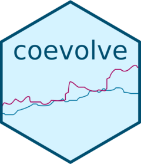

<!-- README.md is generated from README.Rmd. Please edit that file -->

```{r, include = FALSE}
options(width = 120)
knitr::opts_chunk$set(
  collapse = TRUE,
  comment = "#>",
  fig.path = "man/figures/README-",
  dev = "png",
  dpi = 150,
  fig.asp = 0.8,
  fig.width = 5,
  out.width = "60%",
  fig.align = "center"
)
```

[](https://mc-stan.org/)

# coevolve

<!-- badges: start -->
  [](https://www.repostatus.org/#active)
  [](https://github.com/ScottClaessens/coevolve/actions/workflows/R-CMD-check.yaml)
  [](https://app.codecov.io/gh/ScottClaessens/coevolve)
  [](https://github.com/ScottClaessens/coevolve/actions?query=workflow%3Alint)
  [](https://github.com/ropensci/software-review/issues/717)
<!-- badges: end -->

```{r srr-tags, eval = FALSE, echo = FALSE}
#' srr_standards_in_readme
#'
#' @srrstats {G1.0} This README contains references to primary literature
#' @srrstats {G1.2} This README contains a repo status badge highlighting the 
#'   current state of development. We have also added a lifecycle statement to 
#'   .github/CONTRIBUTING.md.
#' @srrstats {BS1.2, BS1.2a} This README contains an example of specifying prior
#'   distributions
#' @srrstats {BS1.4, BS4.3} This README contains a model summary output with 
#'   Rhat and effective sample size statistics for checking convergence
```

## Overview

The **coevolve** package allows the user to fit Bayesian generalized dynamic
phylogenetic models in Stan. These models can be used to estimate how
traits have coevolved over evolutionary time and to assess causal
directionality (X → Y vs. Y → X) and contingencies (X, then Y) in evolution.

While existing methods only allow pairs of binary traits to coevolve
(e.g., [BayesTraits](https://www.evolution.reading.ac.uk/BayesTraitsV4.1.2/BayesTraitsV4.1.2.html)),
the **coevolve** package allows users to include multiple traits of different
data types, including binary, ordinal, count, and continuous traits.

## Generalized dynamic phylogenetic models

Under the hood, the package estimates the parameters of the following stochastic
differential equation along the branches of a phylogenetic tree. The equation 
partitions evolutionary change in the traits into state-dependent deterministic 
selection and state-independent Brownian motion, similar to a multivariate 
Ornstein-Uhlenbeck process:

$$
d\pmb{\eta}(t) = (\textbf{A}\pmb{\eta}(t) + \textbf{b}) + \textbf{G}dW(t)
$$

$\pmb{\eta}(t)$ is a vector of latent variables at time $t$. The matrix 
$\textbf{A}$ represents "selection" with strictly negative autoregressive terms 
on the diagonal. Off-diagonals may be positive or negative, controlling the 
effect of each trait on the others (e.g., $\textbf{A}[2,1]$ represents the 
effect of $\eta_1$ on $\eta_2$). $\textbf{b}$ is a vector of continuous time 
intercepts. The matrix $\textbf{G}$ is the Cholesky decomposition of the 
positive semi-definite "drift" covariance matrix $\textbf{Q}$ which scales the 
Brownian motion process $W(t)$.

The following observation-level measurement model then links $\pmb{\eta}$ to 
the observations at the tips of the tree:

$$
y_{[n,j]} \sim f(\mu_{[n,j]}, {\phi}_{[j]}) \\
g(\mu_{[n,j]}) = \pmb{\eta}_{[n]}
$$

$y_{[n,j]}$ denotes the observed value for trait $j$ from species or population 
$n$ at the tips of a phylogeny. $f()$ is a probability density or mass function 
with expected value $\mu$ and additional distributional parameters $\pmb{\phi}$.
$g()$ denotes a link function, which transforms the expected value from the 
support of the function $f()$ latent values to the unbounded continuous space of 
the evolutionary process.

For more information about the model, refer to the introductory methods paper
[here](https://doi.org/10.1111/2041-210x.70303).

## Installation

You can install the development version of **coevolve** with:

```{r install_coevolve, eval = FALSE}
# install.packages("devtools")
devtools::install_github("ScottClaessens/coevolve")
```

## How to use coevolve

```{r load-package}
library(coevolve)
```

As an example, we analyse the coevolution of political and religious authority
in 97 Austronesian societies. These data were compiled and analysed in [Sheehan
et al. (2023)](https://www.nature.com/articles/s41562-022-01471-y). Both 
variables are four-level ordinal variables reflecting increasing levels of
authority. We use a phylogeny of Austronesian languages to assess patterns of 
coevolution.

```{r authority-fit}
fit <-
  coev_fit(
    data = authority$data,
    variables = list(
      political_authority = "ordered_logistic",
      religious_authority = "ordered_logistic"
    ),
    id = "language",
    tree = authority$phylogeny,
    # manually set prior
    prior = list(A_offdiag = "normal(0, 2)"),
    # arguments for cmdstanr
    parallel_chains = 4,
    refresh = 0,
    seed = 1
  )
```

The results can be investigated using:

```{r authority-summary}
summary(fit)
```

The summary provides general information about the model and details on the 
posterior draws for the model parameters. In particular, the output shows the 
autoregressive selection effects (i.e., the effect of a variable on itself in 
the future), the cross selection effects (i.e., the effect of a variable on 
another variable in the future), the amount of drift, continuous time intercept 
parameters for the stochastic differential equation, and cutpoints for the 
ordinal variables.

While this summary output is useful as a first glance, it is difficult to
interpret these parameters directly to infer directions of coevolution. Another
approach is to "intervene" in the system. We can hold variables of interest at
their average values and then increase one variable by a standardised amount to
see how this affects the optimal trait value for another variable.

The `coev_plot_delta_theta()` function allows us to visualise $\Delta\theta_{z}$
for all variable pairs in the model. $\Delta\theta_{z}$ is defined as the change
in the optimal trait value of one variable which results from a one median
absolute deviation increase in another variable.

```{r authority-delta-theta, fig.height=5, fig.width=5}
#| fig.alt: >
#|   Plot showing the posterior distributions of delta theta for both
#|   directions of coevolution between political and religious authority. The
#|   bulk of the posterior densities are greater than zero.
coev_plot_delta_theta(fit, prob_outer = 0.90)
```

This plot suggests that both variables influence one another in their 
coevolution. A standardised increase in political authority results in an 
increase in the optimal trait value for religious authority, and vice versa.
In other words, these two variables reciprocally coevolve over evolutionary
time.

## Further resources

- [Introductory vignettes](https://scottclaessens.github.io/coevolve/articles/)
- [Methods paper](https://doi.org/10.1111/2041-210x.70303)
- [Lecture and R workshop](https://www.youtube.com/watch?v=9dsTeVflA1s)

## Citing coevolve

When using the **coevolve** package, please cite the following papers:

- Ringen, E., Martin, J. S., & Jaeggi, A. (2021). Novel phylogenetic methods 
  reveal that resource-use intensification drives the evolution of "complex" 
  societies. _EcoEvoRXiv_. https://doi.org/10.32942/osf.io/wfp95
- Ringen, E., Claessens, S., Martin, J. S., & Jaeggi, A. V. (2026). Trait 
  coevolution and causal inference using generalized dynamic phylogenetic 
  models. _Methods in Ecology and Evolution_, _17_(6), 1818-1836. 
  https://doi.org/10.1111/2041-210x.70303
