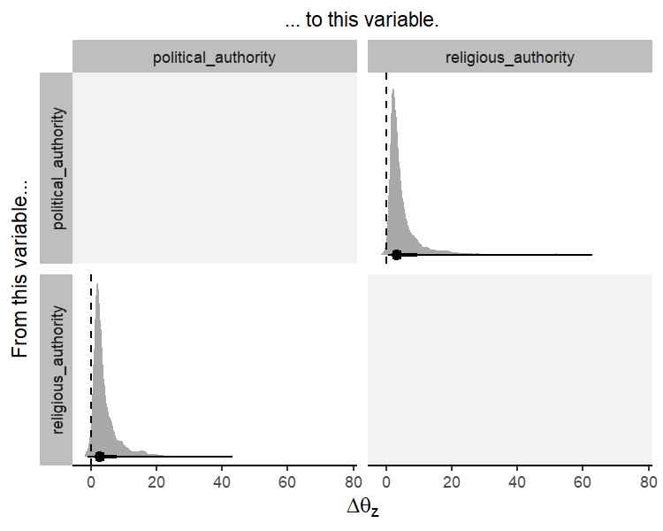

<!-- README.md is generated from README.Rmd. Please edit that file -->

[](https://mc-stan.org/)

# coevolve

<!-- badges: start -->

[](https://github.com/ScottClaessens/coevolve/actions/workflows/R-CMD-check.yaml)
<!-- badges: end -->

## Overview

The **coevolve** package allows the user to fit Bayesian generalized
dynamic phylogenetic models in Stan. These models can be used to
estimate how variables have coevolved over evolutionary time and to
assess causal directionality (X → Y vs. Y → X) and contingencies (X,
then Y) in evolution.

While existing methods only allow pairs of binary traits to coevolve
(e.g.,
[BayesTraits](https://www.evolution.reading.ac.uk/BayesTraitsV4.1.2/BayesTraitsV4.1.2.html)),
the **coevolve** package allows users to include multiple traits of
different data types, including binary, ordinal, count, and continuous
traits.

## Installation

To use the **coevolve** package, you must first install the `cmdstanr`
package (see full installation instructions here:
<https://mc-stan.org/cmdstanr/>).

``` r
install.packages("cmdstanr", repos = c("https://mc-stan.org/r-packages/", getOption("repos")))
```

You can then install the development version of **coevolve** with:

``` r
# install.packages("devtools")
devtools::install_github("ScottClaessens/coevolve")
```

## How to use coevolve

``` r
library(coevolve)
```

As an example, we analyse the coevolution of political and religious
authority in 97 Austronesian societies. These data were compiled and
analysed in [Sheehan et
al. (2023)](https://www.nature.com/articles/s41562-022-01471-y). Both
variables are four-level ordinal variables reflecting increasing levels
of authority. We use a phylogeny of Austronesian languages to assess
patterns of coevolution.

``` r
fit <-
  coev_fit(
    data = authority$data,
    variables = list(
      political_authority = "ordered_logistic",
      religious_authority = "ordered_logistic"
    ),
    id = "language",
    tree = authority$phylogeny,
    # manually set prior
    prior = list(A_offdiag = "normal(0, 2)"),
    # arguments for cmdstanr
    parallel_chains = 4,
    refresh = 0,
    seed = 1
  )
```

```r
#> Running MCMC with 4 parallel chains...
#> 
#> Chain 1 finished in 442.7 seconds.
#> Chain 2 finished in 574.2 seconds.
#> Chain 3 finished in 606.5 seconds.
#> Chain 4 finished in 612.8 seconds.
#> 
#> All 4 chains finished successfully.
#> Mean chain execution time: 559.0 seconds.
#> Total execution time: 613.0 seconds.
#> Warning: 22 of 4000 (1.0%) transitions ended with a divergence.
#> See https://mc-stan.org/misc/warnings for details.
```

The results can be investigated using:

``` r
summary(fit)
#> Variables: political_authority = ordered_logistic 
#>            religious_authority = ordered_logistic 
#>      Data: authority$data (Number of observations: 97)
#> Phylogeny: authority$phylogeny (Number of trees: 1)
#>     Draws: 4 chains, each with iter = 1000; warmup = 1000; thin = 1
#>            total post-warmup draws = 4000
#> 
#> Autoregressive selection effects:
#>                     Estimate Est.Error  2.5% 97.5% Rhat Bulk_ESS Tail_ESS
#> political_authority    -0.67      0.53 -1.99 -0.03 1.00     2120     1768
#> religious_authority    -0.78      0.59 -2.20 -0.03 1.00     2260     1766
#> 
#> Cross selection effects:
#>                                           Estimate Est.Error  2.5% 97.5% Rhat Bulk_ESS Tail_ESS
#> political_authority ⟶ religious_authority     2.32      1.03  0.38  4.45 1.00     1567     1971
#> religious_authority ⟶ political_authority     1.82      1.11 -0.28  4.07 1.00     1288     2124
#> 
#> Drift parameters:
#>                                              Estimate Est.Error  2.5% 97.5% Rhat Bulk_ESS Tail_ESS
#> sd(political_authority)                          1.95      0.83  0.27  3.50 1.01      801     1193
#> sd(religious_authority)                          1.29      0.80  0.06  2.94 1.00      761     1327
#> cor(political_authority,religious_authority)     0.26      0.32 -0.44  0.78 1.00     2732     2641
#> 
#> Continuous time intercept parameters:
#>                     Estimate Est.Error  2.5% 97.5% Rhat Bulk_ESS Tail_ESS
#> political_authority     0.21      0.95 -1.56  2.09 1.00     4088     1162
#> religious_authority     0.21      0.94 -1.65  2.06 1.00     5112     2655
#> 
#> Ordinal cutpoint parameters:
#>                        Estimate Est.Error  2.5% 97.5% Rhat Bulk_ESS Tail_ESS
#> political_authority[1]    -1.31      0.91 -3.12  0.51 1.00     2736     2683
#> political_authority[2]    -0.56      0.89 -2.32  1.24 1.00     3129     2891
#> political_authority[3]     1.64      0.92 -0.10  3.55 1.00     3268     2956
#> religious_authority[1]    -1.53      0.92 -3.31  0.24 1.00     3019     3066
#> religious_authority[2]    -0.84      0.90 -2.59  0.94 1.00     3329     3051
#> religious_authority[3]     1.60      0.95 -0.17  3.51 1.00     3205     3102
#> Warning: There were 22 divergent transitions after warmup.
#> http://mc-stan.org/misc/warnings.html#divergent-transitions-after-warmup
```

The summary provides general information about the model and details on
the posterior draws for the model parameters. In particular, the output
shows the autoregressive selection effects (i.e., the effect of a
variable on itself in the future), the cross selection effects (i.e.,
the effect of a variable on another variable in the future), the amount
of drift, continuous time intercept parameters for the stochastic
differential equation, and cutpoints for the ordinal variables.

While this summary output is useful as a first glance, it is difficult
to interpret these parameters directly to infer directions of
coevolution. Another approach is to “intervene” in the system. We can
hold variables of interest at their average values and then increase one
variable by a standardised amount to see how this affects the optimal
trait value for another variable.

The `coev_plot_delta_theta()` function allows us to visualise
$\Delta\theta_{z}$ for all variable pairs in the model.
$\Delta\theta_{z}$ is defined as the change in the optimal trait value
of one variable which results from a one median absolute deviation
increase in another variable.

``` r
coev_plot_delta_theta(fit)
#> Warning: Removed 235 rows containing non-finite outside the scale range (`stat_density()`).
```



This plot suggests that both variables influence one another in their
coevolution. A standardised increase in political authority results in
an increase in the optimal trait value for religious authority, and vice
versa. In other words, these two variables reciprocally coevolve over
evolutionary time.

## Citing coevolve

When using the **coevolve** package, please cite the following papers:

- Ringen, E., Martin, J. S., & Jaeggi, A. (2021). Novel phylogenetic
  methods reveal that resource-use intensification drives the evolution
  of “complex” societies. *EcoEvoRXiv*.
  <https://doi.org/10.32942/osf.io/wfp95>
- Sheehan, O., Watts, J., Gray, R. D., Bulbulia, J., Claessens, S.,
  Ringen, E. J., & Atkinson, Q. D. (2023). Coevolution of religious and
  political authority in Austronesian societies. *Nature Human
  Behaviour*, *7*(1), 38-45.
  <https://doi.org/10.1038/s41562-022-01471-y>
