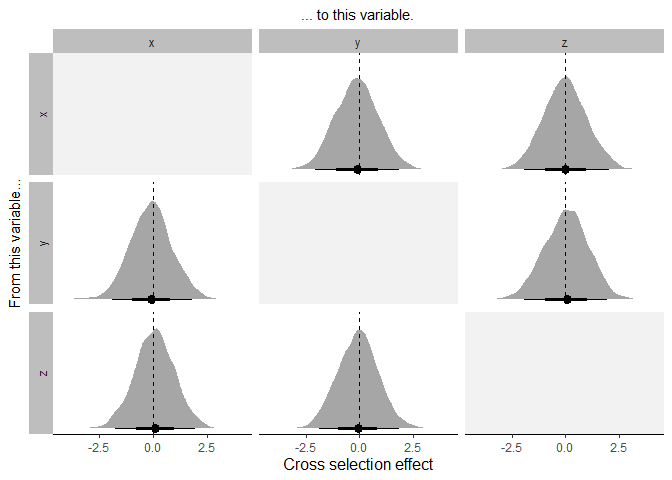

<!-- README.md is generated from README.Rmd. Please edit that file -->

# coevolve

<!-- badges: start -->
<!-- badges: end -->

## Overview

The **coevolve** package allows the user to fit Bayesian dynamic
coevolutionary models in Stan.

## Installation

To use the **coevolve** package, you must first install the `cmdstanr`
package (see full installation instructions here:
<https://mc-stan.org/cmdstanr/>).

``` r
install.packages("cmdstanr", repos = c("https://mc-stan.org/r-packages/", getOption("repos")))
```

You can then install the development version of `coevolve` with:

``` r
# install.packages("devtools")
devtools::install_github("ScottClaessens/coevolve")
```

## Example

We can simulate a phylogenetic tree with some data to see how the
package works. First, simulate a phylogenetic tree.

``` r
# set the random seed
set.seed(1)
# number of taxa
n <- 50
# random tree
tree <- ape::rtree(n)
```

Then, simulate data for a binary trait and two ordinal traits.

``` r
# simulate data
d <- 
  data.frame(
    # id to match dataset to tree tips
    id = tree$tip.label,
    # simulate variables
    x = as.integer(rbinom(n, 1, 0.5)),
    y = ordered(sample(1:3, size = n, replace = TRUE)),
    z = ordered(sample(1:5, size = n, replace = TRUE))
  )

head(d)
#>    id x y z
#> 1 t42 1 3 4
#> 2 t38 0 1 4
#> 3 t47 0 1 4
#> 4 t20 1 1 5
#> 5 t28 1 1 2
#> 6 t48 0 1 4
```

We can then fit our Bayesian dynamic coevolutionary model in `cmdstanr`
with the `coev_fit()` function. We declare all variables and set the
response distributions for binary and ordinal variables as
`bernoulli_logit` and `ordered_logistic` respectively.

``` r
# load the coevolve package
library(coevolve)

# fit model
m <-
  coev_fit(
    data = d,
    variables = list(
      x = "bernoulli_logit",
      y = "ordered_logistic",
      z = "ordered_logistic"
    ),
    id = "id",
    tree = tree,
    # additional arguments for cmdstanr
    parallel_chains = 4,
    refresh = 0,
    show_messages = FALSE,
    seed = 1
  )
#> Running MCMC with 4 parallel chains...
#> 
#> Chain 2 finished in 2874.2 seconds.
#> Chain 4 finished in 2955.1 seconds.
#> Chain 3 finished in 2956.9 seconds.
#> Chain 1 finished in 2965.0 seconds.
#> 
#> All 4 chains finished successfully.
#> Mean chain execution time: 2937.8 seconds.
#> Total execution time: 2965.7 seconds.
#> Warning: 1 of 4000 (0.0%) transitions ended with a divergence.
#> See https://mc-stan.org/misc/warnings for details.

summary(m)
#> Variables: x = bernoulli_logit 
#>            y = ordered_logistic 
#>            z = ordered_logistic 
#>      Data: d (Number of observations: 50)
#>     Draws: 4 chains, each with iter = 1000; warmup = 1000; thin = 1
#>            total post-warmup draws = 4000
#> 
#> Autoregressive selection effects:
#>   mean median   sd  mad    q5  q95 rhat ess_bulk ess_tail
#> x 0.38   0.41 1.02 1.05 -1.33 1.98 1.00     4716     3029
#> y 0.23   0.26 1.01 1.00 -1.47 1.82 1.00     5394     2984
#> z 0.09   0.10 1.00 0.99 -1.55 1.72 1.00     4785     3246
#> 
#> Cross selection effects:
#>        mean median   sd  mad    q5  q95 rhat ess_bulk ess_tail
#> x ⟶ y -0.11  -0.11 1.00 1.02 -1.75 1.55 1.00     7016     2796
#> x ⟶ z -0.01  -0.01 1.01 1.01 -1.65 1.71 1.00     5582     3059
#> y ⟶ x -0.08  -0.08 0.97 0.95 -1.64 1.56 1.00     5909     2974
#> y ⟶ z  0.04   0.05 1.02 1.03 -1.68 1.68 1.00     5443     3215
#> z ⟶ x  0.08   0.08 0.94 0.92 -1.50 1.64 1.00     4445     2648
#> z ⟶ y -0.06  -0.05 0.95 0.94 -1.63 1.50 1.00     5117     3281
#> 
#> Drift scale parameters:
#>   mean median   sd  mad   q5  q95 rhat ess_bulk ess_tail
#> x 0.81   0.69 0.60 0.61 0.07 1.96 1.00     1989     2311
#> y 0.68   0.55 0.53 0.49 0.06 1.73 1.00     2354     1993
#> z 0.97   0.88 0.68 0.71 0.07 2.22 1.00     1487     2185
#> 
#> Note: Not all model parameters are displayed in this summary.
#> Warning: There were 1 divergent transitions after warmup.
#> http://mc-stan.org/misc/warnings.html#divergent-transitions-after-warmup
```

From the cross selection effects, we infer that the three traits do not
influence one another in their evolution.

We can also plot the cross selection effects from this model using the
`coev_plot_cross()` function.

``` r
coev_plot_cross(m)
```



## Citing coevolve

When using the coevolve package, please cite the following papers:

- Ringen, E., Martin, J. S., & Jaeggi, A. (2021). Novel phylogenetic
  methods reveal that resource-use intensification drives the evolution
  of “complex” societies. *EcoEvoRXiv*.
  <https://doi.org/10.32942/osf.io/wfp95>
- Sheehan, O., Watts, J., Gray, R. D., Bulbulia, J., Claessens, S.,
  Ringen, E. J., & Atkinson, Q. D. (2023). Coevolution of religious and
  political authority in Austronesian societies. *Nature Human
  Behaviour*, *7*(1), 38-45.
  <https://doi.org/10.1038/s41562-022-01471-y>
