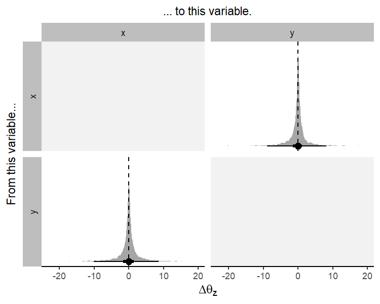

<!-- README.md is generated from README.Rmd. Please edit that file -->

[](https://mc-stan.org/)

# coevolve

<!-- badges: start -->

[](https://github.com/ScottClaessens/coevolve/actions/workflows/R-CMD-check.yaml)
<!-- badges: end -->

## Overview

The **coevolve** package allows the user to fit Bayesian dynamic
coevolutionary phylogenetic models in Stan. These models can be used to
estimate how variables have coevolved over evolutionary time and to
assess causal directionality (X → Y vs. Y → X) and contingencies (X,
then Y) in evolution.

While existing methods only allow pairs of binary traits to coevolve
(e.g.,
[BayesTraits](https://www.evolution.reading.ac.uk/BayesTraitsV4.1.2/BayesTraitsV4.1.2.html)),
the **coevolve** package allows users to include multiple traits of
different data types, including binary, ordinal, count, and continuous
traits.

## Installation

To use the **coevolve** package, you must first install the `cmdstanr`
package (see full installation instructions here:
<https://mc-stan.org/cmdstanr/>).

``` r
install.packages("cmdstanr", repos = c("https://mc-stan.org/r-packages/", getOption("repos")))
```

You can then install the development version of `coevolve` with:

``` r
# install.packages("devtools")
devtools::install_github("ScottClaessens/coevolve")
```

## Example

We can simulate a phylogenetic tree with some data to see how the
package works. First, simulate a phylogenetic tree.

``` r
# set the random seed
set.seed(1)
# number of taxa
n <- 10
# random tree
tree <- ape::rcoal(n)
```

Then, simulate data for an ordinal trait and a count trait.

``` r
# simulate data
d <- 
  data.frame(
    # id to match dataset to tree tips
    id = tree$tip.label,
    # simulate variables
    x = ordered(sample(1:3, size = n, replace = TRUE)),
    y = rpois(n, 2)
  )

head(d)
#>   id x y
#> 1 t6 1 3
#> 2 t4 3 0
#> 3 t9 2 4
#> 4 t8 2 1
#> 5 t2 3 3
#> 6 t7 3 1
```

We can then fit our Bayesian dynamic coevolutionary model in `cmdstanr`
with the `coev_fit()` function. We declare both variables and set the
response distributions for ordinal and count variables as
`ordered_logistic` and `poisson_softplus` respectively.

``` r
# load the coevolve package
library(coevolve)

# fit model
m <-
  coev_fit(
    data = d,
    variables = list(
      x = "ordered_logistic",
      y = "poisson_softplus"
    ),
    id = "id",
    tree = tree,
    # additional arguments for cmdstanr
    parallel_chains = 4,
    refresh = 0,
    seed = 1
  )
#> Running MCMC with 4 parallel chains...
#> 
#> Chain 2 finished in 36.3 seconds.
#> Chain 4 finished in 38.1 seconds.
#> Chain 3 finished in 38.3 seconds.
#> Chain 1 finished in 42.8 seconds.
#> 
#> All 4 chains finished successfully.
#> Mean chain execution time: 38.9 seconds.
#> Total execution time: 43.0 seconds.
```

The results can be investigated using:

``` r
summary(m)
#> Variables: x = ordered_logistic 
#>            y = poisson_softplus 
#>      Data: d (Number of observations: 10)
#>     Draws: 4 chains, each with iter = 1000; warmup = 1000; thin = 1
#>            total post-warmup draws = 4000
#> 
#> Autoregressive selection effects:
#>   Estimate Est.Error  2.5% 97.5% Rhat Bulk_ESS Tail_ESS
#> x    -0.87      0.61 -2.34 -0.04 1.00     2546     1116
#> y    -0.95      0.65 -2.47 -0.05 1.00     2575     1393
#> 
#> Cross selection effects:
#>       Estimate Est.Error  2.5% 97.5% Rhat Bulk_ESS Tail_ESS
#> x ⟶ y    -0.01      0.94 -1.85  1.84 1.00     3361     2821
#> y ⟶ x    -0.02      0.97 -1.89  1.88 1.00     3386     2837
#> 
#> Drift scale parameters:
#>   Estimate Est.Error 2.5% 97.5% Rhat Bulk_ESS Tail_ESS
#> x     0.75      0.58 0.03  2.12 1.00     3397     1855
#> y     0.67      0.54 0.02  2.03 1.00     2782     1969
#> 
#> Continuous time intercept parameters:
#>   Estimate Est.Error  2.5% 97.5% Rhat Bulk_ESS Tail_ESS
#> x     0.12      0.93 -1.68  1.93 1.00     4443     3181
#> y     0.42      0.77 -1.11  1.94 1.00     3252     2717
#> 
#> Ordinal cutpoint parameters:
#>      Estimate Est.Error  2.5% 97.5% Rhat Bulk_ESS Tail_ESS
#> x[1]    -1.97      1.07 -4.16  0.06 1.00     2625     2016
#> x[2]     1.09      0.97 -0.71  3.12 1.00     3943     3294
#> Warning: There were 20 divergent transitions after warmup.
#> http://mc-stan.org/misc/warnings.html#divergent-transitions-after-warmup
```

We can infer whether these traits influence one another in their
evolution by plotting $\Delta\theta_{z}$, the expected change in the
equilibrium trait value of one variable from an absolute deviation
increase in another variable.

``` r
coev_plot_delta_theta(m)
```



This plot suggests that these variables do not coevolve over
evolutionary time.

## Citing coevolve

When using the coevolve package, please cite the following papers:

- Ringen, E., Martin, J. S., & Jaeggi, A. (2021). Novel phylogenetic
  methods reveal that resource-use intensification drives the evolution
  of “complex” societies. *EcoEvoRXiv*.
  <https://doi.org/10.32942/osf.io/wfp95>
- Sheehan, O., Watts, J., Gray, R. D., Bulbulia, J., Claessens, S.,
  Ringen, E. J., & Atkinson, Q. D. (2023). Coevolution of religious and
  political authority in Austronesian societies. *Nature Human
  Behaviour*, *7*(1), 38-45.
  <https://doi.org/10.1038/s41562-022-01471-y>
