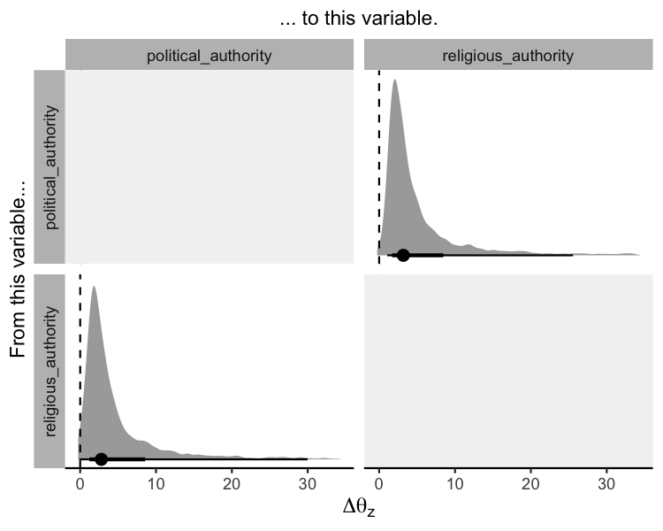

<!-- README.md is generated from README.Rmd. Please edit that file -->

[](https://mc-stan.org/)

# coevolve

<!-- badges: start -->

[](https://www.repostatus.org/#active)
[](https://github.com/ScottClaessens/coevolve/actions/workflows/R-CMD-check.yaml)
[](https://app.codecov.io/gh/ScottClaessens/coevolve)
[](https://github.com/ScottClaessens/coevolve/actions?query=workflow%3Alint)
[](https://github.com/ropensci/software-review/issues/717)
<!-- badges: end -->

## Overview

The **coevolve** package allows the user to fit Bayesian generalized
dynamic phylogenetic models in Stan. These models can be used to
estimate how traits have coevolved over evolutionary time and to assess
causal directionality (X → Y vs. Y → X) and contingencies (X, then Y) in
evolution.

While existing methods only allow pairs of binary traits to coevolve
(e.g.,
[BayesTraits](https://www.evolution.reading.ac.uk/BayesTraitsV4.1.2/BayesTraitsV4.1.2.html)),
the **coevolve** package allows users to include multiple traits of
different data types, including binary, ordinal, count, and continuous
traits.

## Installation

You can install the development version of **coevolve** with:

``` r
# install.packages("devtools")
devtools::install_github("ScottClaessens/coevolve")
```

## How to use coevolve

``` r
library(coevolve)
```

As an example, we analyse the coevolution of political and religious
authority in 97 Austronesian societies. These data were compiled and
analysed in [Sheehan et
al. (2023)](https://www.nature.com/articles/s41562-022-01471-y). Both
variables are four-level ordinal variables reflecting increasing levels
of authority. We use a phylogeny of Austronesian languages to assess
patterns of coevolution.

``` r
fit <-
  coev_fit(
    data = authority$data,
    variables = list(
      political_authority = "ordered_logistic",
      religious_authority = "ordered_logistic"
    ),
    id = "language",
    tree = authority$phylogeny,
    # manually set prior
    prior = list(A_offdiag = "normal(0, 2)"),
    # arguments for cmdstanr
    parallel_chains = 4,
    refresh = 0,
    seed = 1
  )
#> Running MCMC with 4 parallel chains...
#> 
#> Chain 3 finished in 256.2 seconds.
#> Chain 4 finished in 262.9 seconds.
#> Chain 1 finished in 354.9 seconds.
#> Chain 2 finished in 361.1 seconds.
#> 
#> All 4 chains finished successfully.
#> Mean chain execution time: 308.8 seconds.
#> Total execution time: 361.2 seconds.
#> Warning: 7 of 4000 (0.0%) transitions ended with a divergence.
#> See https://mc-stan.org/misc/warnings for details.
```

The results can be investigated using:

``` r
summary(fit)
#> Variables: political_authority = ordered_logistic 
#>            religious_authority = ordered_logistic 
#>      Data: authority$data (Number of observations: 97)
#> Phylogeny: authority$phylogeny (Number of trees: 1)
#>     Draws: 4 chains, each with iter = 1000; warmup = 1000; thin = 1
#>            total post-warmup draws = 4000
#> 
#> Autoregressive selection effects:
#>                     Estimate Est.Error  2.5% 97.5% Rhat Bulk_ESS Tail_ESS
#> political_authority    -0.64      0.53 -1.96 -0.02 1.00     2282     2149
#> religious_authority    -0.81      0.57 -2.16 -0.04 1.00     2639     2106
#> 
#> Cross selection effects:
#>                                           Estimate Est.Error  2.5% 97.5% Rhat Bulk_ESS Tail_ESS
#> political_authority ⟶ religious_authority     2.34      0.96  0.42  4.29 1.01     1508     1853
#> religious_authority ⟶ political_authority     1.68      1.08 -0.42  3.83 1.00     1067     2030
#> 
#> Drift parameters:
#>                                              Estimate Est.Error  2.5% 97.5% Rhat Bulk_ESS Tail_ESS
#> sd(political_authority)                          2.01      0.83  0.25  3.60 1.01      643      602
#> sd(religious_authority)                          1.25      0.79  0.08  2.96 1.02      734     1737
#> cor(political_authority,religious_authority)     0.26      0.31 -0.41  0.77 1.00     2760     2512
#> 
#> Continuous time intercept parameters:
#>                     Estimate Est.Error  2.5% 97.5% Rhat Bulk_ESS Tail_ESS
#> political_authority     0.23      0.94 -1.60  2.07 1.00     4889     2814
#> religious_authority     0.31      0.94 -1.51  2.19 1.00     5071     2710
#> 
#> Ordinal cutpoint parameters:
#>                        Estimate Est.Error  2.5% 97.5% Rhat Bulk_ESS Tail_ESS
#> political_authority[1]    -1.32      0.88 -3.05  0.43 1.00     2746     2770
#> political_authority[2]    -0.57      0.86 -2.28  1.14 1.00     3083     2967
#> political_authority[3]     1.63      0.88 -0.06  3.48 1.00     3629     3113
#> religious_authority[1]    -1.50      0.92 -3.28  0.31 1.00     3289     2605
#> religious_authority[2]    -0.81      0.91 -2.59  0.96 1.00     3582     2759
#> religious_authority[3]     1.63      0.92 -0.12  3.49 1.00     3786     3337
#> Warning: There were 7 divergent transitions after warmup.
#> http://mc-stan.org/misc/warnings.html#divergent-transitions-after-warmup
```

The summary provides general information about the model and details on
the posterior draws for the model parameters. In particular, the output
shows the autoregressive selection effects (i.e., the effect of a
variable on itself in the future), the cross selection effects (i.e.,
the effect of a variable on another variable in the future), the amount
of drift, continuous time intercept parameters for the stochastic
differential equation, and cutpoints for the ordinal variables.

While this summary output is useful as a first glance, it is difficult
to interpret these parameters directly to infer directions of
coevolution. Another approach is to “intervene” in the system. We can
hold variables of interest at their average values and then increase one
variable by a standardised amount to see how this affects the optimal
trait value for another variable.

The `coev_plot_delta_theta()` function allows us to visualise
$\Delta\theta_{z}$ for all variable pairs in the model.
$\Delta\theta_{z}$ is defined as the change in the optimal trait value
of one variable which results from a one median absolute deviation
increase in another variable.

``` r
coev_plot_delta_theta(fit, prob_outer = 0.90)
#> Warning: Removed 518 rows containing non-finite outside the scale range (`stat_density()`).
```



This plot suggests that both variables influence one another in their
coevolution. A standardised increase in political authority results in
an increase in the optimal trait value for religious authority, and vice
versa. In other words, these two variables reciprocally coevolve over
evolutionary time.

## Further resources

- [Introductory
  vignettes](https://scottclaessens.github.io/coevolve/articles/)
- [Methods paper](https://doi.org/10.1111/2041-210x.70303)
- [Lecture and R workshop](https://www.youtube.com/watch?v=9dsTeVflA1s)

## Citing coevolve

When using the **coevolve** package, please cite the following papers:

- Ringen, E., Martin, J. S., & Jaeggi, A. (2021). Novel phylogenetic
  methods reveal that resource-use intensification drives the evolution
  of “complex” societies. *EcoEvoRXiv*.
  <https://doi.org/10.32942/osf.io/wfp95>
- Ringen, E., Claessens, S., Martin, J. S., & Jaeggi, A. V. (2026).
  Trait coevolution and causal inference using generalized dynamic
  phylogenetic models. *Methods in Ecology and Evolution*, *17*(6),
  1818-1836. <https://doi.org/10.1111/2041-210x.70303>
