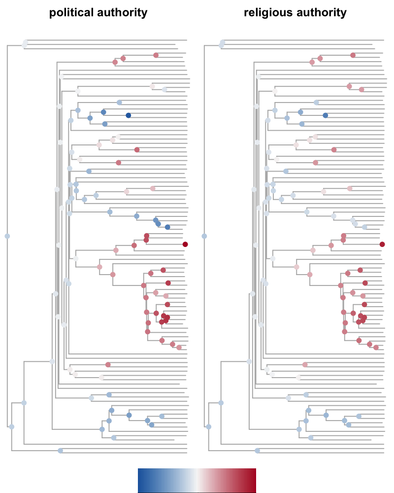
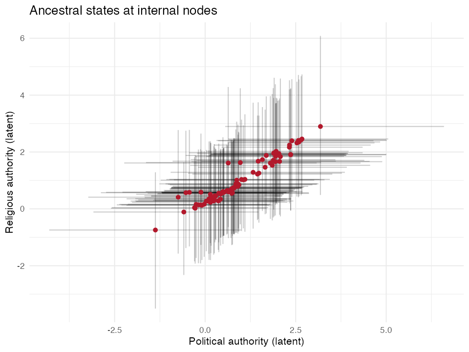
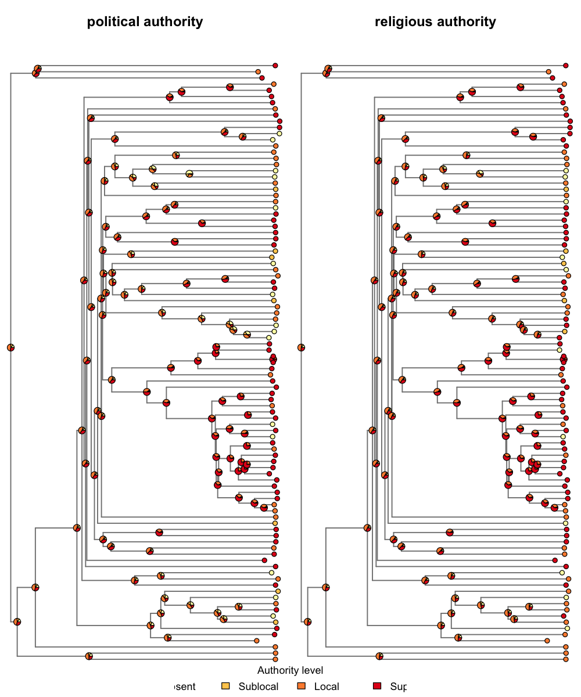
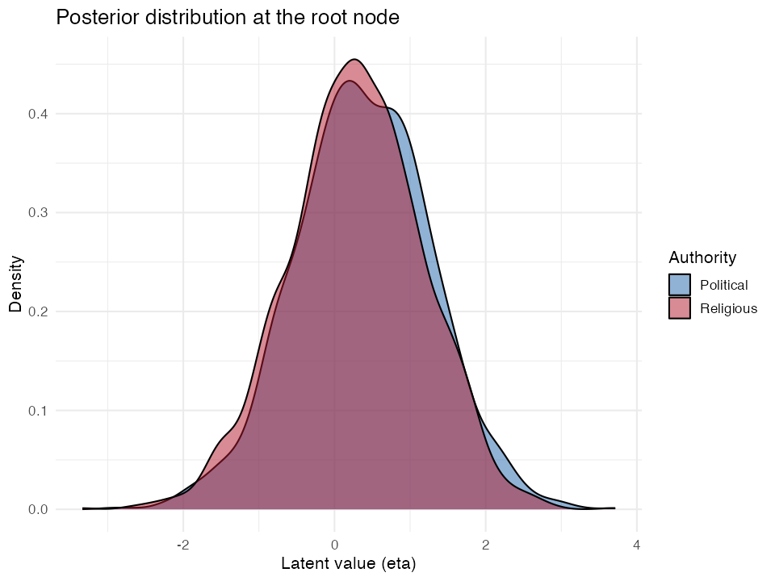
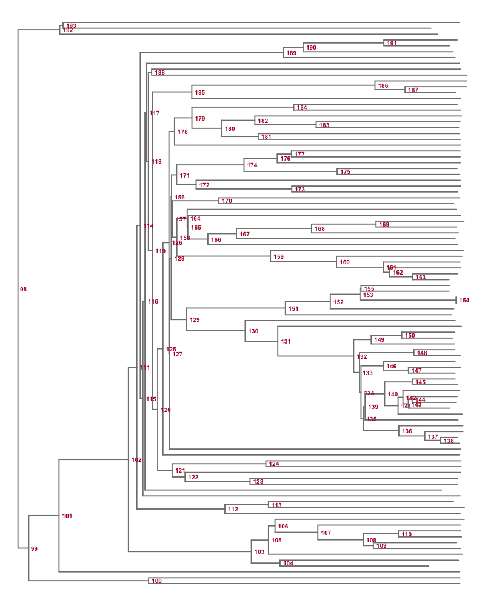

## Overview

The `coev_ancestral_states()` function extracts posterior estimates of latent
trait values at internal (ancestral) nodes of the phylogeny from a fitted
`coevfit` model. Because the model estimates latent states at every node in the
tree, ancestral state reconstruction is a natural byproduct of model fitting --
no separate analysis is needed.

This vignette demonstrates the function using the **authority** dataset bundled
with the package: political and religious authority among 97 Austronesian
societies.

## Setup

``` r
library(coevolve)
library(ggplot2)
library(dplyr)
library(tidyr)
library(ape)
theme_set(theme_minimal(base_size = 13))
```

## Fit the model

We fit a coevolutionary model with two ordered-logistic variables. For
demonstration purposes we use moderate sampling settings; in practice you would
want more iterations and to check convergence carefully.

``` r
fit <- coev_fit(
  data = authority$data,
  variables = list(
    political_authority = "ordered_logistic",
    religious_authority = "ordered_logistic"
  ),
  id = "language",
  tree = authority$phylogeny,
  parallel_chains = 4,
  chains = 4,
  iter_sampling = 500,
  iter_warmup = 500,
  seed = 42
)
```

```
Running MCMC with 4 parallel chains...

Chain 4 finished in 84.6 seconds.
Chain 3 finished in 114.0 seconds.
Chain 1 finished in 115.0 seconds.
Chain 2 finished in 119.0 seconds.

All 4 chains finished successfully.
Mean chain execution time: 108.1 seconds.
Total execution time: 119.2 seconds.
```

Quick check that the model sampled adequately:

``` r
summary(fit)
```

```
Variables: political_authority = ordered_logistic
           religious_authority = ordered_logistic
     Data: authority$data (Number of observations: 97)
Phylogeny: authority$phylogeny (Number of trees: 1)
    Draws: 4 chains, each with iter = 500; warmup = 500; thin = 1
           total post-warmup draws = 2000

Autoregressive selection effects:
                    Estimate Est.Error  2.5% 97.5% Rhat Bulk_ESS Tail_ESS
political_authority    -0.53      0.44 -1.64 -0.02 1.00     1420     1270
religious_authority    -0.60      0.48 -1.82 -0.03 1.00     1549     1137

Cross selection effects:
                                          Estimate Est.Error  2.5% 97.5% Rhat
political_authority ⟶ religious_authority     1.50      0.74 -0.04  2.87 1.00
religious_authority ⟶ political_authority     1.05      0.83 -0.62  2.64 1.00
                                          Bulk_ESS Tail_ESS
political_authority ⟶ religious_authority      842     1055
religious_authority ⟶ political_authority      701     1384

Drift parameters:
                                             Estimate Est.Error  2.5% 97.5%
sd(political_authority)                          2.15      0.82  0.37  3.70
sd(religious_authority)                          1.46      0.82  0.13  3.10
cor(political_authority,religious_authority)     0.37      0.30 -0.35  0.85
                                             Rhat Bulk_ESS Tail_ESS
sd(political_authority)                      1.00      453      406
sd(religious_authority)                      1.01      416      887
cor(political_authority,religious_authority) 1.00     1116     1360

Continuous time intercept parameters:
                    Estimate Est.Error  2.5% 97.5% Rhat Bulk_ESS Tail_ESS
political_authority     0.31      0.91 -1.55  2.12 1.00     2426     1337
religious_authority     0.31      0.91 -1.47  2.14 1.01     3135     1612

Ordinal cutpoint parameters:
                       Estimate Est.Error  2.5% 97.5% Rhat Bulk_ESS Tail_ESS
political_authority[1]    -1.44      0.88 -3.13  0.23 1.00     1266     1010
political_authority[2]    -0.70      0.86 -2.36  1.01 1.00     1418     1276
political_authority[3]     1.48      0.86 -0.20  3.19 1.00     1661     1415
religious_authority[1]    -1.59      0.92 -3.32  0.24 1.00     1424     1248
religious_authority[2]    -0.92      0.90 -2.61  0.87 1.00     1699     1531
religious_authority[3]     1.45      0.92 -0.24  3.28 1.00     1913     1488
```

```
Warning: There were 2 divergent transitions after warmup.
http://mc-stan.org/misc/warnings.html#divergent-transitions-after-warmup
```

## Ancestral states on the latent scale

The default call returns posterior summaries (median + 95% credible interval) for
all internal nodes on the latent (eta) scale:

``` r
asr_latent <- coev_ancestral_states(fit)
head(asr_latent)
```

```
# A tibble: 6 x 6
   node variable            estimate lower upper clade_pp
  <int> <chr>                  <dbl> <dbl> <dbl>    <dbl>
1    98 political_authority    0.377 -1.44  2.15        1
2    98 religious_authority    0.292 -1.52  1.92        1
3    99 political_authority    0.363 -1.39  2.20        1
4    99 religious_authority    0.282 -1.44  1.87        1
5   100 political_authority    0.235 -1.94  2.44        1
6   100 religious_authority    0.276 -1.61  2.20        1
```

The result is a tibble with one row per node-variable combination. The `node`
column uses ape's numbering convention (tips are `1:N_tips`, internal nodes are
`(N_tips+1):(2*N_tips-1)`), so it integrates directly with phylo objects.

### Visualizing latent ancestral states on the tree

We can paint the tree with estimated ancestral values by mapping the posterior
median to a diverging color gradient. Blue indicates low latent values; red
indicates high:

``` r
tree <- attr(asr_latent, "ref_tree")
n_tips <- length(tree$tip.label)
asr_all <- coev_ancestral_states(fit, nodes = "all")

pal <- colorRampPalette(c("#2166AC", "#F7F7F7", "#B2182B"))(100)
global_range <- range(asr_all$estimate)

par(mfrow = c(1, 2), mar = c(2, 0, 2, 0))

for (var in unique(asr_all$variable)) {
  df_var <- asr_all |> filter(variable == var)
  vals <- setNames(df_var$estimate, df_var$node)

  plot(tree, show.tip.label = FALSE, edge.width = 1.5,
       edge.color = "grey70", main = gsub("_", " ", var),
       no.margin = FALSE)

  internal_ids <- (n_tips + 1):(n_tips + tree$Nnode)
  internal_vals <- vals[as.character(internal_ids)]
  bins <- as.integer(
    cut(internal_vals,
        breaks = seq(global_range[1], global_range[2], length.out = 101))
  )
  bins[is.na(bins)] <- 50
  bins <- pmax(1, pmin(100, bins))
  nodelabels(pch = 21, bg = pal[bins], col = NA, cex = 1.2)
}

# add shared color bar legend
par(fig = c(0.35, 0.65, 0.0, 0.05), new = TRUE, mar = c(0, 0, 0, 0))
image(
  x = seq(global_range[1], global_range[2], length.out = 100),
  y = 1,
  z = matrix(1:100, nrow = 100),
  col = pal,
  axes = FALSE, xlab = "", ylab = ""
)
axis(1, at = round(seq(global_range[1], global_range[2], length.out = 5), 1),
     cex.axis = 0.8, padj = -1.5, tck = -0.3)
mtext("Latent value (eta)", side = 1, line = 1.2, cex = 0.7)
```

<div class="figure" style="text-align: center">

</div>

### Joint latent-space scatterplot

We can also look at the joint distribution of ancestral states across the two
variables. Each point is an internal node, with crosshairs showing the 95%
credible interval:

``` r
asr_wide <- asr_latent |>
  select(node, variable, estimate, lower, upper) |>
  pivot_wider(
    names_from = variable,
    values_from = c(estimate, lower, upper)
  )

ggplot(asr_wide,
       aes(x = estimate_political_authority,
           y = estimate_religious_authority)) +
  geom_errorbar(
    aes(ymin = lower_religious_authority,
        ymax = upper_religious_authority),
    alpha = 0.2, width = 0
  ) +
  geom_errorbarh(
    aes(xmin = lower_political_authority,
        xmax = upper_political_authority),
    alpha = 0.2, height = 0
  ) +
  geom_point(color = "#B2182B", size = 2) +
  labs(
    x = "Political authority (latent)",
    y = "Religious authority (latent)",
    title = "Ancestral states at internal nodes"
  )
```

<div class="figure" style="text-align: center">

</div>

## Ancestral states on the response scale

For ordered-logistic variables, the response scale returns estimated category
probabilities at each node -- how likely each level of authority (absent,
sublocal, local, supralocal) was at that ancestral node:

``` r
asr_resp <- coev_ancestral_states(
  fit, nodes = "all", scale = "response"
)
head(asr_resp)
```

```
# A tibble: 6 x 7
   node variable            prob_1 prob_2 prob_3 prob_4 clade_pp
  <int> <chr>                <dbl>  <dbl>  <dbl>  <dbl>    <dbl>
1     1 political_authority 0.0442 0.0419  0.346  0.536        1
2     1 religious_authority 0.0348 0.0284  0.340  0.581        1
3     2 political_authority 0.107  0.0830  0.403  0.323        1
4     2 religious_authority 0.0889 0.0636  0.427  0.342        1
5     3 political_authority 0.0763 0.0645  0.399  0.417        1
6     3 religious_authority 0.0604 0.0458  0.421  0.435        1
```

Notice the output now has `prob_1`, `prob_2`, etc. columns instead of
`estimate`/`lower`/`upper`. Each row sums to 1 across probability columns.

### Pie chart tree: response-scale probabilities

This is the most intuitive way to visualize ordinal ancestral states. Each pie
chart at an internal node shows the posterior median probability of each
category. At the tips, observed values are shown as solid colors (one category
with probability 1). If a tip has missing data, the model-estimated
probabilities are shown instead.

``` r
cat_labels <- c("Absent", "Sublocal", "Local", "Supralocal")
cat_colors <- c("#FFFFB2", "#FECC5C", "#FD8D3C", "#E31A1C")
prob_cols <- grep("^prob_", names(asr_resp), value = TRUE)
n_cats <- length(prob_cols)

# build observed-value lookup: tip label -> integer category per variable
obs_data <- authority$data
obs_data$tip_label <- tree$tip.label[match(obs_data$language,
                                           tree$tip.label)]

par(mfrow = c(1, 2), mar = c(1, 0, 3, 0))

for (var in unique(asr_resp$variable)) {
  df_var <- asr_resp |>
    filter(variable == var) |>
    arrange(node)

  plot(tree, show.tip.label = FALSE, edge.width = 1.5,
       edge.color = "grey50", no.margin = FALSE,
       main = gsub("_", " ", var))

  # internal node pies (model estimates)
  df_internal <- df_var |> filter(node > n_tips) |> arrange(node)
  pie_mat <- as.matrix(df_internal[, prob_cols])
  nodelabels(pie = pie_mat, piecol = cat_colors, cex = 0.6)

  # tip pies: observed values when available, model estimates when missing
  tip_pie <- matrix(0, nrow = n_tips, ncol = n_cats)
  for (i in seq_len(n_tips)) {
    tip_name <- tree$tip.label[i]
    row_idx <- match(tip_name, obs_data$language)
    obs_val <- if (!is.na(row_idx)) obs_data[[var]][row_idx] else NA
    if (!is.na(obs_val)) {
      # observed: deterministic pie (all mass on one category)
      cat_idx <- as.integer(obs_val)
      tip_pie[i, cat_idx] <- 1
    } else {
      # missing: use model-estimated probabilities
      model_row <- df_var |> filter(node == i)
      tip_pie[i, ] <- as.numeric(model_row[, prob_cols])
    }
  }
  tiplabels(pie = tip_pie, piecol = cat_colors, cex = 0.4)
}

# shared legend
par(fig = c(0.3, 0.7, 0.0, 0.05), new = TRUE, mar = c(0, 0, 0, 0))
plot.new()
legend("center", legend = cat_labels, fill = cat_colors,
       horiz = TRUE, bty = "n", cex = 0.9, title = "Authority level")
```

<div class="figure" style="text-align: center">

</div>

## Working with raw posterior draws

Setting `summary = FALSE` returns the full posterior array, which is useful for
custom summaries or propagating uncertainty:

``` r
asr_draws <- coev_ancestral_states(fit, summary = FALSE)
str(asr_draws, max.level = 1)
```

```
List of 4
 $ draws         : num [1:2000, 1:96, 1:2] 0.914 0.294 1.224 0.221 0.319 ...
 $ ref_tree      :List of 5
 $ node_ids      : int [1:96] 98 99 100 101 102 103 104 105 106 107 ...
 $ variable_names: chr [1:2] "political_authority" "religious_authority"
```

The `draws` element is a 3D array with dimensions `[draws, nodes, variables]`.
Here's an example: the posterior density of latent values at the root node for
both variables:

``` r
root_node_idx <- which(asr_draws$node_ids == n_tips + 1)

root_df <- data.frame(
  political_authority = asr_draws$draws[, root_node_idx, 1],
  religious_authority = asr_draws$draws[, root_node_idx, 2]
) |>
  pivot_longer(everything(), names_to = "variable", values_to = "eta")

ggplot(root_df, aes(x = eta, fill = variable)) +
  geom_density(alpha = 0.5) +
  scale_fill_manual(
    values = c(political_authority = "#2166AC",
               religious_authority = "#B2182B"),
    labels = c("Political", "Religious"),
    name = "Authority"
  ) +
  labs(
    x = "Latent value (eta)",
    y = "Density",
    title = "Posterior distribution at the root node"
  )
```

<div class="figure" style="text-align: center">

</div>

## Identifying nodes on the tree

To query ancestral states for specific nodes, you first need to know their IDs.
The `coev_plot_node_labels()` function plots the tree with internal node IDs
displayed in red:

``` r
tree <- coev_plot_node_labels(fit)
```

<div class="figure" style="text-align: center">

</div>

Node numbering follows ape's convention: tips are `1:N_tips` and internal nodes
are `(N_tips + 1):(2 * N_tips - 1)`.

### Interactive node selection

In an interactive R session you can click directly on the tree to identify nodes.
After plotting, call `identify()` on the returned tree object -- click on nodes
of interest, then press Escape to finish:

``` r
tree <- coev_plot_node_labels(fit)
selected <- identify(tree)
# selected$nodes contains the node IDs you clicked on
coev_ancestral_states(fit, nodes = selected$nodes)
```

## Selecting specific nodes and variables

Once you know the node IDs, you can target specific nodes or variables to reduce
computation and focus the output:

``` r
# only religious authority, at three specific internal nodes
asr_sub <- coev_ancestral_states(
  fit,
  variables = "religious_authority",
  nodes = c(n_tips + 1, n_tips + 2, n_tips + 3)
)
asr_sub
```

```
# A tibble: 3 x 6
   node variable            estimate lower upper clade_pp
  <int> <chr>                  <dbl> <dbl> <dbl>    <dbl>
1    98 religious_authority    0.292 -1.52  1.92        1
2    99 religious_authority    0.282 -1.44  1.87        1
3   100 religious_authority    0.276 -1.61  2.20        1
```
