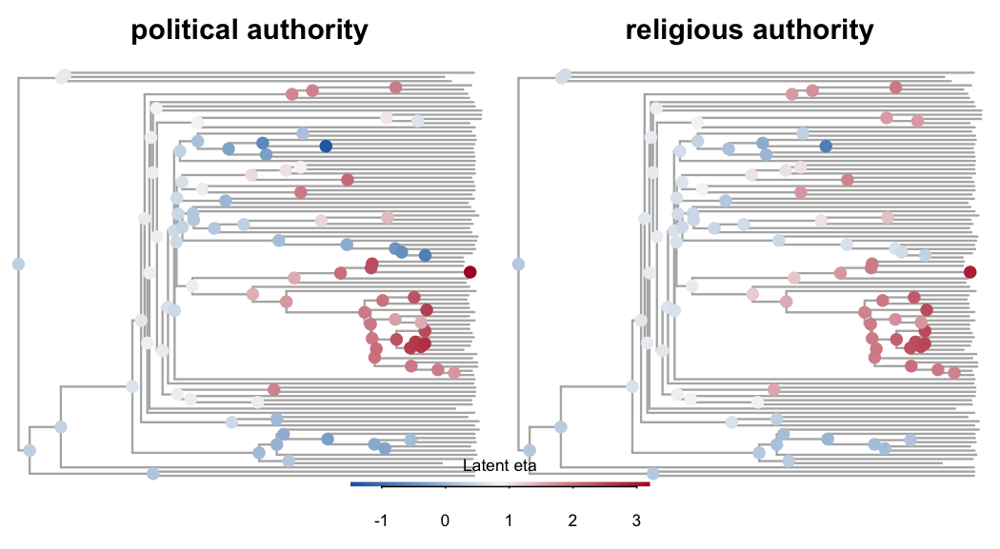
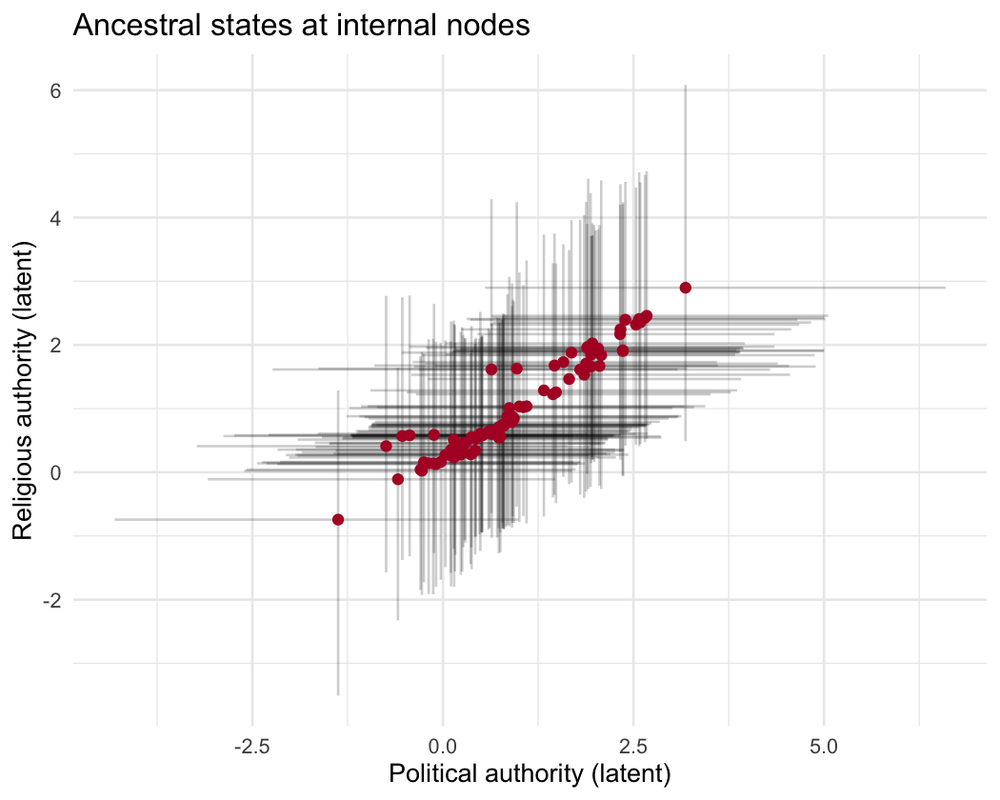
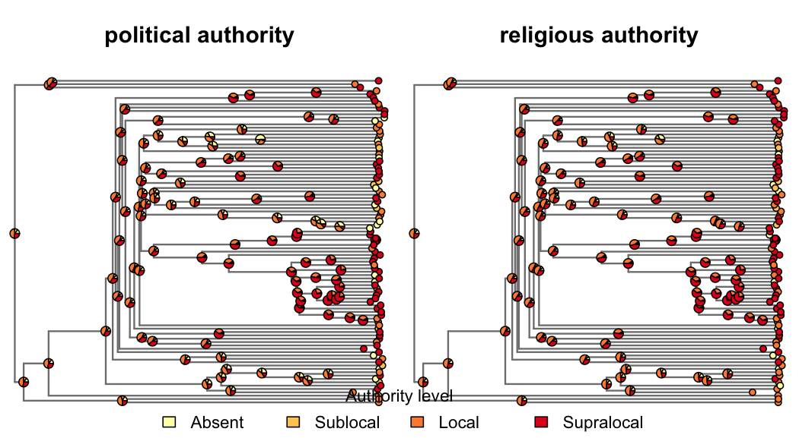
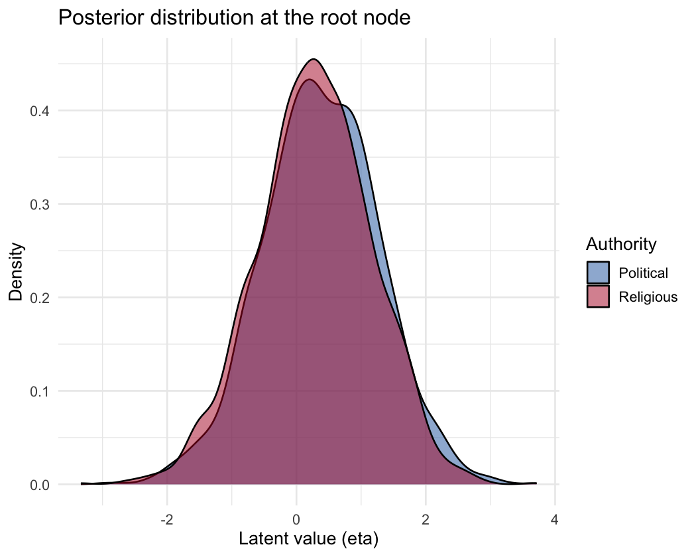
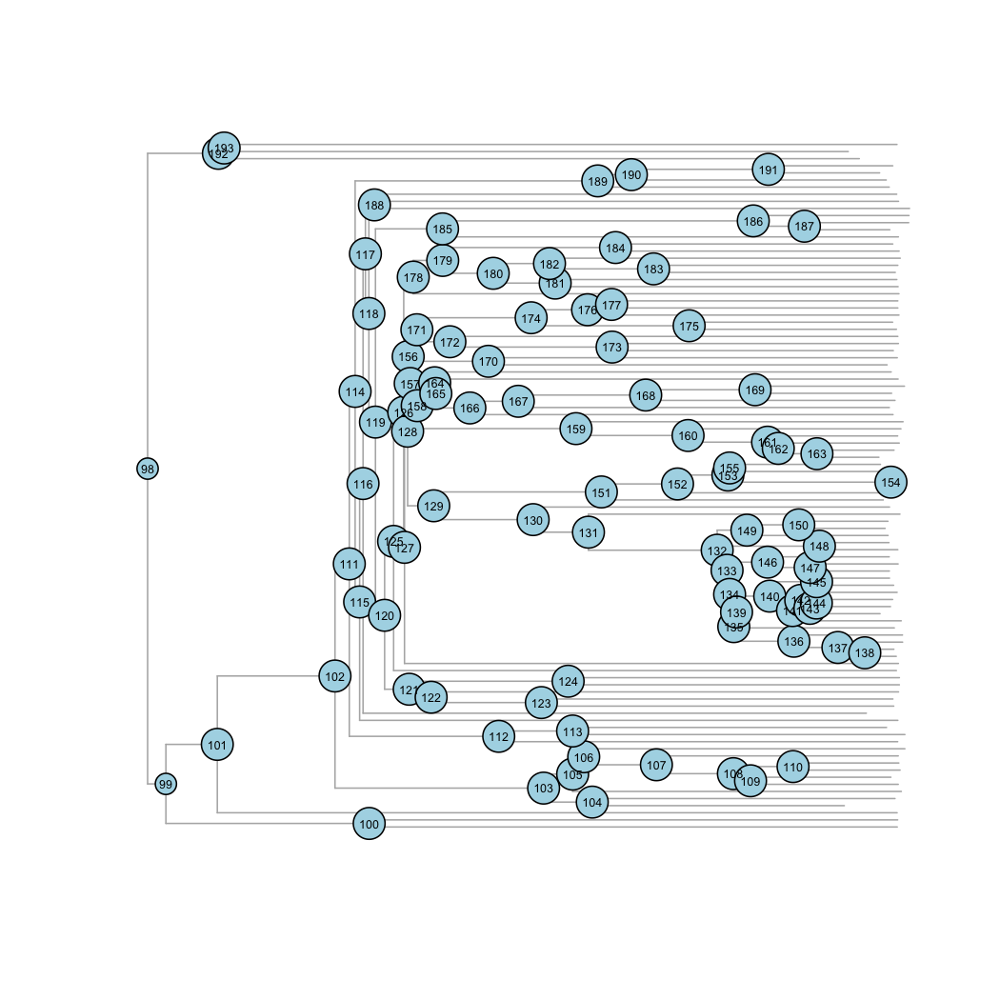

## Overview

The `coev_ancestral_states()` function extracts posterior estimates of latent
trait values at internal (ancestral) nodes of the phylogeny from a fitted
`coevfit` model. Because the model estimates latent states at every node in the
tree, ancestral state reconstruction is a natural byproduct of model fitting --
no separate analysis is needed.

This vignette demonstrates the function using the **authority** dataset bundled
with the package: political and religious authority among 97 Austronesian
societies.

## Setup


``` r
library(coevolve)
library(ggplot2)
library(dplyr)
library(tidyr)
library(ape)
theme_set(theme_minimal(base_size = 13))
```

## Fit the model

We fit a coevolutionary model with two ordered-logistic variables. For
demonstration purposes we use moderate sampling settings; in practice you would
want more iterations and to check convergence carefully.


``` r
fit <- coev_fit(
  data = authority$data,
  variables = list(
    political_authority = "ordered_logistic",
    religious_authority = "ordered_logistic"
  ),
  id = "language",
  tree = authority$phylogeny,
  parallel_chains = 4,
  chains = 4,
  iter_sampling = 500,
  iter_warmup = 500,
  seed = 42
)
```

```
Running MCMC with 4 parallel chains...

Chain 1 Iteration:   1 / 1000 [  0%]  (Warmup) 
Chain 2 Iteration:   1 / 1000 [  0%]  (Warmup) 
Chain 3 Iteration:   1 / 1000 [  0%]  (Warmup) 
Chain 4 Iteration:   1 / 1000 [  0%]  (Warmup) 
Chain 2 Iteration: 100 / 1000 [ 10%]  (Warmup) 
Chain 3 Iteration: 100 / 1000 [ 10%]  (Warmup) 
Chain 4 Iteration: 100 / 1000 [ 10%]  (Warmup) 
Chain 1 Iteration: 100 / 1000 [ 10%]  (Warmup) 
Chain 3 Iteration: 200 / 1000 [ 20%]  (Warmup) 
Chain 2 Iteration: 200 / 1000 [ 20%]  (Warmup) 
Chain 1 Iteration: 200 / 1000 [ 20%]  (Warmup) 
Chain 4 Iteration: 200 / 1000 [ 20%]  (Warmup) 
Chain 3 Iteration: 300 / 1000 [ 30%]  (Warmup) 
Chain 4 Iteration: 300 / 1000 [ 30%]  (Warmup) 
Chain 2 Iteration: 300 / 1000 [ 30%]  (Warmup) 
Chain 1 Iteration: 300 / 1000 [ 30%]  (Warmup) 
Chain 3 Iteration: 400 / 1000 [ 40%]  (Warmup) 
Chain 4 Iteration: 400 / 1000 [ 40%]  (Warmup) 
Chain 2 Iteration: 400 / 1000 [ 40%]  (Warmup) 
Chain 1 Iteration: 400 / 1000 [ 40%]  (Warmup) 
Chain 3 Iteration: 500 / 1000 [ 50%]  (Warmup) 
Chain 3 Iteration: 501 / 1000 [ 50%]  (Sampling) 
Chain 4 Iteration: 500 / 1000 [ 50%]  (Warmup) 
Chain 4 Iteration: 501 / 1000 [ 50%]  (Sampling) 
Chain 2 Iteration: 500 / 1000 [ 50%]  (Warmup) 
Chain 2 Iteration: 501 / 1000 [ 50%]  (Sampling) 
Chain 4 Iteration: 600 / 1000 [ 60%]  (Sampling) 
Chain 1 Iteration: 500 / 1000 [ 50%]  (Warmup) 
Chain 1 Iteration: 501 / 1000 [ 50%]  (Sampling) 
Chain 3 Iteration: 600 / 1000 [ 60%]  (Sampling) 
Chain 4 Iteration: 700 / 1000 [ 70%]  (Sampling) 
Chain 2 Iteration: 600 / 1000 [ 60%]  (Sampling) 
Chain 4 Iteration: 800 / 1000 [ 80%]  (Sampling) 
Chain 1 Iteration: 600 / 1000 [ 60%]  (Sampling) 
Chain 3 Iteration: 700 / 1000 [ 70%]  (Sampling) 
Chain 4 Iteration: 900 / 1000 [ 90%]  (Sampling) 
Chain 2 Iteration: 700 / 1000 [ 70%]  (Sampling) 
Chain 4 Iteration: 1000 / 1000 [100%]  (Sampling) 
Chain 4 finished in 80.5 seconds.
Chain 1 Iteration: 700 / 1000 [ 70%]  (Sampling) 
Chain 3 Iteration: 800 / 1000 [ 80%]  (Sampling) 
Chain 2 Iteration: 800 / 1000 [ 80%]  (Sampling) 
Chain 1 Iteration: 800 / 1000 [ 80%]  (Sampling) 
Chain 3 Iteration: 900 / 1000 [ 90%]  (Sampling) 
Chain 2 Iteration: 900 / 1000 [ 90%]  (Sampling) 
Chain 1 Iteration: 900 / 1000 [ 90%]  (Sampling) 
Chain 3 Iteration: 1000 / 1000 [100%]  (Sampling) 
Chain 3 finished in 104.4 seconds.
Chain 2 Iteration: 1000 / 1000 [100%]  (Sampling) 
Chain 2 finished in 108.4 seconds.
Chain 1 Iteration: 1000 / 1000 [100%]  (Sampling) 
Chain 1 finished in 110.1 seconds.

All 4 chains finished successfully.
Mean chain execution time: 100.8 seconds.
Total execution time: 110.2 seconds.
```

Quick check that the model sampled adequately:


``` r
summary(fit)
```

```
Variables: political_authority = ordered_logistic 
           religious_authority = ordered_logistic 
     Data: authority$data (Number of observations: 97)
Phylogeny: authority$phylogeny (Number of trees: 1)
    Draws: 4 chains, each with iter = 500; warmup = 500; thin = 1
           total post-warmup draws = 2000

Autoregressive selection effects:
                    Estimate Est.Error  2.5% 97.5% Rhat Bulk_ESS Tail_ESS
political_authority    -0.53      0.44 -1.64 -0.02 1.00     1420     1270
religious_authority    -0.60      0.48 -1.82 -0.03 1.00     1549     1137

Cross selection effects:
                                          Estimate Est.Error  2.5% 97.5% Rhat Bulk_ESS Tail_ESS
political_authority ⟶ religious_authority     1.50      0.74 -0.04  2.87 1.00      842     1055
religious_authority ⟶ political_authority     1.05      0.83 -0.62  2.64 1.00      701     1384

Drift parameters:
                                             Estimate Est.Error  2.5% 97.5% Rhat Bulk_ESS Tail_ESS
sd(political_authority)                          2.15      0.82  0.37  3.70 1.00      453      406
sd(religious_authority)                          1.46      0.82  0.13  3.10 1.01      416      887
cor(political_authority,religious_authority)     0.37      0.30 -0.35  0.85 1.00     1116     1360

Continuous time intercept parameters:
                    Estimate Est.Error  2.5% 97.5% Rhat Bulk_ESS Tail_ESS
political_authority     0.31      0.91 -1.55  2.12 1.00     2426     1337
religious_authority     0.31      0.91 -1.47  2.14 1.01     3135     1612

Ordinal cutpoint parameters:
                       Estimate Est.Error  2.5% 97.5% Rhat Bulk_ESS Tail_ESS
political_authority[1]    -1.44      0.88 -3.13  0.23 1.00     1266     1010
political_authority[2]    -0.70      0.86 -2.36  1.01 1.00     1418     1276
political_authority[3]     1.48      0.86 -0.20  3.19 1.00     1661     1415
religious_authority[1]    -1.59      0.92 -3.32  0.24 1.00     1424     1248
religious_authority[2]    -0.92      0.90 -2.61  0.87 1.00     1699     1531
religious_authority[3]     1.45      0.92 -0.24  3.28 1.00     1913     1488
```

```
Warning: There were 2 divergent transitions after warmup.
http://mc-stan.org/misc/warnings.html#divergent-transitions-after-warmup
```

## Ancestral states on the latent scale

The default call returns posterior summaries (median + 95% credible interval) for
all internal nodes on the latent (eta) scale:


``` r
asr_latent <- coev_ancestral_states(fit)
head(asr_latent)
```

```
# A tibble: 6 × 5
   node variable            estimate lower upper
  <int> <chr>                  <dbl> <dbl> <dbl>
1    98 political_authority    0.377 -1.44  2.15
2    98 religious_authority    0.292 -1.52  1.92
3    99 political_authority    0.363 -1.39  2.20
4    99 religious_authority    0.282 -1.44  1.87
5   100 political_authority    0.235 -1.94  2.44
6   100 religious_authority    0.276 -1.61  2.20
```

The result is a long-format tibble with one row per node-variable combination.
On the response scale (below), ordinal variables expand to one row per
node-variable-category and a `category` column identifies the level; this
column only appears for response-scale output. The `node` column uses ape's
numbering convention (tips are `1:N_tips`, internal nodes are
`(N_tips+1):(2*N_tips-1)`), so it integrates directly with phylo objects.

### Visualizing latent ancestral states on the tree

We can paint the tree with estimated ancestral values by mapping the posterior
median to a diverging color gradient. Blue indicates low latent values; red
indicates high:


``` r
tree <- attr(asr_latent, "ref_tree")
n_tips <- length(tree$tip.label)
asr_all <- coev_ancestral_states(fit, nodes = "all")

pal <- colorRampPalette(c("#2166AC", "#F7F7F7", "#B2182B"))(100)
rng <- range(asr_all$estimate)

# helper: map values onto the palette
to_color <- function(x) {
  pal[pmax(1, pmin(100, findInterval(x, seq(rng[1], rng[2], length.out = 101))))]
}

par(mfrow = c(1, 2), mar = c(2, 0, 2, 0))

for (var in unique(asr_all$variable)) {
  vals <- setNames(asr_all$estimate[asr_all$variable == var],
                   asr_all$node[asr_all$variable == var])
  plot(tree, show.tip.label = FALSE, edge.width = 1.5,
       edge.color = "grey70", main = gsub("_", " ", var))
  internal_ids <- (n_tips + 1):(n_tips + tree$Nnode)
  nodelabels(pch = 21, bg = to_color(vals[as.character(internal_ids)]),
             col = NA, cex = 1.2)
}

# shared color bar
par(fig = c(0.35, 0.65, 0.02, 0.18), new = TRUE, mar = c(1.8, 0, 1.1, 0))
image(seq(rng[1], rng[2], length.out = 100), 1,
      matrix(1:100), col = pal, axes = FALSE, xlab = "", ylab = "")
axis(1, cex.axis = 0.7, padj = -1, tck = -0.25)
mtext("Latent eta", side = 3, line = 0.2, cex = 0.7)
```

<div class="figure" style="text-align: center">

<p class="caption">plot of chunk asr-latent-tree</p>
</div>

### Joint latent-space scatterplot

We can also look at the joint distribution of ancestral states across the two
variables. Each point is an internal node, with crosshairs showing the 95%
credible interval:


``` r
asr_wide <- asr_latent |>
  select(node, variable, estimate, lower, upper) |>
  pivot_wider(
    names_from = variable,
    values_from = c(estimate, lower, upper)
  )

ggplot(asr_wide,
       aes(x = estimate_political_authority,
           y = estimate_religious_authority)) +
  geom_errorbar(
    aes(ymin = lower_religious_authority,
        ymax = upper_religious_authority),
    alpha = 0.2, width = 0
  ) +
  geom_errorbarh(
    aes(xmin = lower_political_authority,
        xmax = upper_political_authority),
    alpha = 0.2, height = 0
  ) +
  geom_point(color = "#B2182B", size = 2) +
  labs(
    x = "Political authority (latent)",
    y = "Religious authority (latent)",
    title = "Ancestral states at internal nodes"
  )
```

```
Warning: `geom_errorbarh()` was deprecated in ggplot2 4.0.0.
ℹ Please use the `orientation` argument of `geom_errorbar()` instead.
This warning is displayed once every 8 hours.
Call `lifecycle::last_lifecycle_warnings()` to see where this warning was generated.
```

```
`height` was translated to `width`.
```

<div class="figure" style="text-align: center">

<p class="caption">plot of chunk asr-latent-scatter</p>
</div>

## Ancestral states on the response scale

For ordered-logistic variables, the response scale returns estimated category
probabilities at each node -- how likely each level of authority (absent,
sublocal, local, supralocal) was at that ancestral node. Each ordinal variable
expands to one row per category, with `category` populated:


``` r
asr_resp <- coev_ancestral_states(
  fit, nodes = "all", scale = "response"
)
head(asr_resp, 8)
```

```
# A tibble: 8 × 6
   node variable            category estimate   lower upper
  <int> <chr>               <chr>       <dbl>   <dbl> <dbl>
1     1 political_authority cat_1      0.0442 0.00234 0.303
2     1 political_authority cat_2      0.0419 0.00264 0.193
3     1 political_authority cat_3      0.346  0.0455  0.587
4     1 political_authority cat_4      0.536  0.102   0.947
5     1 religious_authority cat_1      0.0348 0.00157 0.285
6     1 religious_authority cat_2      0.0284 0.00133 0.149
7     1 religious_authority cat_3      0.340  0.0352  0.607
8     1 religious_authority cat_4      0.581  0.106   0.960
```

The point estimate (`estimate`) is the posterior median for all rows,
consistent with the latent scale. Because medians do not distribute over
sums, the per-node category estimates need not sum exactly to 1. The `lower`
and `upper` columns are per-category posterior quantiles.

### Pie chart tree: response-scale probabilities

This is the most intuitive way to visualize ordinal ancestral states. Each pie
chart at an internal node shows the posterior probability of each category
(posterior medians, normalized to sum to 1). At the tips, observed values are
shown as solid colors (one category with probability 1). If a tip has missing
data, the model-estimated probabilities are shown instead.


``` r
cat_labels <- c("Absent", "Sublocal", "Local", "Supralocal")
cat_colors <- c("#FFFFB2", "#FECC5C", "#FD8D3C", "#E31A1C")
n_cats <- length(cat_labels)

# pivot ordinal-response long format -> per-node probability matrix
to_pie_mat <- function(df) {
  wide <- df |>
    select(node, category, estimate) |>
    pivot_wider(names_from = category, values_from = estimate) |>
    arrange(node)
  mat <- as.matrix(wide[, paste0("cat_", seq_len(n_cats))])
  mat / rowSums(mat)
}

par(mfrow = c(1, 2), mar = c(1, 0, 3, 0))

for (var in unique(asr_resp$variable)) {
  df_var <- asr_resp |> filter(variable == var)
  plot(tree, show.tip.label = FALSE, edge.width = 1.5,
       edge.color = "grey50", main = gsub("_", " ", var))
  # internal nodes: model-estimated category probabilities
  nodelabels(pie = to_pie_mat(filter(df_var, node > n_tips)),
             piecol = cat_colors, cex = 0.6)
  # tips: observed value (deterministic) when present, otherwise model estimate
  tip_pie <- to_pie_mat(filter(df_var, node <= n_tips))
  obs <- authority$data[[var]][match(tree$tip.label, authority$data$language)]
  observed <- !is.na(obs)
  tip_pie[observed, ] <- 0
  tip_pie[cbind(which(observed), as.integer(obs[observed]))] <- 1
  tiplabels(pie = tip_pie, piecol = cat_colors, cex = 0.4)
}

# shared legend
par(fig = c(0.2, 0.8, 0, 0.12), new = TRUE, mar = rep(0, 4))
plot.new()
legend("center", legend = cat_labels, fill = cat_colors, xpd = NA,
       horiz = TRUE, bty = "n", cex = 0.9, title = "Authority level")
```

<div class="figure" style="text-align: center">

<p class="caption">plot of chunk asr-pie-tree</p>
</div>

## Working with raw posterior draws

Setting `summary = FALSE` returns the full posterior array, which is useful for
custom summaries or propagating uncertainty:


``` r
asr_draws <- coev_ancestral_states(fit, summary = FALSE)
str(asr_draws, max.level = 1)
```

```
List of 4
 $ draws         : num [1:2000, 1:96, 1:2] 0.914 0.294 1.224 0.221 0.319 ...
  ..- attr(*, "dimnames")=List of 3
 $ ref_tree      :List of 5
  ..- attr(*, "class")= chr "phylo"
  ..- attr(*, "order")= chr "cladewise"
  ..- attr(*, "clade.credibility")= num -24.9
 $ node_ids      : int [1:96] 98 99 100 101 102 103 104 105 106 107 ...
 $ variable_names: chr [1:2] "political_authority" "religious_authority"
```

The `draws` element is a 3D array with dimensions `[draws, nodes, variables]`.
Here's an example: the posterior density of latent values at the root node for
both variables:


``` r
root_node_idx <- which(asr_draws$node_ids == n_tips + 1)

root_df <- data.frame(
  political_authority = asr_draws$draws[, root_node_idx, 1],
  religious_authority = asr_draws$draws[, root_node_idx, 2]
) |>
  pivot_longer(everything(), names_to = "variable", values_to = "eta")

ggplot(root_df, aes(x = eta, fill = variable)) +
  geom_density(alpha = 0.5) +
  scale_fill_manual(
    values = c(political_authority = "#2166AC",
               religious_authority = "#B2182B"),
    labels = c("Political", "Religious"),
    name = "Authority"
  ) +
  labs(
    x = "Latent value (eta)",
    y = "Density",
    title = "Posterior distribution at the root node"
  )
```

<div class="figure" style="text-align: center">

<p class="caption">plot of chunk asr-root-density</p>
</div>

## Identifying nodes on the tree

To query ancestral states for specific nodes, you first need to know their IDs.
Node numbering follows ape's convention: tips are `1:N_tips` and internal nodes
are `(N_tips + 1):(2 * N_tips - 1)`. The ape package provides everything needed
to display and select nodes -- for example, plotting the tree with internal
node IDs labelled:


``` r
plot(tree, show.tip.label = FALSE, edge.color = "grey70")
nodelabels(cex = 0.5, frame = "circle", bg = "lightblue")
```

<div class="figure" style="text-align: center">

<p class="caption">plot of chunk asr-node-labels</p>
</div>

In an interactive R session you can instead click directly on the plotted tree
to select nodes with `ape::identify.phylo()`:

``` r
plot(tree, show.tip.label = FALSE)
node <- identify(tree)$nodes
coev_ancestral_states(fit, nodes = node)
```

## Selecting specific nodes and variables

Once you know the node IDs, you can target specific nodes or variables to reduce
computation and focus the output:


``` r
# only religious authority, at three specific internal nodes
asr_sub <- coev_ancestral_states(
  fit,
  variables = "religious_authority",
  nodes = c(n_tips + 1, n_tips + 2, n_tips + 3)
)
asr_sub
```

```
# A tibble: 3 × 5
   node variable            estimate lower upper
  <int> <chr>                  <dbl> <dbl> <dbl>
1    98 religious_authority    0.292 -1.52  1.92
2    99 religious_authority    0.282 -1.44  1.87
3   100 religious_authority    0.276 -1.61  2.20
```
