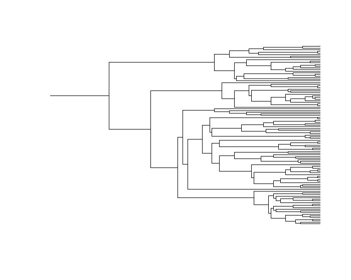
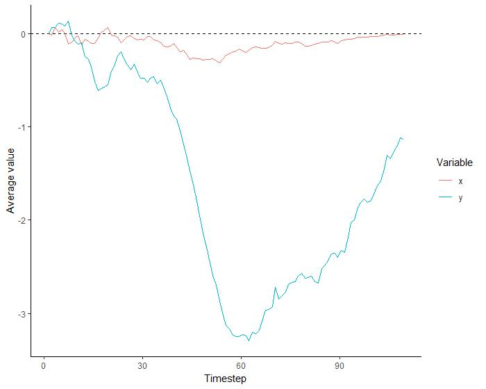
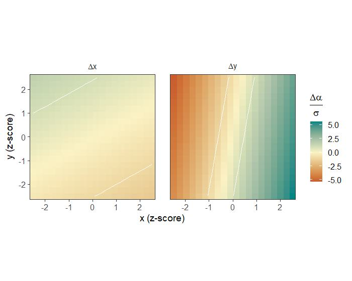
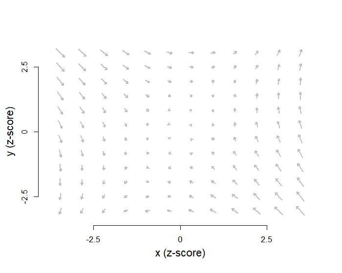

## Introduction

This vignette provides an introduction to the **coevolve** package. It briefly
describes the class of dynamic coevolutionary model that the package is designed
to fit. Then it runs through a working example, simulating data and showing that
the model can reconstruct the true coevolutionary process that generated the
data.

## The dynamic coevolutionary model

In the **coevolve** package, the main function is `coev_fit()`, which fits a
dynamic coevolutionary model to taxa variables given the phylogenetic
relationships among taxa. The model allows the user to determine whether
evolutionary change in one variable precedes evolutionary change in another
variable.

A full description of the dynamic coevolutionary model can be found in
[this pre-print](https://ecoevorxiv.org/repository/view/4119/). Briefly, the
model represents observed variables as latent variables that are allowed to
coevolve along an evolutionary time series. Coevolution unfolds according to a
stochastic differential equation similar to an Ornstein-Uhlenbeck process, which
contains both "selection" (tendency towards an optimum value) and "drift"
(exogenous Gaussian noise) components. Change in the latent variables depend
upon all other latent variables in the model and themselves, allowing users to
assess the directional influence of one variable on future change in another
variable.

Similar coevolutionary models are offered in programs like BayesTraits
(see [here](http://www.evolution.reading.ac.uk/BayesTraitsV4.1.1/BayesTraitsV4.1.1.html)).
However, these models are limited to a small number of discrete traits. The
**coevolve** package goes beyond these models by allowing the user to estimate
coevolutionary effects between any number of variables and a much wider range of
response distributions, including continuous, binary, ordinal, and count
distributions.

## Proof-of-concept simulation

To show the model in action, we can first simulate a dataset where we know the
true directional influence between variables. In the following simulation
(code not shown here for space reasons), we simulate the coevolution between two
continuous variables *x* and *y*, where changes in *x* influence future changes
in *y* but not vice versa.


```r
sim <- simulate_coevolution(seed = 1)
```

We can plot the phylogenetic tree tracking the evolution of different species
in this simulation.



We can also plot how the variables *x* and *y* coevolved over time. It is clear
from this that *x* does indeed have a large directional influence on *y* --
even a small decrease in *x* results in a large subsequent decrease in *y*, and
then when *x* begins to climb again, so does *y*.



We then end up with the following observed data for *x* and *y* at the tips of
the tree.


```r
glimpse(sim$data)
```

```
Rows: 109
Columns: 3
$ species <chr> "t1", "t2", "t3", "t4", "t5", "t6", "t7", "t8", "t102", "t9", "t10", "t11",…
$ x       <dbl> 1.89644400, 0.55655060, 0.27149439, 0.64883493, -2.32384628, 2.20387164, -0…
$ y       <dbl> 1.50080870, -0.26959519, 0.69695012, 0.17260053, -1.07087054, 2.00995784, 0…
```

We can fit our dynamic coevolutionary model to this dataset. We specify that *x*
and *y* are both continuous variables, feed in our simulated data and phylogeny,
and indicate which column in the dataset matches the tip labels on the tree. We
also define additional arguments for running the model in `cmdstanr`, which
happens behind the scenes.


```r
library(coevolve)

fit <-
  coev_fit(
    data = sim$data,
    variables = list(
      x = "normal",
      y = "normal"
    ),
    id = "species",
    tree = sim$tree,
    # additional arguments for cmdstanr
    parallel_chains = 4,
    iter_warmup = 1000,
    iter_sampling = 1000,
    refresh = 0,
    seed = 1
  )
```


We can then inspect the model results.


```r
summary(fit)
```

```
Variables: x = normal 
           y = normal 
     Data: sim$data (Number of observations: 109)
    Draws: 4 chains, each with iter = 1000; warmup = 1000; thin = 1
           total post-warmup draws = 4000

Autoregressive selection effects:
  Estimate Est.Error  2.5% 97.5% Rhat Bulk_ESS Tail_ESS
x    -0.45      0.77 -2.14  0.91 1.00     1532      787
y    -1.03      0.69 -2.57  0.18 1.00     3261     1906

Cross selection effects:
      Estimate Est.Error  2.5% 97.5% Rhat Bulk_ESS Tail_ESS
x ⟶ y     3.81      1.09  1.70  5.87 1.00      811     1354
y ⟶ x     0.68      0.81 -0.90  2.32 1.00     1538     1940

Drift scale parameters:
  Estimate Est.Error 2.5% 97.5% Rhat Bulk_ESS Tail_ESS
x     0.62      0.05 0.53  0.72 1.00     2415     2776
y     0.43      0.05 0.33  0.52 1.00      831      952

Continuous time intercept parameters:
  Estimate Est.Error  2.5% 97.5% Rhat Bulk_ESS Tail_ESS
x     0.08      0.50 -0.92  1.05 1.00     1967      741
y    -0.06      0.83 -1.67  1.65 1.00     1511      699
```

The model confirms the true coevolutionary relationship. We correctly infer that
changes in *x* precede changes in *y*, but not vice versa.

We can visualise the posterior densities for the two cross-effects.


```r
coev_plot_cross(fit)
```


We can also visualise the coevolutionary dynamics with a selection gradient
heatmap, where increasing green indicates positive selection, increasing red
indicates negative selection, and the area between the white contour lines
indicates where deterministic selection on a trait is weaker than stochastic
drift.


```r
coev_plot_selection_gradient(fit, var1 = "x", var2 = "y", contour = TRUE)
```



Finally, we can visualise the coevolutionary dynamics with a flowfield, with
arrows indicating the direction of evolutionary change at different combinations
of *x* and *y*.


```r
coev_plot_flowfield(fit, var1 = "x", var2 = "y")
```



These visualisations confirm our inference that changes in *x* precede changes
in *y*, but not vice versa.
