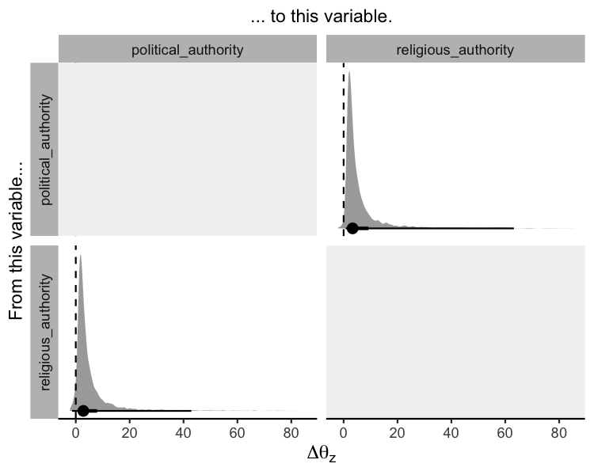
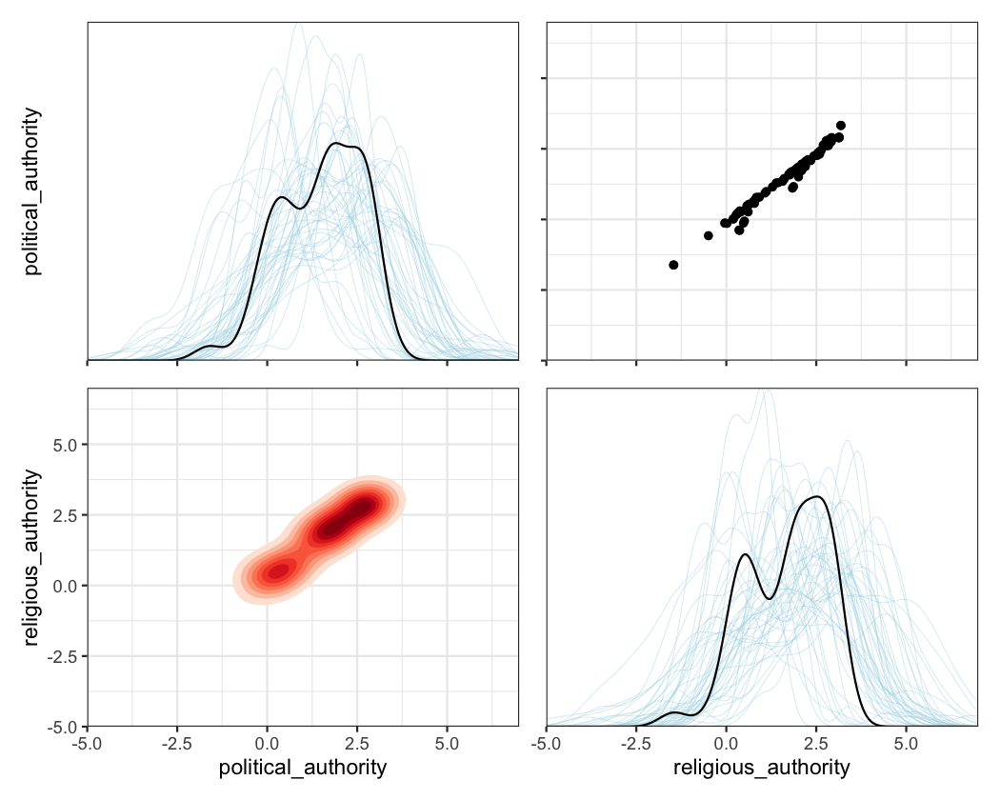
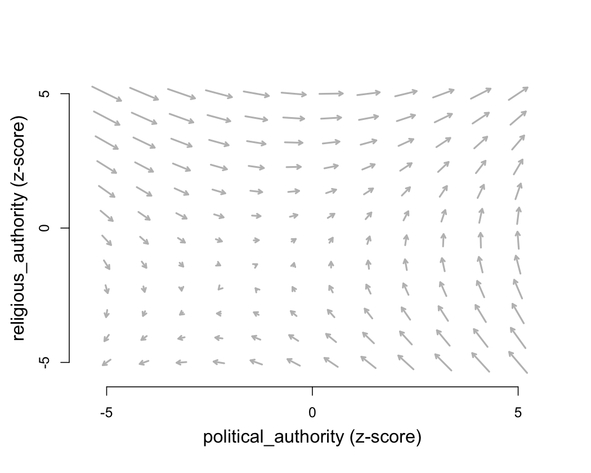
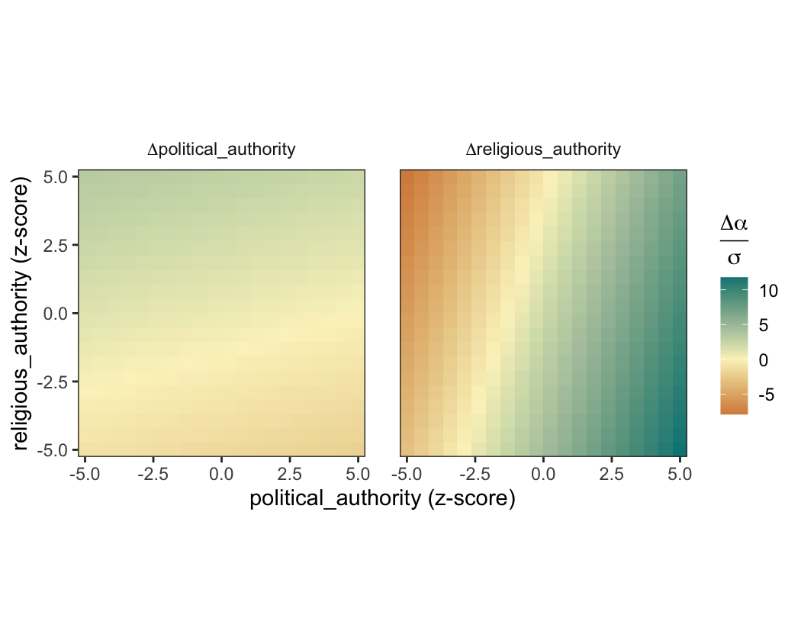
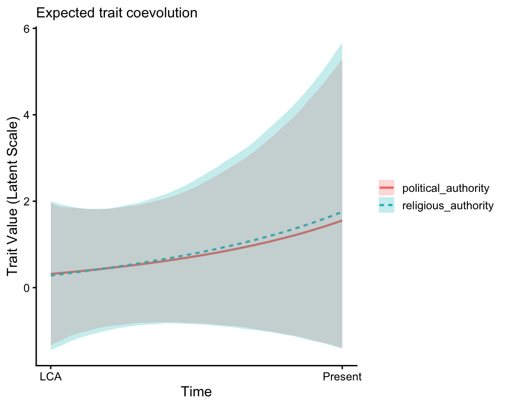
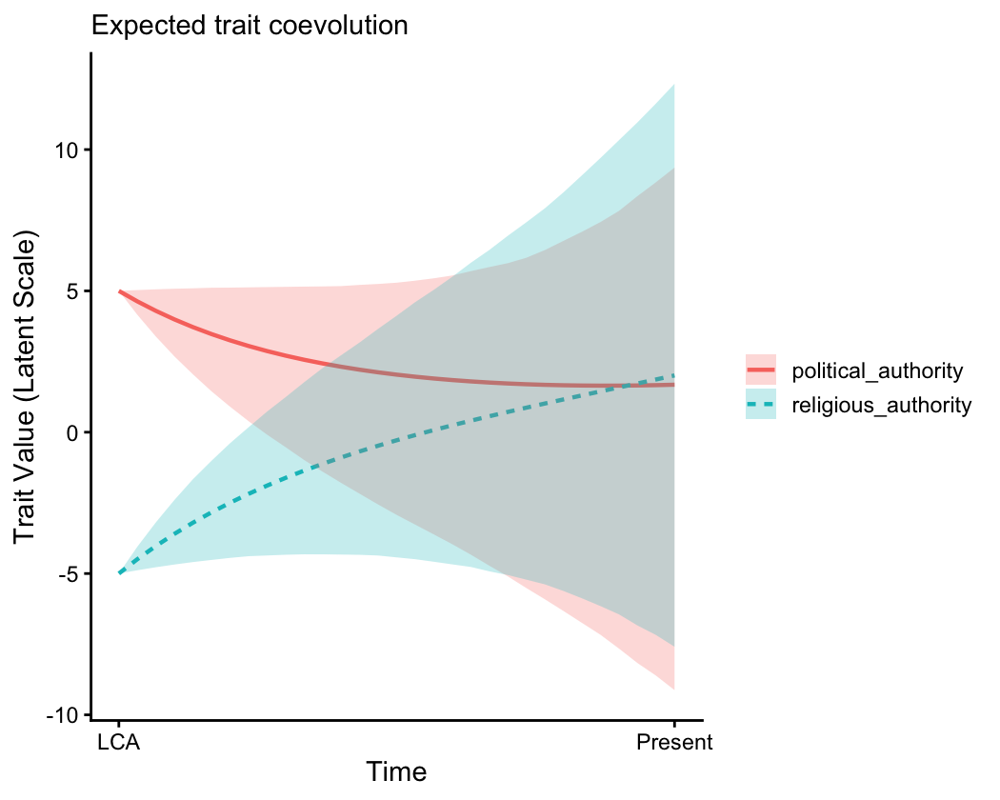

```{r srr-tags, eval = FALSE, echo = FALSE}
#' srr_standards_in_readme
#'
#' @srrstats {BS1.2, BS1.2b} This vignette contains examples of specifying prior
#'   distributions
#' @srrstats {BS1.4, BS4.3} This vignette contains a model summary output with
#'   Rhat and effective sample size statistics for checking convergence
```

## Introduction

This vignette provides an introduction to the **coevolve** package. It briefly
describes the class of generalized dynamic phylogenetic models (GDPMs) that the
package is designed to fit. It then runs through several working examples to
showcase features of the package, including models with different response
distributions, missing data, repeated observations, multiPhylo tree objects, and
controls for spatial location.

## The generalized dynamic phylogenetic model

In the **coevolve** package, the main function is `coev_fit()`, which fits a
generalized dynamic phylogenetic model to taxa variables given the phylogenetic
relationships among taxa. The model allows the user to determine whether
evolutionary change in one variable precedes evolutionary change in another
variable.

A full description of the model can be found in
[this pre-print](https://ecoevorxiv.org/repository/view/4119/). Briefly, the
model represents observed variables as latent variables that are allowed to
coevolve along an evolutionary time series. Coevolution unfolds according to a
stochastic differential equation similar to an Ornstein-Uhlenbeck process, which
contains both "selection" (tendency towards an optimum value) and "drift"
(exogenous Gaussian noise) components. Change in the latent variables depend
upon all other latent variables in the model and themselves, allowing users to
assess the directional influence of one variable on future change in another
variable.

Similar dynamic coevolutionary models are offered in programs like BayesTraits
(see [here](http://www.evolution.reading.ac.uk/BayesTraitsV4.1.1/BayesTraitsV4.1.1.html)).
However, these models are limited to a small number of discrete traits. The
**coevolve** package goes beyond these models by allowing the user to estimate
coevolutionary effects between any number of variables and a much wider range of
response distributions, including continuous, binary, ordinal, and count
distributions.

## A working example

To show the model in action, we will use data on political and religious
authority among 97 Austronesian societies. Political and religious authority are
both four-level ordinal variables representing whether each type of authority is
absent (not present above the household level), sublocal (incorporating a group
larger than the household but smaller than the local community), local
(incorporating the local community) and supralocal (incorporating more than one
local community). These data were compiled by Sheehan et al. (2023).


``` r
library(coevolve)
head(authority$data)
```

```
        language political_authority religious_authority
1          Aiwoo            Sublocal            Sublocal
2          Alune          Supralocal          Supralocal
3 AnejomAneityum          Supralocal          Supralocal
4          Anuta               Local               Local
5          Atoni          Supralocal          Supralocal
6          Baree               Local               Local
```

Each society is on a separate row and is linked to a different Austronesian
language. These languages can be represented on a linguistic phylogeny (see
`authority$phylogeny`). We are interested in using this phylogeny to understand
how political and religious authority have coevolved over the course of
Austronesian cultural evolution.

To fit the generalized dynamic phylogenetic model, we use the `coev_fit()`
function. Internally, this function builds the Stan code, builds a data list,
and then compiles and fits the model using the
[cmdstanr](https://mc-stan.org/cmdstanr/) package. Users can run these steps
one-by-one using the `coev_make_stancode()` and `coev_make_standata()`
functions, but for brevity we just use the `coev_fit()` function.


``` r
fit1 <-
  coev_fit(
    data = authority$data,
    variables = list(
      political_authority = "ordered_logistic",
      religious_authority = "ordered_logistic"
    ),
    id = "language",
    tree = authority$phylogeny,
    # set manual prior
    prior = list(A_offdiag = "normal(0, 2)"),
    # return log likelihood
    log_lik = TRUE,
    # additional arguments for cmdstanr
    parallel_chains = 4,
    iter_sampling = 2000,
    iter_warmup = 2000,
    refresh = 0,
    seed = 1
  )
```

```
Running MCMC with 4 parallel chains...

Chain 3 finished in 554.7 seconds.
Chain 4 finished in 706.9 seconds.
Chain 1 finished in 725.2 seconds.
Chain 2 finished in 757.4 seconds.

All 4 chains finished successfully.
Mean chain execution time: 686.0 seconds.
Total execution time: 757.6 seconds.
```

The function takes several arguments, including a dataset, a named list of
variables that we would like to coevolve in the model (along with their
associated response distributions), the column in the dataset that links to
the phylogeny tip labels, and a phylogeny of class `phylo`. The function sets
priors for the parameters by default, but it is possible for the user to
manually set these priors. The user can also pass additional arguments to
cmdstanr's `sample()` method which runs under the hood.

Once the model has fitted, we can print a summary of the parameters.


``` r
summary(fit1)
```

```
Variables: political_authority = ordered_logistic 
           religious_authority = ordered_logistic 
     Data: authority$data (Number of observations: 97)
Phylogeny: authority$phylogeny (Number of trees: 1)
    Draws: 4 chains, each with iter = 2000; warmup = 2000; thin = 1
           total post-warmup draws = 8000

Autoregressive selection effects:
                    Estimate Est.Error  2.5% 97.5% Rhat Bulk_ESS Tail_ESS
political_authority    -0.65      0.52 -1.95 -0.03 1.00     4343     4203
religious_authority    -0.79      0.59 -2.15 -0.03 1.00     5225     3876

Cross selection effects:
                                          Estimate Est.Error  2.5% 97.5% Rhat Bulk_ESS Tail_ESS
political_authority ⟶ religious_authority     2.33      0.98  0.44  4.29 1.00     3328     3594
religious_authority ⟶ political_authority     1.74      1.09 -0.32  3.91 1.00     2109     4686

Drift parameters:
                                             Estimate Est.Error  2.5% 97.5% Rhat Bulk_ESS Tail_ESS
sd(political_authority)                          1.98      0.84  0.21  3.54 1.00     1272     1261
sd(religious_authority)                          1.25      0.79  0.06  2.92 1.00     1640     3283
cor(political_authority,religious_authority)     0.25      0.31 -0.42  0.77 1.00     4837     5973

Continuous time intercept parameters:
                    Estimate Est.Error  2.5% 97.5% Rhat Bulk_ESS Tail_ESS
political_authority     0.21      0.94 -1.64  2.01 1.00     8830     5761
religious_authority     0.29      0.93 -1.54  2.11 1.00    10528     5870

Ordinal cutpoint parameters:
                       Estimate Est.Error  2.5% 97.5% Rhat Bulk_ESS Tail_ESS
political_authority[1]    -1.32      0.88 -3.04  0.45 1.00     5327     4841
political_authority[2]    -0.56      0.85 -2.23  1.14 1.00     6127     5424
political_authority[3]     1.63      0.88 -0.03  3.44 1.00     7270     5857
religious_authority[1]    -1.50      0.92 -3.26  0.33 1.00     6697     5991
religious_authority[2]    -0.82      0.90 -2.53  1.00 1.00     6992     6041
religious_authority[3]     1.63      0.93 -0.11  3.51 1.00     7742     6728
```

```
Warning: There were 14 divergent transitions after warmup.
http://mc-stan.org/misc/warnings.html#divergent-transitions-after-warmup
```

We can see a printed summary of the model parameters, including the
autoregressive effects (i.e., the effects of variables on themselves in the
future), the cross effects (i.e., the effects of variables on the other
variables in the future), the amount of drift, correlated drift, the continuous
time intercepts for the stochastic differential equation, and the ordinal
cutpoints for both variables.

While the summary output is useful, it is difficult to interpret the
parameters directly to make inferences about coevolutionary patterns. An
alternative approach is to directly "intervene" in the system. By doing this,
we can better understand how increases or decreases in a variable change the
equilibrium trait values of other variables in the system. For example, we can
hold one variable at its average value and then increase it by a standardised
amount to see how the equilibrium value for the other trait changes.

The function `coev_calculate_delta_theta()` allows the user to calculate
$\Delta\theta_{z}$, which is defined as the change in the equilibrium trait
value for one variable which results from a median absolute deviation increase
in another variable. This function returns a posterior distribution. We can
easily visualise the posterior distributions for all cross effects at once using
the function `coev_plot_delta_theta()`.


``` r
coev_plot_delta_theta(fit1)
```

<div class="figure" style="text-align: center">

</div>

This plot shows the posterior distribution, the posterior median, and the 66%
and 95% credible intervals for $\Delta\theta_{z}$. We can conclude that
political and religious authority both influence each other in their evolution.
A one median absolute deviation increase in political authority results in an
increase in the equilibrium trait value for religious authority, and vice versa.
In other words, these two variables coevolve reciprocally over time.

There are several ways to visualise this runaway coevolutionary process: (1) a
flow field of evolutionary change, (2) a selection gradient plot, and (3) a time
series simulation of evolutionary dynamics. In order to make these various plots
more understandable, it is useful to first plot where the different taxa are
situated in latent trait space. We can do this using the
`coev_plot_trait_values()` function, which produces a pairs plot of estimated
trait values for all the variables in the model (along with associated posterior
uncertainty on the diagonal).


``` r
coev_plot_trait_values(fit1, xlim = c(-5, 7), ylim = c(-5, 7))
```

<div class="figure" style="text-align: center">

</div>

Now that we have a good sense of the trait space, we can plot a flow field of
evolutionary change. The `coev_plot_flowfield()` function plots the strength and
direction of evolutionary change at different locations in trait space.


``` r
coev_plot_flowfield(
  object = fit1,
  var1 = "political_authority",
  var2 = "religious_authority",
  limits = c(-5, 5)
  )
```

<div class="figure" style="text-align: center">

</div>

The arrows in this plot tend to point towards the upper right-hand corner,
suggesting that political and religious authority evolve towards higher levels
in a runaway coevolutionary process.

We can also visualise the coevolutionary dynamics with a selection gradient
plot. The function `coev_plot_selection_gradient()` produces a heatmap which
shows how selection acts on both variables at different locations in trait
space, with green indicating positive selection and red indicating negative
selection.


``` r
coev_plot_selection_gradient(
  object = fit1,
  var1 = "political_authority",
  var2 = "religious_authority",
  limits = c(-5, 5)
)
```

<div class="figure" style="text-align: center">

</div>

We can see from this plot that as each variable increases, the selection on the
other variable increases.

Finally, we can "replay the past" by simulating these coevolutionary dynamics
over a time series. By default, the `coev_plot_pred_series()` function uses the
model-implied ancestral states at the root of the phylogeny as starting points,
and allows the variables to coevolve over time. Shaded areas represent 95%
credible intervals for the predictions.


``` r
coev_plot_pred_series(fit1)
```

<div class="figure" style="text-align: center">

</div>

It is also possible to initialise the variables at different starting points, to
see the implied coevolutionary dynamics. For example, we can imagine a case
where the ancestral society had high levels of political authority but low
levels of religious authority.


``` r
coev_plot_pred_series(
  object = fit1,
  eta_anc = list(
    political_authority = 5,
    religious_authority = -5
  )
)
```

<div class="figure" style="text-align: center">

</div>

## Available response distributions

In the above example, both variables were ordinal. As such, we declared both of
them to follow the "ordered_logistic" response distribution. But the
**coevolve** package supports several more response distributions.


| Response distribution      | Data type       | Link function  |
|----------------------------|-----------------|----------------|
| bernoulli_logit            | Binary          | Logit          |
| ordered_logistic           | Ordinal         | Logit          |
| poisson_softplus           | Count           | Softplus       |
| negative_binomial_softplus | Count           | Softplus       |
| normal                     | Continuous real | -              |
| gamma_log                  | Positive real   | Log            |

Different variables need not follow the same response distribution. This can be
useful when users would like to assess the coevolution between variables of
different types.

## Handling missing data

Often in comparative datasets, data will be missing for some taxa. Rather
than remove cases if they have any missing data, the `coev_fit()` function will
automatically impute any missing values in the model, using all available
information.

We show this by modelling the coevolutionary relationships between brain weight
and group size across 21 primate species from the Lemuriformes clade. Data on
primate species were compiled by DeCasien et al. (2017). There are data for 143
primate species in total, but we focus on one clade to keep the example small
and simple.


``` r
# filter dataset to Lemuriformes only
primates_data <- primates$data[primates$data$clade == "Lemuriformes",]

# prune phylogeny to Lemuriformes only
library(ape)
primates_phylogeny <- keep.tip(primates$phylogeny, primates_data$species)

# view data
head(primates_data[, c("species", "brain_weight", "group_size")])
```

```
                        species brain_weight group_size
13                Avahi_laniger    10.251355   2.666667
14           Avahi_occidentalis     8.236200         NA
44           Cheirogaleus_major     6.119797   5.500000
45          Cheirogaleus_medius     2.912291   2.000000
54 Daubentonia_madagascariensis    46.344725   1.750000
56            Eulemur_coronatus    21.394398   6.950000
```

Both variables are positive reals, so we use the "gamma_log" distribution. While
there are no missing data for the brain weight variable, some data are missing
for the group size variable.


``` r
fit2 <-
  coev_fit(
    data = primates_data,
    variables = list(
      brain_weight = "gamma_log",
      group_size = "gamma_log"
    ),
    id = "species",
    tree = primates_phylogeny,
    # additional arguments for cmdstanr
    parallel_chains = 4,
    iter_sampling = 2000,
    iter_warmup = 2000,
    refresh = 0,
    seed = 1
  )
```

```
Running MCMC with 4 parallel chains...

Chain 1 finished in 208.7 seconds.
Chain 3 finished in 217.3 seconds.
Chain 4 finished in 226.4 seconds.
Chain 2 finished in 288.3 seconds.

All 4 chains finished successfully.
Mean chain execution time: 235.2 seconds.
Total execution time: 288.4 seconds.
```


``` r
summary(fit2)
```

```
Variables: brain_weight = gamma_log 
           group_size = gamma_log 
     Data: primates_data (Number of observations: 21)
Phylogeny: primates_phylogeny (Number of trees: 1)
    Draws: 4 chains, each with iter = 2000; warmup = 2000; thin = 1
           total post-warmup draws = 8000

Autoregressive selection effects:
             Estimate Est.Error  2.5% 97.5% Rhat Bulk_ESS Tail_ESS
brain_weight    -0.44      0.36 -1.33 -0.01 1.00     5487     2827
group_size      -0.76      0.52 -1.95 -0.04 1.00     4512     3041

Cross selection effects:
                          Estimate Est.Error  2.5% 97.5% Rhat Bulk_ESS Tail_ESS
brain_weight ⟶ group_size     0.27      0.79 -1.43  1.69 1.00     2327     3530
group_size ⟶ brain_weight     0.95      1.00 -0.97  3.09 1.01      738      287

Drift parameters:
                             Estimate Est.Error  2.5% 97.5% Rhat Bulk_ESS Tail_ESS
sd(brain_weight)                 1.05      0.24  0.62  1.56 1.00     1850     2491
sd(group_size)                   0.73      0.45  0.04  1.68 1.01      773     1213
cor(brain_weight,group_size)     0.08      0.30 -0.52  0.64 1.00     2192      959

Continuous time intercept parameters:
             Estimate Est.Error  2.5% 97.5% Rhat Bulk_ESS Tail_ESS
brain_weight    -0.34      0.78 -1.83  1.20 1.00     5466     5389
group_size      -1.03      0.83 -2.53  0.65 1.00     2964     4869

Shape parameters:
             Estimate Est.Error 2.5%  97.5% Rhat Bulk_ESS Tail_ESS
brain_weight    57.43     55.36 5.13 207.68 1.01      561     1199
group_size       7.10     15.67 1.42  41.76 1.01      689      520
```

```
Warning: There were 404 divergent transitions after warmup.
http://mc-stan.org/misc/warnings.html#divergent-transitions-after-warmup
```

Notice that the number of observations is still 21 in the summary output,
informing us that all observations were retained and any missing data were
imputed.

If we wanted instead to remove any taxa with missing data, we could set
`complete_cases = TRUE` when fitting the model.

## Repeated observations

Another common feature of comparative datasets is repeated observations. In the
previous examples, we had only one observation per taxon. But often there will
be more than one observation for each taxon, such as when we have observed
multiple individuals of the same species. In these cases, it can be useful to
include all of these observations in the model and estimate the residual
variation that is not due to the coevolutionary process.

We show this using an example dataset from de Villemereuil & Nakagawa (2014).
Suppose we have measured two continuous variables ($x$ and $y$) for 20 species,
with five observations for each species.


``` r
head(repeated$data)
```

```
  species         x         y
1    sp_1 11.223724 107.41919
2    sp_1  9.805934 109.16403
3    sp_1 10.308423  91.88672
4    sp_1  8.355349 121.54341
5    sp_1 11.854510 105.31638
6    sp_2  4.314015  64.99859
```

We can fit the dynamic coevolutionary model to this dataset.


``` r
fit3 <-
  coev_fit(
    data = repeated$data,
    variables = list(
      x = "normal",
      y = "normal"
    ),
    id = "species",
    tree = repeated$phylogeny,
    # additional arguments for cmdstanr
    parallel_chains = 4,
    iter_warmup = 2000,
    iter_sampling = 2000,
    refresh = 0,
    seed = 1
  )
```

```
Running MCMC with 4 parallel chains...

Chain 3 finished in 261.3 seconds.
Chain 4 finished in 363.7 seconds.
Chain 2 finished in 376.8 seconds.
Chain 1 finished in 386.7 seconds.

All 4 chains finished successfully.
Mean chain execution time: 347.1 seconds.
Total execution time: 386.8 seconds.
```


``` r
summary(fit3)
```

```
Variables: x = normal 
           y = normal 
     Data: repeated$data (Number of observations: 100)
Phylogeny: repeated$phylogeny (Number of trees: 1)
    Draws: 4 chains, each with iter = 2000; warmup = 2000; thin = 1
           total post-warmup draws = 8000

Autoregressive selection effects:
  Estimate Est.Error  2.5% 97.5% Rhat Bulk_ESS Tail_ESS
x    -1.58      0.77 -3.17 -0.21 1.00     5111     3604
y    -1.34      0.71 -2.85 -0.15 1.00     5223     3187

Cross selection effects:
      Estimate Est.Error  2.5% 97.5% Rhat Bulk_ESS Tail_ESS
x ⟶ y     0.42      0.86 -1.27  2.10 1.00     7501     6161
y ⟶ x     0.04      0.85 -1.65  1.71 1.00     7967     6517

Drift parameters:
         Estimate Est.Error 2.5% 97.5% Rhat Bulk_ESS Tail_ESS
sd(x)        2.93      0.32 2.37  3.60 1.00     5491     5809
sd(y)        2.58      0.29 2.05  3.21 1.00     5128     6351
cor(x,y)     0.87      0.06 0.71  0.96 1.00     3770     4970

Continuous time intercept parameters:
  Estimate Est.Error  2.5% 97.5% Rhat Bulk_ESS Tail_ESS
x    -0.06      0.78 -1.61  1.46 1.00     8432     5963
y     0.04      0.76 -1.48  1.53 1.00     9003     5867

Residual parameters:
         Estimate Est.Error  2.5% 97.5% Rhat Bulk_ESS Tail_ESS
sd(x)        0.28      0.02  0.23  0.32 1.00     9704     5265
sd(y)        0.29      0.02  0.25  0.34 1.00    10692     5832
cor(x,y)    -0.18      0.10 -0.38  0.02 1.00     8699     5553
```

```
Warning: There were 30 divergent transitions after warmup.
http://mc-stan.org/misc/warnings.html#divergent-transitions-after-warmup
```

In the model output, we can see that `coev_fit()` has detected the presence of
repeated observations and has consequently modelled residual standard deviation
and residual correlation parameters for $x$ and $y$.

## Using multiPhylo tree objects

Often, we would like to average our analysis over a posterior set of
phylogenetic trees, rather than use a single tree. This can be a useful way to
account for phylogenetic uncertainty in our inferences.

To deal with phylogenetic uncertainty, the `coev_fit()` function allows the user
to declare multiPhylo objects in the `tree` argument. So long as all trees in
the multiPhylo object have the same number of taxa with the same tip labels,
the Stan code will average over all the trees within the same model.

To keep the computation time short, we imagine a simple case where we have a
multiPhylo object with two identical Austronesian language phylogenies. While
the results should be the same in this case as there is no phylogenetic
uncertainty, users should expect differing results when using sets of different
trees.


``` r
authority_multiphylo <- c(
  authority$phylogeny,
  authority$phylogeny
)

authority_multiphylo
```

```
2 phylogenetic trees
```


``` r
fit4 <-
  coev_fit(
    data = authority$data,
    variables = list(
      political_authority = "ordered_logistic",
      religious_authority = "ordered_logistic"
    ),
    id = "language",
    # use multiPhylo tree object
    tree = authority_multiphylo,
    # set manual prior
    prior = list(A_offdiag = "normal(0, 2)"),
    # additional arguments for cmdstanr
    parallel_chains = 4,
    iter_sampling = 2000,
    iter_warmup = 2000,
    refresh = 0,
    seed = 1
  )
```

```
Running MCMC with 4 parallel chains...

Chain 4 finished in 605.2 seconds.
Chain 3 finished in 606.7 seconds.
Chain 2 finished in 616.3 seconds.
Chain 1 finished in 618.8 seconds.

All 4 chains finished successfully.
Mean chain execution time: 611.7 seconds.
Total execution time: 618.8 seconds.
```


``` r
summary(fit4)
```

```
Variables: political_authority = ordered_logistic 
           religious_authority = ordered_logistic 
     Data: authority$data (Number of observations: 97)
Phylogeny: authority_multiphylo (Number of trees: 2)
    Draws: 4 chains, each with iter = 2000; warmup = 2000; thin = 1
           total post-warmup draws = 8000

Autoregressive selection effects:
                    Estimate Est.Error  2.5% 97.5% Rhat Bulk_ESS Tail_ESS
political_authority    -0.64      0.52 -1.92 -0.02 1.00     5613     3516
religious_authority    -0.71      0.55 -2.06 -0.03 1.00     7194     4247

Cross selection effects:
                                          Estimate Est.Error 2.5% 97.5% Rhat Bulk_ESS Tail_ESS
political_authority ⟶ religious_authority     2.16      1.03 0.45  4.45 1.00     2989     4592
religious_authority ⟶ political_authority     2.00      1.03 0.21  4.26 1.00     2504     3559

Drift parameters:
                                             Estimate Est.Error  2.5% 97.5% Rhat Bulk_ESS Tail_ESS
sd(political_authority)                          1.09      0.82  0.04  2.89 1.00      913     3153
sd(religious_authority)                          0.89      0.68  0.04  2.52 1.00     1426     3101
cor(political_authority,religious_authority)     0.04      0.34 -0.61  0.67 1.00     5369     5862

Continuous time intercept parameters:
                    Estimate Est.Error  2.5% 97.5% Rhat Bulk_ESS Tail_ESS
political_authority     0.34      0.90 -1.45  2.03 1.00    10239     6144
religious_authority     0.45      0.91 -1.36  2.24 1.00    10524     6090

Ordinal cutpoint parameters:
                       Estimate Est.Error  2.5% 97.5% Rhat Bulk_ESS Tail_ESS
political_authority[1]    -1.49      0.91 -3.35  0.24 1.00     5995     5599
political_authority[2]    -0.76      0.89 -2.56  0.95 1.00     6697     5828
political_authority[3]     1.92      0.92  0.16  3.80 1.00     8514     5958
religious_authority[1]    -1.82      0.88 -3.58 -0.11 1.00     6588     5984
religious_authority[2]    -1.14      0.86 -2.84  0.54 1.00     7245     6132
religious_authority[3]     1.71      0.94 -0.03  3.65 1.00     5922     6285
```

```
Warning: There were 15 divergent transitions after warmup.
http://mc-stan.org/misc/warnings.html#divergent-transitions-after-warmup
```

The summary output correctly shows that we averaged over two trees. Note that
with more trees, users should expect the computation time for these models to
increase.

## Controlling for spatial location

If we have data on the longitudes and latitudes of taxa, sometimes it is useful
to control for this spatial location to ensure that our model is capturing deep
ancestral relationships rather than shared environmental effects or more recent
diffusion among neighbours. For example, when studying the coevolution of
political and religious authority in Austronesian societies, we would like to
ensure that our results are due to coevolution over deep cultural time rather
than more recent borrowing among societies with close geographic proximity.

The `lon_lat` argument in the `coev_fit()` function allows us to easily control
for spatial proximity. This argument takes a data frame of longitude and
latitude coordinates (in decimal degrees) for taxa on the phylogeny. If
longitude and latitude values are inputted by the user, the function calculates
the Euclidean distances between these points on a unit sphere and includes a
Gaussian process over these distances for each variable in the model.

Here are the longitude and latitude values for the first five Austronesian
societies:


``` r
authority$coordinates[1:5, ]
```

```
# A tibble: 5 × 3
  id             latitude longitude
  <chr>             <dbl>     <dbl>
1 Aiwoo             -10.3      166.
2 Alune              -3.1      128.
3 AnejomAneityum    -20.2      170.
4 Anuta             -11.6      170.
5 Atoni              -9.7      124.
```

We can include these spatial coordinates in the model. The distance matrix is
scaled to vary between 0 and 1 under the hood to improve model sampling.


``` r
fit5 <-
  coev_fit(
    data = authority$data,
    variables = list(
      political_authority = "ordered_logistic",
      religious_authority = "ordered_logistic"
    ),
    id = "language",
    tree = authority$phylogeny,
    # declare longitude and latitude values
    lon_lat = authority$coordinates,
    # set manual prior
    prior = list(A_offdiag = "normal(0, 2)"),
    # return log likelihood
    log_lik = TRUE,
    # additional arguments for cmdstanr
    parallel_chains = 4,
    iter_sampling = 2000,
    iter_warmup = 2000,
    refresh = 0,
    seed = 1
  )
```

```
Running MCMC with 4 parallel chains...

Chain 2 finished in 653.8 seconds.
Chain 3 finished in 669.8 seconds.
Chain 4 finished in 685.2 seconds.
Chain 1 finished in 911.2 seconds.

All 4 chains finished successfully.
Mean chain execution time: 730.0 seconds.
Total execution time: 911.4 seconds.
```


``` r
summary(fit5)
```

```
Variables: political_authority = ordered_logistic 
           religious_authority = ordered_logistic 
     Data: authority$data (Number of observations: 97)
Phylogeny: authority$phylogeny (Number of trees: 1)
    Draws: 4 chains, each with iter = 2000; warmup = 2000; thin = 1
           total post-warmup draws = 8000

Autoregressive selection effects:
                    Estimate Est.Error  2.5% 97.5% Rhat Bulk_ESS Tail_ESS
political_authority    -0.70      0.55 -2.04 -0.03 1.00     5198     3665
religious_authority    -0.77      0.57 -2.14 -0.03 1.00     4905     2919

Cross selection effects:
                                          Estimate Est.Error  2.5% 97.5% Rhat Bulk_ESS Tail_ESS
political_authority ⟶ religious_authority     1.97      1.25 -0.67  4.37 1.00     2512     2004
religious_authority ⟶ political_authority     1.49      1.28 -1.08  4.01 1.00     1885     3395

Drift parameters:
                                             Estimate Est.Error  2.5% 97.5% Rhat Bulk_ESS Tail_ESS
sd(political_authority)                          1.26      0.74  0.06  2.83 1.00      974     1590
sd(religious_authority)                          0.94      0.64  0.04  2.40 1.01     1590     2316
cor(political_authority,religious_authority)     0.12      0.33 -0.54  0.70 1.00     3963     5106

Continuous time intercept parameters:
                    Estimate Est.Error  2.5% 97.5% Rhat Bulk_ESS Tail_ESS
political_authority     0.41      0.97 -1.51  2.32 1.00     6112     5721
religious_authority     0.42      0.93 -1.37  2.26 1.00     6920     5885

Ordinal cutpoint parameters:
                       Estimate Est.Error  2.5% 97.5% Rhat Bulk_ESS Tail_ESS
political_authority[1]    -1.57      1.03 -3.56  0.44 1.00     4403     6008
political_authority[2]    -0.85      1.01 -2.81  1.19 1.00     4441     5608
political_authority[3]     1.30      1.06 -0.70  3.47 1.00     3242     5209
religious_authority[1]    -1.87      1.06 -3.94  0.24 1.00     4308     5009
religious_authority[2]    -1.16      1.04 -3.18  0.96 1.00     4488     4854
religious_authority[3]     1.54      1.10 -0.53  3.76 1.00     3936     5472

Gaussian Process parameters for distances:
                          Estimate Est.Error 2.5% 97.5% Rhat Bulk_ESS Tail_ESS
rho(political_authority)      0.10      0.05 0.04  0.20 1.00      781     1298
rho(religious_authority)      0.07      0.04 0.03  0.18 1.00      502      461
sdgp(political_authority)     1.87      0.73 0.72  3.59 1.00     2167     2185
sdgp(religious_authority)     2.40      0.80 1.04  4.16 1.00     2358     2639
```

```
Warning: There were 10 divergent transitions after warmup.
http://mc-stan.org/misc/warnings.html#divergent-transitions-after-warmup
```

The summary output shows that the model has estimated the parameters for two
Gaussian process functions over geographic locations, one for each variable.

In addition, it is possible to change the underlying covariance kernel for the
Gaussian processes using the `dist_cov` argument and estimate approximate
Hilbert-space Gaussian processes using the `dist_k` argument. The latter may be
particularly useful for large datasets where exact Gaussian processes are
intractable. See `help(coev_fit)` for more details.

## Model comparison

When we set `log_lik = TRUE`, the underlying Stan code for these models returns
a log likelihood vector for all observations. With this, it is possible to
compare different models using methods like approximate leave-one-out
cross-validation. For example, we can use the `loo_compare()` function from the
[loo](https://mc-stan.org/loo/index.html) package to see whether adding the
spatial control in the authority example improved our out-of-sample predictive
accuracy.


``` r
library(loo)
loo_compare(
  list(
    fit1 = fit1$fit$loo(), # authority model without spatial control
    fit5 = fit5$fit$loo()  # authority model with spatial control
  )
)
```

```
     elpd_diff se_diff
fit5  0.0       0.0   
fit1 -5.8       4.7   
```

This model comparison suggests that adding spatial location to the model did not
improve out-of-sample predictive accuracy.

This model comparison approach may also be useful for comparing models with
different cross selection effects constrained to zero (see the `effects_mat`
argument in the `coev_fit()` function). The user can then test whether "turning
on" a particular cross selection effect improves model fit. However, currently
it is not possible to compare models that include different coevolving
variables, as the datasets and resulting log likelihood vectors vary between
models.

## Conclusion

We hope that this package is a useful addition to the phylogenetic comparative
methods toolkit. If you have any questions about the package, please feel free
to email Scott Claessens (scott.claessens@gmail.com) or Erik Ringen
(erikjacob.ringen@uzh.ch) or raise an issue over on GitHub:
https://github.com/ScottClaessens/coevolve/issues

## References

DeCasien, A. R., Williams, S. A., & Higham, J. P. (2017). Primate brain size is
predicted by diet but not sociality. *Nature Ecology & Evolution*, *1*(5), 0112.

de Villemereuil P. & Nakagawa, S. (2014). General quantitative genetic methods
for comparative biology. In L. Garamszegi (Ed.), *Modern phylogenetic
comparative methods and their application in evolutionary biology: concepts and
practice* (pp. 287-303). Springer, New York.

Sheehan, O., Watts, J., Gray, R. D., Bulbulia, J., Claessens, S., Ringen, E. J.,
& Atkinson, Q. D. (2023). Coevolution of religious and political authority in
Austronesian societies. *Nature Human Behaviour*, *7*(1), 38-45.
