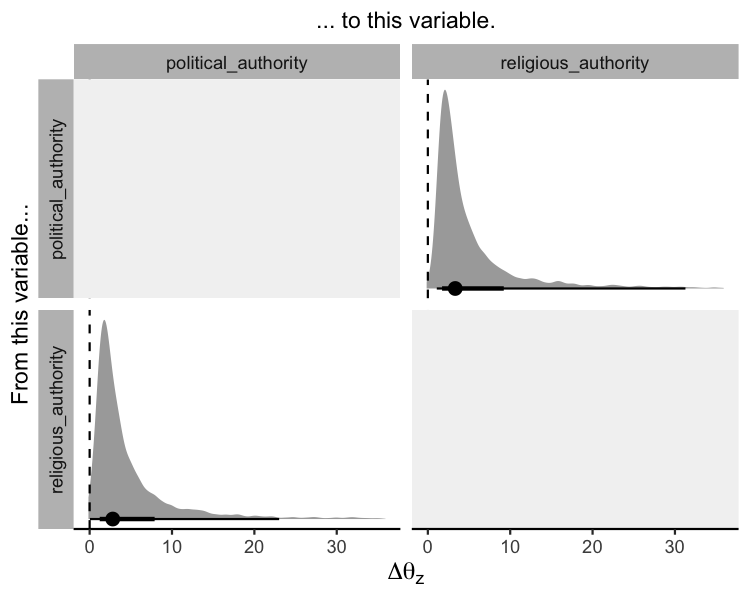
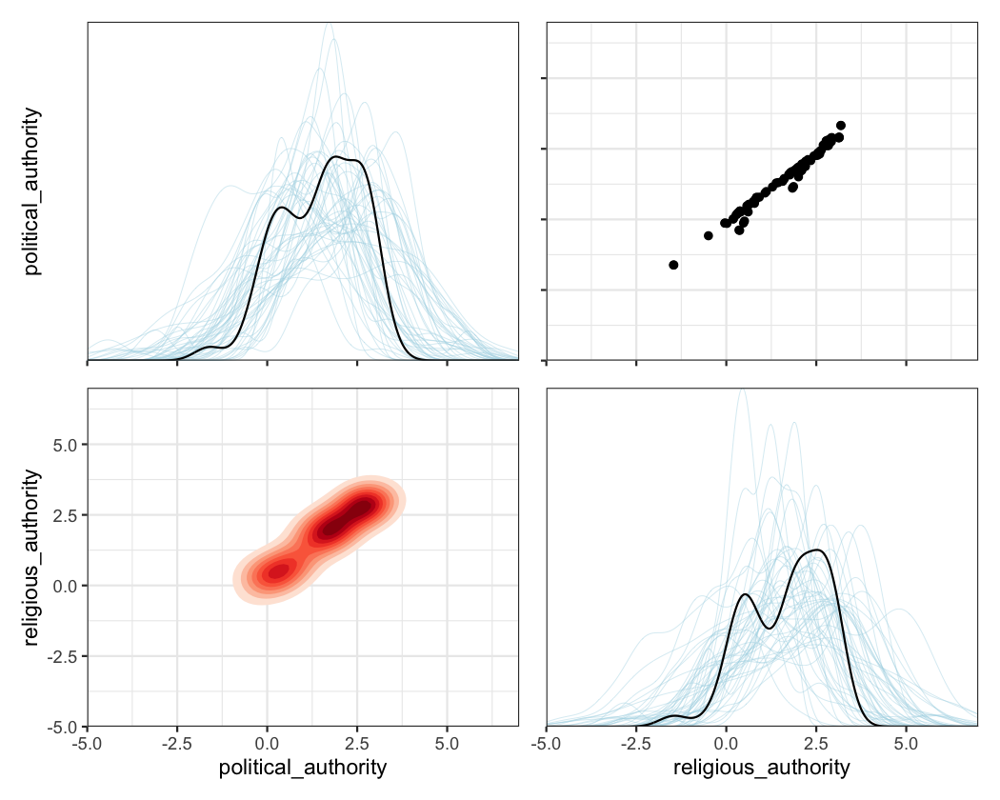
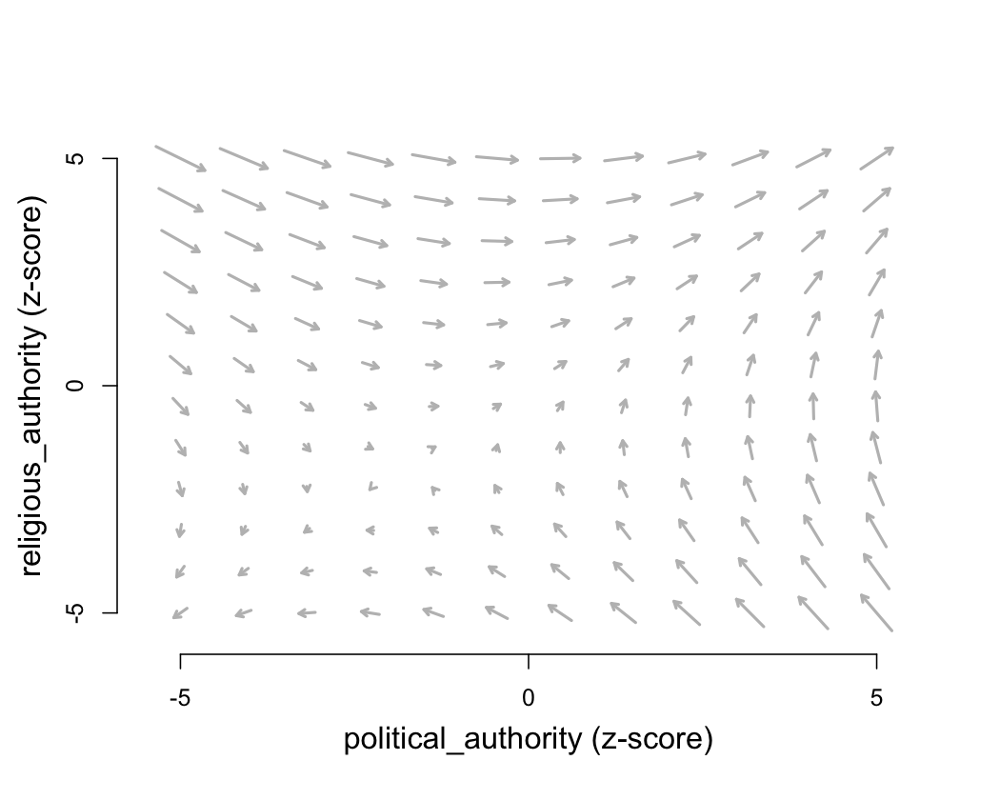
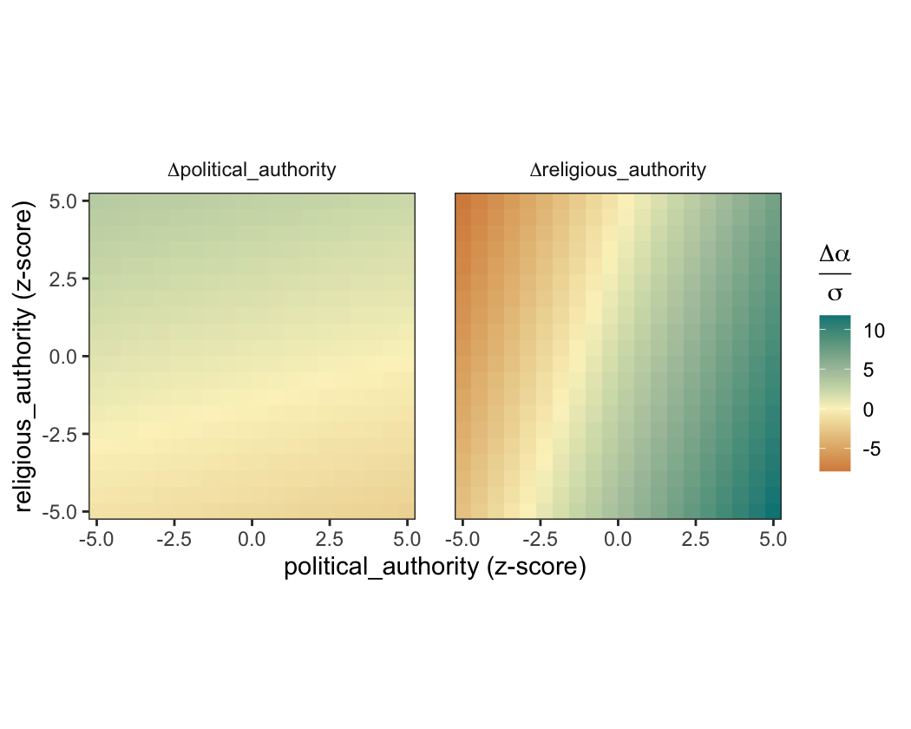
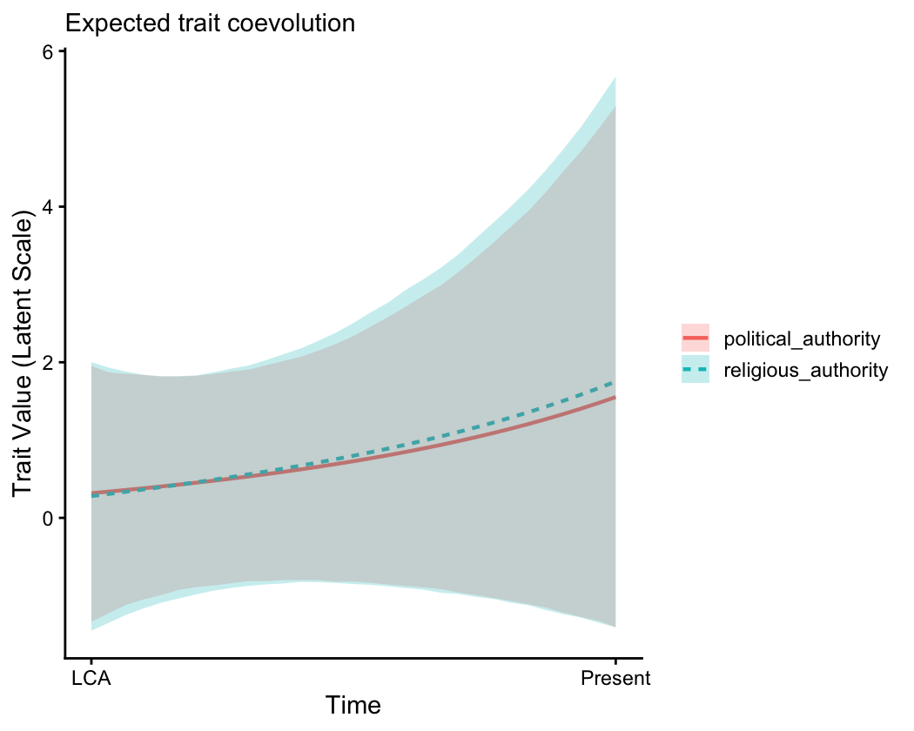
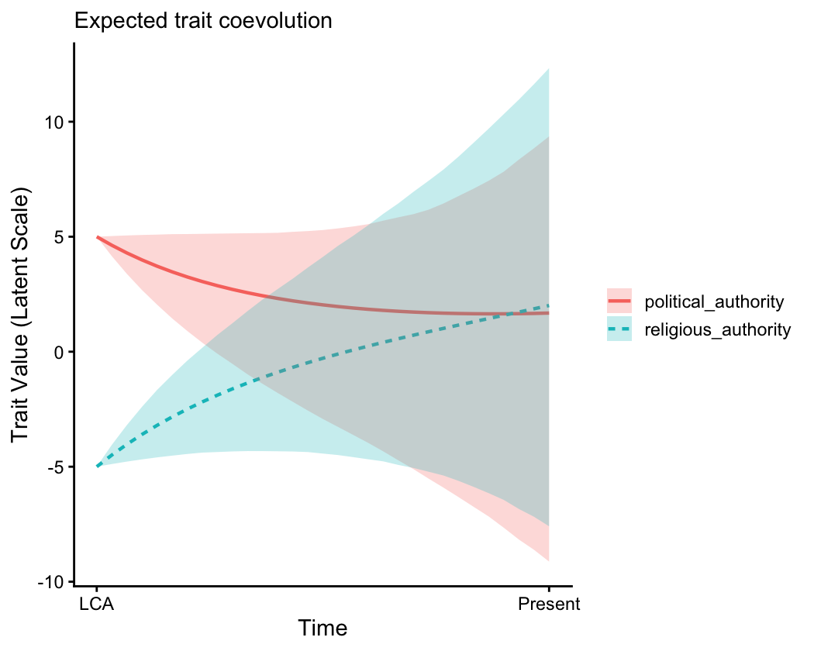

## Introduction

This vignette provides an introduction to the **coevolve** package. It briefly
describes the class of generalized dynamic phylogenetic models (GDPMs) that the
package is designed to fit. It then runs through a working example to showcase
different features of the package.

## The generalized dynamic phylogenetic model

In the **coevolve** package, the main function is `coev_fit()`, which fits a
generalized dynamic phylogenetic model to traits given the phylogenetic
relationships among taxa. The model allows the user to determine whether
evolutionary change in one trait precedes evolutionary change in another trait.

Under the hood, the package estimates the parameters of the following stochastic
differential equation along the branches of a phylogenetic tree. The equation
partitions evolutionary change in the traits into state-dependent deterministic
selection and state-independent Brownian motion, similar to a multivariate
Ornstein-Uhlenbeck process:

$$
d\pmb{\eta}(t) = (\textbf{A}\pmb{\eta}(t) + \textbf{b}) + \textbf{G}dW(t)
$$

$\pmb{\eta}(t)$ is a vector of latent variables at time $t$. The matrix
$\textbf{A}$ represents "selection" with strictly negative autoregressive terms
on the diagonal. Off-diagonals may be positive or negative, controlling the
effect of each trait on the others (e.g., $\textbf{A}[2,1]$ represents the
effect of $\eta_1$ on $\eta_2$). $\textbf{b}$ is a vector of continuous time
intercepts. The matrix $\textbf{G}$ is the Cholesky decomposition of the
positive semi-definite "drift" covariance matrix $\textbf{Q}$ which scales the
Brownian motion process $W(t)$.

The following observation-level measurement model then links $\pmb{\eta}$ to
the observations at the tips of the tree:

$$
y_{[n,j]} \sim f(\mu_{[n,j]}, {\phi}_{[j]}) \\
g(\mu_{[n,j]}) = \pmb{\eta}_{[n]}
$$

$y_{[n,j]}$ denotes the observed value for trait $j$ from species or population
$n$ at the tips of a phylogeny. $f()$ is a probability density or mass function
with expected value $\mu$ and additional distributional parameters $\pmb{\phi}$.
$g()$ denotes a link function, which transforms the expected value from the
support of the function $f()$ latent values to the unbounded continuous space of
the evolutionary process.

Similar dynamic coevolutionary models are offered in programs like BayesTraits
(see [here](http://www.evolution.reading.ac.uk/BayesTraitsV4.1.1/BayesTraitsV4.1.1.html)).
However, these models are limited to a small number of discrete traits. The
**coevolve** package goes beyond these models by allowing the user to estimate
coevolutionary effects between any number of variables and a much wider range of
response distributions, including continuous, binary, ordinal, and count
distributions.

For more information about the model, refer to the introductory methods paper
[here](https://doi.org/10.1111/2041-210x.70303).

## A working example

To show the model in action, we will use data on political and religious
authority among 97 Austronesian societies. Political and religious authority are
both four-level ordinal variables representing whether each type of authority is
absent (not present above the household level), sublocal (incorporating a group
larger than the household but smaller than the local community), local
(incorporating the local community) and supralocal (incorporating more than one
local community). These data were compiled by Sheehan et al. (2023).


``` r
library(coevolve)
head(authority$data)
```

```
        language political_authority religious_authority
1          Aiwoo            Sublocal            Sublocal
2          Alune          Supralocal          Supralocal
3 AnejomAneityum          Supralocal          Supralocal
4          Anuta               Local               Local
5          Atoni          Supralocal          Supralocal
6          Baree               Local               Local
```

Each society is on a separate row and is linked to a different Austronesian
language. These languages can be represented on a linguistic phylogeny (see
`authority$phylogeny`). We are interested in using this phylogeny to understand
how political and religious authority have coevolved over the course of
Austronesian cultural evolution.

To fit the generalized dynamic phylogenetic model, we use the `coev_fit()`
function. Internally, this function builds the Stan code, builds a data list,
and then compiles and fits the model using the
[cmdstanr](https://mc-stan.org/cmdstanr/) package. Users can run these steps
one-by-one using the `coev_make_stancode()` and `coev_make_standata()`
functions, but for brevity we just use the `coev_fit()` function.


``` r
fit <-
  coev_fit(
    data = authority$data,
    variables = list(
      political_authority = "ordered_logistic",
      religious_authority = "ordered_logistic"
    ),
    id = "language",
    tree = authority$phylogeny,
    # set manual prior
    prior = list(A_offdiag = "normal(0, 2)"),
    # additional arguments for cmdstanr
    parallel_chains = 4,
    iter_sampling = 2000,
    iter_warmup = 2000,
    refresh = 0,
    seed = 1
  )
```

```
Running MCMC with 4 parallel chains...

Chain 3 finished in 515.0 seconds.
Chain 4 finished in 665.3 seconds.
Chain 1 finished in 690.4 seconds.
Chain 2 finished in 714.4 seconds.

All 4 chains finished successfully.
Mean chain execution time: 646.3 seconds.
Total execution time: 714.5 seconds.
```

The function takes several arguments, including a dataset, a named list of
variables that we would like to coevolve in the model (along with their
associated response distributions), the column in the dataset that links to
the phylogeny tip labels, and a phylogeny of class `phylo`. The function sets
priors for the parameters by default, but it is possible for the user to
manually set these priors. The user can also pass additional arguments to
cmdstanr's `sample()` method which runs under the hood.

Once the model has fitted, we can print a summary of the parameters.


``` r
summary(fit)
```

```
Variables: political_authority = ordered_logistic 
           religious_authority = ordered_logistic 
     Data: authority$data (Number of observations: 97)
Phylogeny: authority$phylogeny (Number of trees: 1)
    Draws: 4 chains, each with iter = 2000; warmup = 2000; thin = 1
           total post-warmup draws = 8000

Autoregressive selection effects:
                    Estimate Est.Error  2.5% 97.5% Rhat Bulk_ESS Tail_ESS
political_authority    -0.65      0.52 -1.95 -0.03 1.00     4343     4203
religious_authority    -0.79      0.59 -2.15 -0.03 1.00     5225     3876

Cross selection effects:
                                          Estimate Est.Error  2.5% 97.5% Rhat Bulk_ESS Tail_ESS
political_authority ⟶ religious_authority     2.33      0.98  0.44  4.29 1.00     3328     3594
religious_authority ⟶ political_authority     1.74      1.09 -0.32  3.91 1.00     2109     4686

Drift parameters:
                                             Estimate Est.Error  2.5% 97.5% Rhat Bulk_ESS Tail_ESS
sd(political_authority)                          1.98      0.84  0.21  3.54 1.00     1272     1261
sd(religious_authority)                          1.25      0.79  0.06  2.92 1.00     1640     3283
cor(political_authority,religious_authority)     0.25      0.31 -0.42  0.77 1.00     4837     5973

Continuous time intercept parameters:
                    Estimate Est.Error  2.5% 97.5% Rhat Bulk_ESS Tail_ESS
political_authority     0.21      0.94 -1.64  2.01 1.00     8830     5761
religious_authority     0.29      0.93 -1.54  2.11 1.00    10528     5870

Ordinal cutpoint parameters:
                       Estimate Est.Error  2.5% 97.5% Rhat Bulk_ESS Tail_ESS
political_authority[1]    -1.32      0.88 -3.04  0.45 1.00     5327     4841
political_authority[2]    -0.56      0.85 -2.23  1.14 1.00     6127     5424
political_authority[3]     1.63      0.88 -0.03  3.44 1.00     7270     5857
religious_authority[1]    -1.50      0.92 -3.26  0.33 1.00     6697     5991
religious_authority[2]    -0.82      0.90 -2.53  1.00 1.00     6992     6041
religious_authority[3]     1.63      0.93 -0.11  3.51 1.00     7742     6728
```

```
Warning: There were 14 divergent transitions after warmup.
http://mc-stan.org/misc/warnings.html#divergent-transitions-after-warmup
```

We can see a printed summary of the model parameters, including the
autoregressive effects (i.e., the effects of variables on themselves in the
future), the cross effects (i.e., the effects of variables on the other
variables in the future), the amount of drift, correlated drift, the continuous
time intercepts for the stochastic differential equation, and the ordinal
cutpoints for both variables.

While the summary output is useful, it is difficult to interpret the
parameters directly to make inferences about coevolutionary patterns. An
alternative approach is to directly "intervene" in the system. By doing this,
we can better understand how increases or decreases in a variable change the
equilibrium trait values of other variables in the system. For example, we can
hold one variable at its average value and then increase it by a standardised
amount to see how the equilibrium value for the other trait changes.

The function `coev_calculate_delta_theta()` allows the user to calculate
$\Delta\theta_{z}$, which is defined as the change in the equilibrium trait
value for one variable which results from a median absolute deviation increase
in another variable. This function returns a posterior distribution. We can
easily visualise the posterior distributions for all cross effects at once using
the function `coev_plot_delta_theta()`.


``` r
coev_plot_delta_theta(fit, prob_outer = 0.90)
```



This plot shows the posterior distribution, the posterior median, and the 66%
and 90% credible intervals for $\Delta\theta_{z}$. We can conclude that
political and religious authority both influence each other in their evolution.
A one median absolute deviation increase in political authority results in an
increase in the equilibrium trait value for religious authority, and vice versa.
In other words, these two variables coevolve reciprocally over time.

There are several ways to visualise this runaway coevolutionary process: (1) a
flow field of evolutionary change, (2) a selection gradient plot, and (3) a time
series simulation of evolutionary dynamics. In order to make these various plots
more understandable, it is useful to first plot where the different taxa are
situated in latent trait space. We can do this using the
`coev_plot_trait_values()` function, which produces a pairs plot of estimated
trait values for all the variables in the model (along with associated posterior
uncertainty on the diagonal).


``` r
coev_plot_trait_values(fit, xlim = c(-5, 7), ylim = c(-5, 7))
```



Now that we have a good sense of the trait space, we can plot a flow field of
evolutionary change. The `coev_plot_flowfield()` function plots the strength and
direction of evolutionary change at different locations in trait space.


``` r
coev_plot_flowfield(
  object = fit,
  var1 = "political_authority",
  var2 = "religious_authority",
  limits = c(-5, 5)
  )
```



The arrows in this plot tend to point towards the upper right-hand corner,
suggesting that political and religious authority evolve towards higher levels
in a runaway coevolutionary process.

We can also visualise the coevolutionary dynamics with a selection gradient
plot. The function `coev_plot_selection_gradient()` produces a heatmap which
shows how selection acts on both variables at different locations in trait
space, with green indicating positive selection and red indicating negative
selection.


``` r
coev_plot_selection_gradient(
  object = fit,
  var1 = "political_authority",
  var2 = "religious_authority",
  limits = c(-5, 5)
)
```



We can see from this plot that as each variable increases, the selection on the
other variable increases.

Finally, we can "replay the past" by simulating these coevolutionary dynamics
over a time series. By default, the `coev_plot_pred_series()` function uses the
model-implied ancestral states at the root of the phylogeny as starting points,
and allows the variables to coevolve over time. Shaded areas represent 95%
credible intervals for the predictions.


``` r
coev_plot_pred_series(fit)
```



It is also possible to initialise the variables at different starting points, to
see the implied coevolutionary dynamics. For example, we can imagine a case
where the ancestral society had high levels of political authority but low
levels of religious authority.


``` r
coev_plot_pred_series(
  object = fit,
  eta_anc = list(
    political_authority = 5,
    religious_authority = -5
  )
)
```



## Available response distributions

In the above example, both variables were ordinal. As such, we declared both of
them to follow the "ordered_logistic" response distribution. But the
**coevolve** package supports several more response distributions.


| Response distribution      | Data type       | Link function  |
|----------------------------|-----------------|----------------|
| bernoulli_logit            | Binary          | Logit          |
| ordered_logistic           | Ordinal         | Logit          |
| poisson_softplus           | Count           | Softplus       |
| negative_binomial_softplus | Count           | Softplus       |
| normal                     | Continuous real | -              |
| gamma_log                  | Positive real   | Log            |

Different variables need not follow the same response distribution. This can be
useful when users would like to assess the coevolution between variables of
different types.

## Conclusion

We hope that this package is a useful addition to the phylogenetic comparative
methods toolkit. If you have any questions about the package, please feel free
to email Scott Claessens (scott.claessens@gmail.com) or Erik Ringen
(erikjacob.ringen@uzh.ch) or raise an issue over on GitHub:
https://github.com/ScottClaessens/coevolve/issues

## References

Sheehan, O., Watts, J., Gray, R. D., Bulbulia, J., Claessens, S., Ringen, E. J.,
& Atkinson, Q. D. (2023). Coevolution of religious and political authority in
Austronesian societies. *Nature Human Behaviour*, *7*(1), 38-45.
