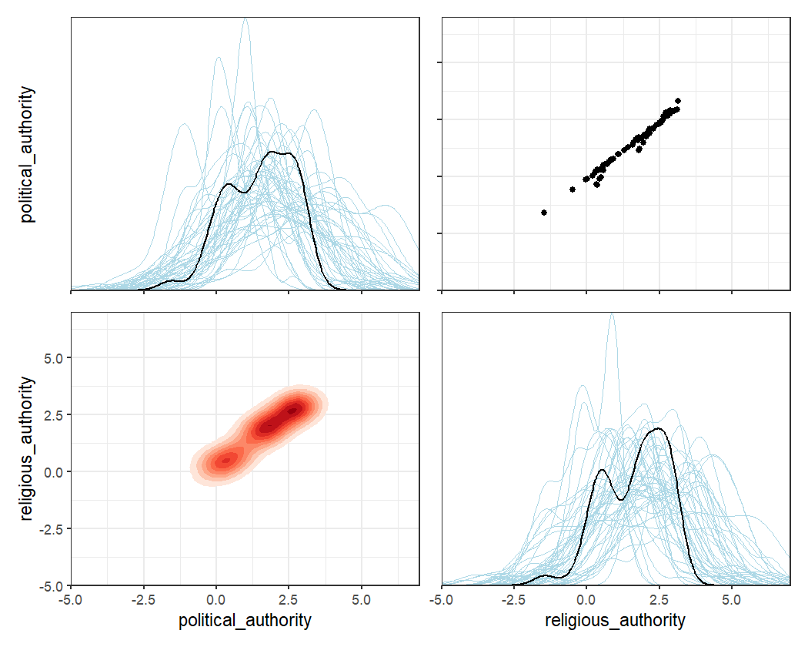
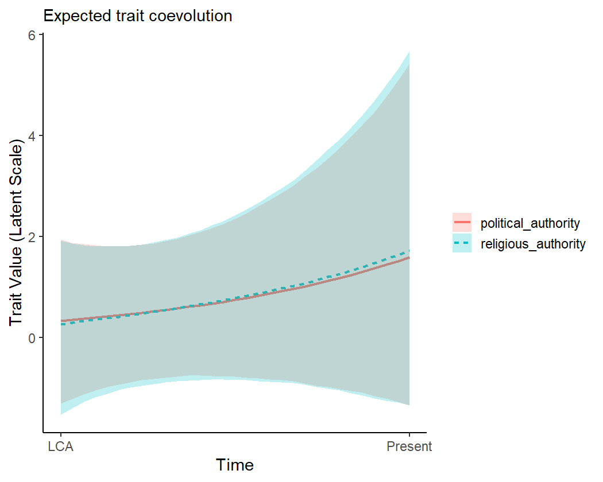

## Introduction

This vignette provides an introduction to the **coevolve** package. It briefly
describes the class of generalized dynamic phylogenetic models (GDPMs) that the
package is designed to fit. It then runs through several working examples to
showcase features of the package, including models with different response
distributions, missing data, repeated observations, multiPhylo tree objects, and
controls for spatial location.

## The generalized dynamic phylogenetic model

In the **coevolve** package, the main function is `coev_fit()`, which fits a
generalized dynamic phylogenetic model to taxa variables given the phylogenetic
relationships among taxa. The model allows the user to determine whether
evolutionary change in one variable precedes evolutionary change in another
variable.

A full description of the model can be found in
[this pre-print](https://ecoevorxiv.org/repository/view/4119/). Briefly, the
model represents observed variables as latent variables that are allowed to
coevolve along an evolutionary time series. Coevolution unfolds according to a
stochastic differential equation similar to an Ornstein-Uhlenbeck process, which
contains both "selection" (tendency towards an optimum value) and "drift"
(exogenous Gaussian noise) components. Change in the latent variables depend
upon all other latent variables in the model and themselves, allowing users to
assess the directional influence of one variable on future change in another
variable.

Similar dynamic coevolutionary models are offered in programs like BayesTraits
(see [here](http://www.evolution.reading.ac.uk/BayesTraitsV4.1.1/BayesTraitsV4.1.1.html)).
However, these models are limited to a small number of discrete traits. The
**coevolve** package goes beyond these models by allowing the user to estimate
coevolutionary effects between any number of variables and a much wider range of
response distributions, including continuous, binary, ordinal, and count
distributions.

## A working example

To show the model in action, we will use data on political and religious
authority among 97 Austronesian societies. Political and religious authority are
both four-level ordinal variables representing whether each type of authority is
absent (not present above the household level), sublocal (incorporating a group
larger than the household but smaller than the local community), local
(incorporating the local community) and supralocal (incorporating more than one
local community). These data were compiled by Sheehan et al. (2023).


``` r
library(coevolve)
head(authority$data)
```

```
        language political_authority religious_authority
1          Aiwoo            Sublocal            Sublocal
2          Alune          Supralocal          Supralocal
3 AnejomAneityum          Supralocal          Supralocal
4          Anuta               Local               Local
5          Atoni          Supralocal          Supralocal
6          Baree               Local               Local
```

Each society is on a separate row and is linked to a different Austronesian
language. These languages can be represented on a linguistic phylogeny (see
`authority$phylogeny`). We are interested in using this phylogeny to understand
how political and religious authority have coevolved over the course of
Austronesian cultural evolution.

To fit the generalized dynamic phylogenetic model, we use the `coev_fit()`
function. Internally, this function builds the Stan code, builds a data list,
and then compiles and fits the model using the
[cmdstanr](https://mc-stan.org/cmdstanr/) package. Users can run these steps
one-by-one using the `coev_make_stancode()` and `coev_make_standata()`
functions, but for brevity we just use the `coev_fit()` function.


``` r
fit1 <-
  coev_fit(
    data = authority$data,
    variables = list(
      political_authority = "ordered_logistic",
      religious_authority = "ordered_logistic"
    ),
    id = "language",
    tree = authority$phylogeny,
    # set manual prior
    prior = list(A_offdiag = "normal(0, 2)"),
    # return log likelihood
    log_lik = TRUE,
    # additional arguments for cmdstanr
    parallel_chains = 4,
    iter_sampling = 2000,
    iter_warmup = 2000,
    refresh = 0,
    seed = 1
  )
```

```
Running MCMC with 4 parallel chains...

Chain 2 finished in 878.0 seconds.
Chain 4 finished in 1213.6 seconds.
Chain 1 finished in 1228.8 seconds.
Chain 3 finished in 1251.5 seconds.

All 4 chains finished successfully.
Mean chain execution time: 1143.0 seconds.
Total execution time: 1252.7 seconds.
```

The function takes several arguments, including a dataset, a named list of
variables that we would like to coevolve in the model (along with their
associated response distributions), the column in the dataset that links to
the phylogeny tip labels, and a phylogeny of class `phylo`. The function sets
priors for the parameters by default, but it is possible for the user to
manually set these priors. The user can also pass additional arguments to
cmdstanr's `sample()` method which runs under the hood.

Once the model has fitted, we can print a summary of the parameters.


``` r
summary(fit1)
```

```
Variables: political_authority = ordered_logistic 
           religious_authority = ordered_logistic 
     Data: authority$data (Number of observations: 97)
Phylogeny: authority$phylogeny (Number of trees: 1)
    Draws: 4 chains, each with iter = 2000; warmup = 2000; thin = 1
           total post-warmup draws = 8000

Autoregressive selection effects:
                    Estimate Est.Error  2.5% 97.5% Rhat Bulk_ESS Tail_ESS
political_authority    -0.67      0.52 -1.97 -0.03 1.00     5036     4459
religious_authority    -0.78      0.57 -2.13 -0.03 1.00     5461     3926

Cross selection effects:
                                          Estimate Est.Error  2.5% 97.5% Rhat Bulk_ESS Tail_ESS
political_authority ⟶ religious_authority     2.28      0.99  0.34  4.26 1.00     3310     3706
religious_authority ⟶ political_authority     1.81      1.11 -0.36  4.08 1.00     2068     3963

Drift parameters:
                                             Estimate Est.Error  2.5% 97.5% Rhat Bulk_ESS Tail_ESS
sd(political_authority)                          1.93      0.82  0.25  3.45 1.00     1446     1572
sd(religious_authority)                          1.27      0.79  0.06  2.91 1.00     1478     3513
cor(political_authority,religious_authority)     0.26      0.31 -0.42  0.77 1.00     5593     6287

Continuous time intercept parameters:
                    Estimate Est.Error  2.5% 97.5% Rhat Bulk_ESS Tail_ESS
political_authority     0.21      0.94 -1.65  2.01 1.00     8762     5444
religious_authority     0.21      0.94 -1.66  2.06 1.00     9553     5646

Ordinal cutpoint parameters:
                       Estimate Est.Error  2.5% 97.5% Rhat Bulk_ESS Tail_ESS
political_authority[1]    -1.29      0.89 -3.03  0.51 1.00     5964     5452
political_authority[2]    -0.55      0.87 -2.22  1.20 1.00     6278     5920
political_authority[3]     1.65      0.91 -0.08  3.49 1.00     6729     6160
religious_authority[1]    -1.51      0.92 -3.30  0.29 1.00     6792     5557
religious_authority[2]    -0.82      0.90 -2.58  0.97 1.00     7241     6064
religious_authority[3]     1.60      0.93 -0.15  3.49 1.00     6983     6370
```

```
Warning: There were 18 divergent transitions after warmup.
http://mc-stan.org/misc/warnings.html#divergent-transitions-after-warmup
```

We can see a printed summary of the model parameters, including the
autoregressive effects (i.e., the effects of variables on themselves in the
future), the cross effects (i.e., the effects of variables on the other
variables in the future), the amount of drift, correlated drift, the continuous
time intercepts for the stochastic differential equation, and the ordinal
cutpoints for both variables.

While the summary output is useful, it is difficult to interpret the
parameters directly to make inferences about coevolutionary patterns. An
alternative approach is to directly "intervene" in the system. By doing this,
we can better understand how increases or decreases in a variable change the
equilibrium trait values of other variables in the system. For example, we can
hold one variable at its average value and then increase it by a standardised
amount to see how the equilibrium value for the other trait changes.

The function `coev_calculate_delta_theta()` allows the user to calculate
$\Delta\theta_{z}$, which is defined as the change in the equilibrium trait
value for one variable which results from a median absolute deviation increase
in another variable. This function returns a posterior distribution. We can
easily visualise the posterior distributions for all cross effects at once using
the function `coev_plot_delta_theta()`.


``` r
coev_plot_delta_theta(fit1)
```

<div class="figure" style="text-align: center">

</div>

This plot shows the posterior distribution, the posterior median, and the 66%
and 95% credible intervals for $\Delta\theta_{z}$. We can conclude that
political and religious authority both influence each other in their evolution.
A one median absolute deviation increase in political authority results in an
increase in the equilibrium trait value for religious authority, and vice versa.
In other words, these two variables coevolve reciprocally over time.

There are several ways to visualise this runaway coevolutionary process: (1) a
flow field of evolutionary change, (2) a selection gradient plot, and (3) a time
series simulation of evolutionary dynamics. In order to make these various plots
more understandable, it is useful to first plot where the different taxa are
situated in latent trait space. We can do this using the
`coev_plot_trait_values()` function, which produces a pairs plot of estimated
trait values for all the variables in the model (along with associated posterior
uncertainty on the diagonal).


``` r
coev_plot_trait_values(fit1, xlim = c(-5, 7), ylim = c(-5, 7))
```

<div class="figure" style="text-align: center">

</div>

Now that we have a good sense of the trait space, we can plot a flow field of
evolutionary change. The `coev_plot_flowfield()` function plots the strength and
direction of evolutionary change at different locations in trait space.


``` r
coev_plot_flowfield(
  object = fit1,
  var1 = "political_authority",
  var2 = "religious_authority",
  limits = c(-5, 5)
  )
```

<div class="figure" style="text-align: center">

</div>

The arrows in this plot tend to point towards the upper right-hand corner,
suggesting that political and religious authority evolve towards higher levels
in a runaway coevolutionary process.

We can also visualise the coevolutionary dynamics with a selection gradient
plot. The function `coev_plot_selection_gradient()` produces a heatmap which
shows how selection acts on both variables at different locations in trait
space, with green indicating positive selection and red indicating negative
selection.


``` r
coev_plot_selection_gradient(
  object = fit1,
  var1 = "political_authority",
  var2 = "religious_authority",
  limits = c(-5, 5)
)
```

<div class="figure" style="text-align: center">

</div>

We can see from this plot that as each variable increases, the selection on the
other variable increases.

Finally, we can "replay the past" by simulating these coevolutionary dynamics
over a time series. By default, the `coev_plot_pred_series()` function uses the
model-implied ancestral states at the root of the phylogeny as starting points,
and allows the variables to coevolve over time. Shaded areas represent 95%
credible intervals for the predictions.


``` r
coev_plot_pred_series(fit1)
```

<div class="figure" style="text-align: center">

</div>

It is also possible to initialise the variables at different starting points, to
see the implied coevolutionary dynamics. For example, we can imagine a case
where the ancestral society had high levels of political authority but low
levels of religious authority.


``` r
coev_plot_pred_series(
  object = fit1,
  eta_anc = list(
    political_authority = 5,
    religious_authority = -5
  )
)
```

<div class="figure" style="text-align: center">

</div>

## Available response distributions

In the above example, both variables were ordinal. As such, we declared both of
them to follow the "ordered_logistic" response distribution. But the
**coevolve** package supports several more response distributions.


| Response distribution      | Data type       | Link function  |
|----------------------------|-----------------|----------------|
| bernoulli_logit            | Binary          | Logit          |
| ordered_logistic           | Ordinal         | Logit          |
| poisson_softplus           | Count           | Softplus       |
| negative_binomial_softplus | Count           | Softplus       |
| normal                     | Continuous real | -              |
| gamma_log                  | Positive real   | Log            |

Different variables need not follow the same response distribution. This can be
useful when users would like to assess the coevolution between variables of
different types.

## Handling missing data

Often in comparative datasets, data will be missing for some taxa. Rather
than remove cases if they have any missing data, the `coev_fit()` function will
automatically impute any missing values in the model, using all available
information.

We show this by modelling the coevolutionary relationships between brain weight
and group size across 21 primate species from the Lemuriformes clade. Data on
primate species were compiled by DeCasien et al. (2017). There are data for 143
primate species in total, but we focus on one clade to keep the example small
and simple.


``` r
# filter dataset to Lemuriformes only
primates_data <- primates$data[primates$data$clade == "Lemuriformes",]

# prune phylogeny to Lemuriformes only
library(ape)
primates_phylogeny <- keep.tip(primates$phylogeny, primates_data$species)

# view data
head(primates_data[, c("species", "brain_weight", "group_size")])
```

```
                        species brain_weight group_size
13                Avahi_laniger    10.251355   2.666667
14           Avahi_occidentalis     8.236200         NA
44           Cheirogaleus_major     6.119797   5.500000
45          Cheirogaleus_medius     2.912291   2.000000
54 Daubentonia_madagascariensis    46.344725   1.750000
56            Eulemur_coronatus    21.394398   6.950000
```

Both variables are positive reals, so we use the "gamma_log" distribution. While
there are no missing data for the brain weight variable, some data are missing
for the group size variable.


``` r
fit2 <-
  coev_fit(
    data = primates_data,
    variables = list(
      brain_weight = "gamma_log",
      group_size = "gamma_log"
    ),
    id = "species",
    tree = primates_phylogeny,
    # additional arguments for cmdstanr
    parallel_chains = 4,
    iter_sampling = 2000,
    iter_warmup = 2000,
    refresh = 0,
    seed = 1
  )
```

```
Running MCMC with 4 parallel chains...

Chain 1 finished in 459.8 seconds.
Chain 3 finished in 477.3 seconds.
Chain 2 finished in 607.5 seconds.
Chain 4 finished in 634.7 seconds.

All 4 chains finished successfully.
Mean chain execution time: 544.8 seconds.
Total execution time: 634.8 seconds.
```


``` r
summary(fit2)
```

```
Variables: brain_weight = gamma_log 
           group_size = gamma_log 
     Data: primates_data (Number of observations: 21)
Phylogeny: primates_phylogeny (Number of trees: 1)
    Draws: 4 chains, each with iter = 2000; warmup = 2000; thin = 1
           total post-warmup draws = 8000

Autoregressive selection effects:
             Estimate Est.Error  2.5% 97.5% Rhat Bulk_ESS Tail_ESS
brain_weight    -0.42      0.35 -1.34 -0.01 1.00     5998     3875
group_size      -0.77      0.54 -2.01 -0.04 1.00     6044     3424

Cross selection effects:
                          Estimate Est.Error  2.5% 97.5% Rhat Bulk_ESS Tail_ESS
brain_weight ⟶ group_size     0.46      0.72 -1.12  1.76 1.00     2799     2861
group_size ⟶ brain_weight     0.62      0.94 -1.29  2.41 1.00     3113     3754

Drift parameters:
                             Estimate Est.Error  2.5% 97.5% Rhat Bulk_ESS Tail_ESS
sd(brain_weight)                 1.07      0.22  0.67  1.56 1.00     2112     2198
sd(group_size)                   0.69      0.44  0.04  1.66 1.01      784     1713
cor(brain_weight,group_size)     0.06      0.30 -0.53  0.62 1.00     7637     5552

Continuous time intercept parameters:
             Estimate Est.Error  2.5% 97.5% Rhat Bulk_ESS Tail_ESS
brain_weight    -0.25      0.85 -1.88  1.41 1.00     5417     5515
group_size      -0.87      0.76 -2.32  0.66 1.00     5891     5285

Shape parameters:
             Estimate Est.Error 2.5%  97.5% Rhat Bulk_ESS Tail_ESS
brain_weight    57.29     60.33 4.83 223.56 1.01      573     1593
group_size       5.99     12.12 1.43  28.40 1.01      826      784
```

```
Warning: There were 91 divergent transitions after warmup.
http://mc-stan.org/misc/warnings.html#divergent-transitions-after-warmup
```

Notice that the number of observations is still 21 in the summary output,
informing us that all observations were retained and any missing data were
imputed.

If we wanted instead to remove any taxa with missing data, we could set
`complete_cases = TRUE` when fitting the model.

## Repeated observations

Another common feature of comparative datasets is repeated observations. In the
previous examples, we had only one observation per taxon. But often there will
be more than one observation for each taxon, such as when we have observed
multiple individuals of the same species. In these cases, it can be useful to
include all of these observations in the model and estimate the residual
variation that is not due to the coevolutionary process.

We show this using an example dataset from de Villemereuil & Nakagawa (2014).
Suppose we have measured two continuous variables ($x$ and $y$) for 20 species,
with five observations for each species.


``` r
head(repeated$data)
```

```
  species         x         y
1    sp_1 11.223724 107.41919
2    sp_1  9.805934 109.16403
3    sp_1 10.308423  91.88672
4    sp_1  8.355349 121.54341
5    sp_1 11.854510 105.31638
6    sp_2  4.314015  64.99859
```

We can fit the dynamic coevolutionary model to this dataset.


``` r
fit3 <-
  coev_fit(
    data = repeated$data,
    variables = list(
      x = "normal",
      y = "normal"
    ),
    id = "species",
    tree = repeated$phylogeny,
    # additional arguments for cmdstanr
    parallel_chains = 4,
    iter_warmup = 2000,
    iter_sampling = 2000,
    refresh = 0,
    seed = 1
  )
```

```
Running MCMC with 4 parallel chains...

Chain 2 finished in 605.4 seconds.
Chain 4 finished in 624.9 seconds.
Chain 3 finished in 851.5 seconds.
Chain 1 finished in 852.4 seconds.

All 4 chains finished successfully.
Mean chain execution time: 733.5 seconds.
Total execution time: 852.4 seconds.
```


``` r
summary(fit3)
```

```
Variables: x = normal 
           y = normal 
     Data: repeated$data (Number of observations: 100)
Phylogeny: repeated$phylogeny (Number of trees: 1)
    Draws: 4 chains, each with iter = 2000; warmup = 2000; thin = 1
           total post-warmup draws = 8000

Autoregressive selection effects:
  Estimate Est.Error  2.5% 97.5% Rhat Bulk_ESS Tail_ESS
x    -1.57      0.77 -3.18 -0.20 1.00     3920     2089
y    -1.32      0.71 -2.78 -0.12 1.00     4906     3238

Cross selection effects:
      Estimate Est.Error  2.5% 97.5% Rhat Bulk_ESS Tail_ESS
x ⟶ y     0.42      0.85 -1.25  2.07 1.00     6608     5754
y ⟶ x     0.03      0.87 -1.71  1.73 1.00     6875     5415

Drift parameters:
         Estimate Est.Error 2.5% 97.5% Rhat Bulk_ESS Tail_ESS
sd(x)        2.94      0.32 2.37  3.63 1.00     4183     5327
sd(y)        2.58      0.29 2.05  3.20 1.00     4666     5667
cor(x,y)     0.88      0.06 0.72  0.96 1.00     3234     4999

Continuous time intercept parameters:
  Estimate Est.Error  2.5% 97.5% Rhat Bulk_ESS Tail_ESS
x    -0.03      0.79 -1.59  1.51 1.00     6792     6144
y     0.06      0.78 -1.51  1.58 1.00     7337     5761

Residual parameters:
         Estimate Est.Error  2.5% 97.5% Rhat Bulk_ESS Tail_ESS
sd(x)        0.28      0.02  0.23  0.33 1.00     8310     5374
sd(y)        0.29      0.02  0.25  0.34 1.00     8427     5323
cor(x,y)    -0.18      0.11 -0.38  0.03 1.00     7568     5759
```

```
Warning: There were 36 divergent transitions after warmup.
http://mc-stan.org/misc/warnings.html#divergent-transitions-after-warmup
```

In the model output, we can see that `coev_fit()` has detected the presence of
repeated observations and has consequently modelled residual standard deviation
and residual correlation parameters for $x$ and $y$.

## Using multiPhylo tree objects

Often, we would like to average our analysis over a posterior set of
phylogenetic trees, rather than use a single tree. This can be a useful way to
account for phylogenetic uncertainty in our inferences.

To deal with phylogenetic uncertainty, the `coev_fit()` function allows the user
to declare multiPhylo objects in the `tree` argument. So long as all trees in
the multiPhylo object have the same number of taxa with the same tip labels,
the Stan code will average over all the trees within the same model.

To keep the computation time short, we imagine a simple case where we have a
multiPhylo object with two identical Austronesian language phylogenies. While
the results should be the same in this case as there is no phylogenetic
uncertainty, users should expect differing results when using sets of different
trees.


``` r
authority_multiphylo <- c(
  authority$phylogeny,
  authority$phylogeny
)

authority_multiphylo
```

```
2 phylogenetic trees
```


``` r
fit4 <-
  coev_fit(
    data = authority$data,
    variables = list(
      political_authority = "ordered_logistic",
      religious_authority = "ordered_logistic"
    ),
    id = "language",
    # use multiPhylo tree object
    tree = authority_multiphylo,
    # set manual prior
    prior = list(A_offdiag = "normal(0, 2)"),
    # additional arguments for cmdstanr
    parallel_chains = 4,
    iter_sampling = 2000,
    iter_warmup = 2000,
    refresh = 0,
    seed = 1
  )
```

```
Running MCMC with 4 parallel chains...

Chain 4 finished in 1598.6 seconds.
Chain 3 finished in 1625.2 seconds.
Chain 2 finished in 1633.5 seconds.
Chain 1 finished in 2088.5 seconds.

All 4 chains finished successfully.
Mean chain execution time: 1736.5 seconds.
Total execution time: 2088.7 seconds.
```


``` r
summary(fit4)
```

```
Variables: political_authority = ordered_logistic 
           religious_authority = ordered_logistic 
     Data: authority$data (Number of observations: 97)
Phylogeny: authority_multiphylo (Number of trees: 2)
    Draws: 4 chains, each with iter = 2000; warmup = 2000; thin = 1
           total post-warmup draws = 8000

Autoregressive selection effects:
                    Estimate Est.Error  2.5% 97.5% Rhat Bulk_ESS Tail_ESS
political_authority    -0.64      0.52 -1.95 -0.02 1.00     5950     3489
religious_authority    -0.70      0.55 -2.07 -0.03 1.00     6287     4187

Cross selection effects:
                                          Estimate Est.Error 2.5% 97.5% Rhat Bulk_ESS Tail_ESS
political_authority ⟶ religious_authority     2.05      1.03 0.37  4.34 1.00     2690     5116
religious_authority ⟶ political_authority     2.12      1.08 0.26  4.47 1.00     2419     3669

Drift parameters:
                                             Estimate Est.Error  2.5% 97.5% Rhat Bulk_ESS Tail_ESS
sd(political_authority)                          1.11      0.83  0.04  2.94 1.00      910     2354
sd(religious_authority)                          0.88      0.68  0.03  2.50 1.00     1456     2887
cor(political_authority,religious_authority)     0.05      0.33 -0.60  0.66 1.00     4522     5683

Continuous time intercept parameters:
                    Estimate Est.Error  2.5% 97.5% Rhat Bulk_ESS Tail_ESS
political_authority     0.34      0.91 -1.43  2.11 1.00     9445     6549
religious_authority     0.42      0.92 -1.40  2.18 1.00    10164     5564

Ordinal cutpoint parameters:
                       Estimate Est.Error  2.5% 97.5% Rhat Bulk_ESS Tail_ESS
political_authority[1]    -1.55      0.90 -3.36  0.15 1.00     6041     5141
political_authority[2]    -0.81      0.88 -2.59  0.85 1.00     6578     5453
political_authority[3]     1.92      0.95  0.11  3.83 1.00     7628     5767
religious_authority[1]    -1.83      0.88 -3.62 -0.13 1.00     6347     5593
religious_authority[2]    -1.15      0.85 -2.87  0.52 1.00     7035     5596
religious_authority[3]     1.67      0.93 -0.06  3.61 1.00     4677     4682
```

```
Warning: There were 18 divergent transitions after warmup.
http://mc-stan.org/misc/warnings.html#divergent-transitions-after-warmup
```

The summary output correctly shows that we averaged over two trees. Note that
with more trees, users should expect the computation time for these models to
increase.

## Controlling for spatial location

If we have data on the spatial location of taxa, sometimes it is useful to
control for this spatial location to ensure that our model is capturing deep
ancestral relationships rather than more recent diffusion among neighbours.
For example, when studying the coevolution of political and religious authority
in Austronesian societies, we would like to ensure that our results are due to
coevolution over deep cultural time rather than more recent borrowing among
societies with close geographic proximity.

The `dist_mat` argument in the `coev_fit()` function allows us to easily control
for spatial proximity. This argument takes a distance matrix between all taxa in
the phylogeny. If the distance matrix is specified by the user, the function
includes in the Stan code a separate Gaussian Process over spatial location for
each variable in the model.

Here is the geographic distance matrix (measured in metres) for the first five
Austronesian societies:


``` r
authority$distance_matrix[1:5, 1:5]
```

```
                   Aiwoo     Alune AnejomAneityum     Anuta     Atoni
Aiwoo                0.0 4250625.9      1158010.2  408692.9 4602028.5
Alune          4250625.9       0.0      4863176.7 4649868.1  865094.2
AnejomAneityum 1158010.2 4863176.7            0.0  951671.2 5013641.1
Anuta           408692.9 4649868.1       951671.2       0.0 4977783.9
Atoni          4602028.5  865094.2      5013641.1 4977783.9       0.0
```

We can include this distance matrix in the model. The matrix is scaled to vary
between 0 and 1 under the hood to improve model sampling.


``` r
fit5 <-
  coev_fit(
    data = authority$data,
    variables = list(
      political_authority = "ordered_logistic",
      religious_authority = "ordered_logistic"
    ),
    id = "language",
    tree = authority$phylogeny,
    # declare distance matrix and covariance kernel
    dist_mat = authority$distance_matrix,
    dist_cov = "exp_quad",
    # set manual prior
    prior = list(A_offdiag = "normal(0, 2)"),
    # return log likelihood
    log_lik = TRUE,
    # additional arguments for cmdstanr
    parallel_chains = 4,
    iter_sampling = 2000,
    iter_warmup = 2000,
    refresh = 0,
    seed = 1
  )
```

```
Running MCMC with 4 parallel chains...
```

```
Chain 3 finished in 1566.6 seconds.
Chain 1 finished in 1660.9 seconds.
Chain 4 finished in 2080.0 seconds.
Chain 2 finished in 2086.5 seconds.

All 4 chains finished successfully.
Mean chain execution time: 1848.5 seconds.
Total execution time: 2086.7 seconds.
```


``` r
summary(fit5)
```

```
Variables: political_authority = ordered_logistic 
           religious_authority = ordered_logistic 
     Data: authority$data (Number of observations: 97)
Phylogeny: authority$phylogeny (Number of trees: 1)
    Draws: 4 chains, each with iter = 2000; warmup = 2000; thin = 1
           total post-warmup draws = 8000

Autoregressive selection effects:
                    Estimate Est.Error  2.5% 97.5% Rhat Bulk_ESS Tail_ESS
political_authority    -0.69      0.54 -1.99 -0.03 1.00     5230     3961
religious_authority    -0.77      0.58 -2.15 -0.03 1.00     5743     3919

Cross selection effects:
                                          Estimate Est.Error  2.5% 97.5% Rhat Bulk_ESS Tail_ESS
political_authority ⟶ religious_authority     2.02      1.19 -0.45  4.34 1.00     2142     2494
religious_authority ⟶ political_authority     1.65      1.23 -0.81  4.06 1.00     2656     3526

Drift parameters:
                                             Estimate Est.Error  2.5% 97.5% Rhat Bulk_ESS Tail_ESS
sd(political_authority)                          1.52      0.80  0.11  3.11 1.00     1181     2182
sd(religious_authority)                          1.02      0.69  0.05  2.54 1.00     1427     2927
cor(political_authority,religious_authority)     0.16      0.33 -0.51  0.74 1.00     5589     5523

Continuous time intercept parameters:
                    Estimate Est.Error  2.5% 97.5% Rhat Bulk_ESS Tail_ESS
political_authority     0.32      0.94 -1.52  2.16 1.00     8469     5212
religious_authority     0.30      0.97 -1.60  2.17 1.00     7767     5844

Ordinal cutpoint parameters:
                       Estimate Est.Error  2.5% 97.5% Rhat Bulk_ESS Tail_ESS
political_authority[1]    -1.49      0.98 -3.41  0.44 1.00     5038     5486
political_authority[2]    -0.77      0.96 -2.64  1.16 1.00     4991     5665
political_authority[3]     1.38      1.01 -0.58  3.42 1.00     4106     5215
religious_authority[1]    -1.62      1.01 -3.58  0.38 1.00     6003     5297
religious_authority[2]    -0.96      1.00 -2.84  1.01 1.00     6071     5604
religious_authority[3]     1.46      1.04 -0.52  3.56 1.00     5740     5616

Gaussian Process parameters for distances:
                          Estimate Est.Error 2.5% 97.5% Rhat Bulk_ESS Tail_ESS
rho(political_authority)      0.05      0.09 0.00  0.33 1.00     1110     2047
rho(religious_authority)      0.06      0.11 0.00  0.39 1.00      626     2322
sdgp(political_authority)     1.82      1.21 0.16  4.73 1.00     1871     1720
sdgp(religious_authority)     2.12      1.40 0.16  5.34 1.01     1185     2182
```

```
Warning: There were 630 divergent transitions after warmup.
http://mc-stan.org/misc/warnings.html#divergent-transitions-after-warmup
```

The summary output shows that the model has estimated the parameters for two
Gaussian Process functions over geographic locations, one for each variable.

## Model comparison

When we set `log_lik = TRUE`, the underlying Stan code for these models returns
a log likelihood vector for all observations. With this, it is possible to
compare different models using methods like approximate leave-one-out
cross-validation. For example, we can use the `loo_compare()` function from the
[loo](https://mc-stan.org/loo/index.html) package to see whether adding the
distance matrix in the authority example improved our out-of-sample predictive
accuracy.


``` r
library(loo)
loo_compare(
  list(
    fit1 = fit1$fit$loo(), # authority model without distance matrix
    fit5 = fit5$fit$loo()  # authority model with distance matrix
  )
)
```

```
     elpd_diff se_diff
fit5  0.0       0.0   
fit1 -1.9       2.8   
```

This model comparison suggests that adding spatial location to the model did not
improve out-of-sample predictive accuracy.

This model comparison approach may also be useful for comparing models with
different cross selection effects constrained to zero (see the `effects_mat`
argument in the `coev_fit()` function). The user can then test whether "turning
on" a particular cross selection effect improves model fit. However, currently
it is not possible to compare models that include different coevolving
variables, as the datasets and resulting log likelihood vectors vary between
models.

## Conclusion

We hope that this package is a useful addition to the phylogenetic comparative
methods toolkit. If you have any questions about the package, please feel free
to email Scott Claessens (scott.claessens@gmail.com) or Erik Ringen
(erikjacob.ringen@uzh.ch) or raise an issue over on GitHub:
https://github.com/ScottClaessens/coevolve/issues

## References

DeCasien, A. R., Williams, S. A., & Higham, J. P. (2017). Primate brain size is
predicted by diet but not sociality. *Nature Ecology & Evolution*, *1*(5), 0112.

de Villemereuil P. & Nakagawa, S. (2014). General quantitative genetic methods
for comparative biology. In L. Garamszegi (Ed.), *Modern phylogenetic
comparative methods and their application in evolutionary biology: concepts and
practice* (pp. 287-303). Springer, New York.

Sheehan, O., Watts, J., Gray, R. D., Bulbulia, J., Claessens, S., Ringen, E. J.,
& Atkinson, Q. D. (2023). Coevolution of religious and political authority in
Austronesian societies. *Nature Human Behaviour*, *7*(1), 38-45.
