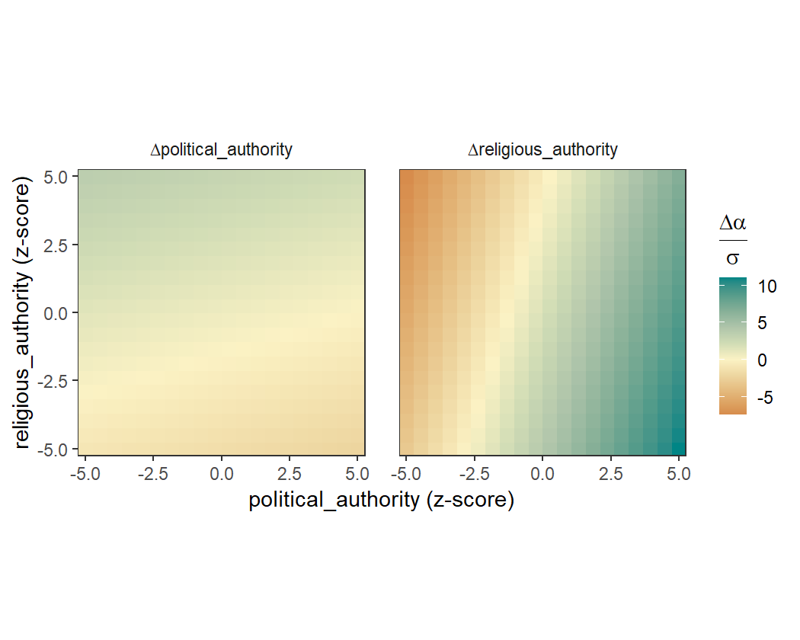

## Introduction

This vignette provides an introduction to the **coevolve** package. It briefly
describes the class of dynamic coevolutionary model that the package is designed
to fit. It then runs through several working examples to showcase features of
the package, including models with different response distributions, missing
data, repeated observations, and controls for spatial location.

## The dynamic coevolutionary model

In the **coevolve** package, the main function is `coev_fit()`, which fits a
dynamic coevolutionary model to taxa variables given the phylogenetic
relationships among taxa. The model allows the user to determine whether
evolutionary change in one variable precedes evolutionary change in another
variable.

A full description of the dynamic coevolutionary model can be found in
[this pre-print](https://ecoevorxiv.org/repository/view/4119/). Briefly, the
model represents observed variables as latent variables that are allowed to
coevolve along an evolutionary time series. Coevolution unfolds according to a
stochastic differential equation similar to an Ornstein-Uhlenbeck process, which
contains both "selection" (tendency towards an optimum value) and "drift"
(exogenous Gaussian noise) components. Change in the latent variables depend
upon all other latent variables in the model and themselves, allowing users to
assess the directional influence of one variable on future change in another
variable.

Similar coevolutionary models are offered in programs like BayesTraits (see
[here](http://www.evolution.reading.ac.uk/BayesTraitsV4.1.1/BayesTraitsV4.1.1.html)).
However, these models are limited to a small number of discrete traits. The
**coevolve** package goes beyond these models by allowing the user to estimate
coevolutionary effects between any number of variables and a much wider range of
response distributions, including continuous, binary, ordinal, and count
distributions.

Note that the models in this vignette will take a few hours to fit.

## A working example

To show the model in action, we will use data on political and religious
authority among 97 Austronesian societies. Political and religious authority are
both four-level ordinal variables representing whether each type of authority is
absent (not present above the household level), sublocal (incorporating a group
larger than the household but smaller than the local community), local
(incorporating the local community) and supralocal (incorporating more than one
local community). These data were compiled by Sheehan et al. (2023).


``` r
library(coevolve)
head(authority$data)
```

```
        language political_authority religious_authority
1          Aiwoo            Sublocal            Sublocal
2          Alune          Supralocal          Supralocal
3 AnejomAneityum          Supralocal          Supralocal
4          Anuta               Local               Local
5          Atoni          Supralocal          Supralocal
6          Baree               Local               Local
```

Each society is on a separate row and is linked to a different Austronesian
language. These languages can be represented on a linguistic phylogeny (see
`authority$phylogeny`). We are interested in using this phylogeny to understand
how political and religious authority have coevolved over the course of
Austronesian cultural evolution.

To fit the dynamic coevolutionary model, we use the `coev_fit()` function.
Internally, this function builds the Stan code, builds a data list, and then
compiles and fits the model using the [cmdstanr](https://mc-stan.org/cmdstanr/)
package. Users can run these steps one-by-one using the `coev_make_stancode()`
and `coev_make_standata()` functions, but for now we just use the `coev_fit()`
function.


``` r
fit1 <-
  coev_fit(
    data = authority$data,
    variables = list(
      political_authority = "ordered_logistic",
      religious_authority = "ordered_logistic"
    ),
    id = "language",
    tree = authority$phylogeny,
    # set manual prior
    prior = list(A_offdiag = "normal(0, 2)"),
    # additional arguments for cmdstanr
    parallel_chains = 4,
    iter_sampling = 500,
    refresh = 0,
    seed = 1
  )
```

```
Running MCMC with 4 parallel chains...

Chain 4 finished in 1250.9 seconds.
Chain 3 finished in 1496.0 seconds.
Chain 2 finished in 1540.3 seconds.
Chain 1 finished in 1550.7 seconds.

All 4 chains finished successfully.
Mean chain execution time: 1459.5 seconds.
Total execution time: 1550.9 seconds.
```

The function takes several arguments, including a dataset, a named list of
variables that we would like to coevolve in the model (along with their
associated response distributions), the column in the dataset that links to
the phylogeny tip labels, and a phylogeny of class `phylo`. The function sets
priors for the parameters by default, but it is possible for the user to
manually set these priors. The user can also pass additional arguments to
cmdstanr's `sample()` method which runs under the hood.

Once the model has fitted, we can print a summary of the parameters.


``` r
summary(fit1)
```

```
Variables: political_authority = ordered_logistic 
           religious_authority = ordered_logistic 
     Data: authority$data (Number of observations: 97)
    Draws: 4 chains, each with iter = 500; warmup = 1000; thin = 1
           total post-warmup draws = 2000

Autoregressive selection effects:
                    Estimate Est.Error  2.5% 97.5% Rhat Bulk_ESS Tail_ESS
political_authority    -0.61      0.51 -1.91 -0.03 1.01     1589      964
religious_authority    -0.68      0.53 -1.98 -0.03 1.01     1170      665

Cross selection effects:
                                          Estimate Est.Error 2.5% 97.5% Rhat Bulk_ESS Tail_ESS
political_authority ⟶ religious_authority     2.99      1.20 0.84  5.58 1.02      189       74
religious_authority ⟶ political_authority     2.43      1.08 0.65  4.88 1.01      666      833

Drift scale parameters:
                    Estimate Est.Error 2.5% 97.5% Rhat Bulk_ESS Tail_ESS
political_authority     1.52      0.74 0.23  3.05 1.01      772      685
religious_authority     1.18      0.71 0.09  2.72 1.01      668      972

Continuous time intercept parameters:
                    Estimate Est.Error  2.5% 97.5% Rhat Bulk_ESS Tail_ESS
political_authority     0.14      0.93 -1.61  1.91 1.01     2427     1288
religious_authority     0.15      0.91 -1.69  1.93 1.01     2063     1300

Ordinal cutpoint parameters:
                       Estimate Est.Error  2.5% 97.5% Rhat Bulk_ESS Tail_ESS
political_authority[1]    -1.03      0.84 -2.67  0.73 1.00     1590     1088
political_authority[2]    -0.33      0.83 -1.95  1.42 1.00     1693     1288
political_authority[3]     1.63      0.86  0.02  3.40 1.01     1640     1397
religious_authority[1]    -1.32      0.87 -3.00  0.35 1.00     1428     1415
religious_authority[2]    -0.68      0.84 -2.23  0.94 1.00     1479     1532
religious_authority[3]     1.64      0.92 -0.09  3.44 1.01      770      714
```

We can see a printed summary of the model parameters, including the
autoregressive effects (i.e., the effects of variables on themselves in the
future), the cross effects (i.e., the effects of variables on the other
variables in the future), the amount of drift, the continuous time intercepts
for the stochastic differential equation, and the ordinal cutpoints for both
variables.

While the summary output is useful, it is difficult to interpret the
parameters directly to make inferences about coevolutionary patterns. An
alternative approach is to directly "intervene" in the system. By doing this,
we can better understand how increases or decreases in a variable change the
optimal trait values of other variables in the system. For example, we can hold
one variable at its average value and then increase it by a standardised amount
to see how the optimal value for the other trait changes.

The function `coev_calculate_delta_theta()` allows the user to calculate
$\Delta\theta_{z}$, which is defined as the change in the optimal trait value
for one variable which results from a median absolute deviation increase in
another variable. This function returns a posterior distribution. We can easily
visualise the posterior distributions for all cross effects at once using the
function `coev_plot_delta_theta()`.


``` r
coev_plot_delta_theta(fit1)
```

<div class="figure" style="text-align: center">

</div>

This plot shows the posterior distribution, the posterior median, and the 50%
and 89% credible intervals for $\Delta\theta_{z}$. We can conclude that
political and religious authority both influence each other in their evolution.
A one median absolute deviation increase in political authority results in an
increase in the optimal trait value for religious authority, and vice versa. In
other words, these two variables coevolve reciprocally over time.

One way of visualising this runaway coevolutionary process is by plotting a flow
field of evolutionary change. This plot visualises the strength and direction
of evolutionary change at different locations in trait space.


``` r
coev_plot_flowfield(
  object = fit1,
  var1 = "political_authority",
  var2 = "religious_authority"
  )
```

<div class="figure" style="text-align: center">

</div>

The arrows in this plot tend to point towards the upper right-hand corner,
suggesting that political and religious authority evolve towards higher levels
in a runaway coevolutionary process.

Another way of visualising coevolutionary dynamics is with a selection gradient
plot. This heatmap shows how selection acts on both variables at different
locations in trait space, with green indicating positive selection and red
indicating negative selection.


``` r
coev_plot_selection_gradient(
  object = fit1,
  var1 = "political_authority",
  var2 = "religious_authority"
)
```

<div class="figure" style="text-align: center">

</div>

We can see from this plot that as each variable increases, the selection on the
other variable increases.

## Available response distributions

In the above example, both variables were ordinal. As such, we declared both of
them to follow the "ordered_logistic" response distribution. But the
**coevolve** package supports several more response distributions.


| Response distribution      | Data type       | Link function  |
|----------------------------|-----------------|----------------|
| bernoulli_logit            | Binary          | Logit          |
| ordered_logistic           | Ordinal         | Logit          |
| poisson_softplus           | Count           | Softplus       |
| negative_binomial_softplus | Count           | Softplus       |
| normal                     | Continuous real | -              |
| student_t                  | Continuous real | -              |
| lognormal                  | Positive real   | -              |

Different variables need not follow the same response distribution. This can be
useful when users would like to assess the coevolution between variables of
different types.

## Handling missing data

Often in comparative datasets, data will be missing for some taxa. Rather
than remove cases if they have any missing data, the `coev_fit()` function will
only remove cases if they have missing data for *all* coevolving variables. If
data are missing for some variables and not others, the function will impute the
missing values in the coevolutionary process.

We show this by modelling the coevolutionary relationships between brain weight
and group size across 21 primate species from the Lemuriformes clade. Data on
primate species were compiled by DeCasien et al. (2017). There are data for 143
primate species in total, but we focus on one clade to keep the example small
and simple.


``` r
# filter dataset to Lemuriformes only
primates_data <- primates$data[primates$data$clade == "Lemuriformes",]

# prune phylogeny to Lemuriformes only
library(ape)
primates_phylogeny <- keep.tip(primates$phylogeny, primates_data$species)

# view data
head(primates_data[, c("species", "brain_weight", "group_size")])
```

```
                        species brain_weight group_size
13                Avahi_laniger    10.251355   2.666667
14           Avahi_occidentalis     8.236200         NA
44           Cheirogaleus_major     6.119797   5.500000
45          Cheirogaleus_medius     2.912291   2.000000
54 Daubentonia_madagascariensis    46.344725   1.750000
56            Eulemur_coronatus    21.394398   6.950000
```

Both variables are positive reals and are lognormally distributed. While there
are no missing data for the brain weight variable, some data are missing for the
group size variable.

In this case, the model will retain all available data and impute the missing
group size values.


``` r
fit2 <-
  coev_fit(
    data = primates_data,
    variables = list(
      brain_weight = "lognormal",
      group_size = "lognormal"
    ),
    id = "species",
    tree = primates_phylogeny,
    # additional arguments for cmdstanr
    parallel_chains = 4,
    iter_sampling = 500,
    refresh = 0,
    seed = 1
  )
```

```
Running MCMC with 4 parallel chains...

Chain 3 finished in 150.8 seconds.
Chain 1 finished in 163.0 seconds.
Chain 2 finished in 166.9 seconds.
Chain 4 finished in 172.2 seconds.

All 4 chains finished successfully.
Mean chain execution time: 163.2 seconds.
Total execution time: 172.4 seconds.
```

``` r
summary(fit2)
```

```
Variables: brain_weight = lognormal 
           group_size = lognormal 
     Data: primates_data (Number of observations: 21)
    Draws: 4 chains, each with iter = 500; warmup = 1000; thin = 1
           total post-warmup draws = 2000

Autoregressive selection effects:
             Estimate Est.Error  2.5% 97.5% Rhat Bulk_ESS Tail_ESS
brain_weight    -0.28      0.26 -0.98 -0.01 1.00     1662     1230
group_size      -0.86      0.57 -2.22 -0.06 1.00     1246     1111

Cross selection effects:
                          Estimate Est.Error  2.5% 97.5% Rhat Bulk_ESS Tail_ESS
brain_weight ⟶ group_size     0.54      0.58 -0.61  1.63 1.00      854     1275
group_size ⟶ brain_weight     1.68      0.92 -0.32  3.24 1.00      541     1080

Drift scale parameters:
             Estimate Est.Error 2.5% 97.5% Rhat Bulk_ESS Tail_ESS
brain_weight     0.55      0.14 0.32  0.86 1.00      614      573
group_size       0.65      0.14 0.44  0.98 1.00     1597      845

Continuous time intercept parameters:
             Estimate Est.Error  2.5% 97.5% Rhat Bulk_ESS Tail_ESS
brain_weight     0.82      0.87 -0.88  2.54 1.00     1291     1425
group_size       0.54      0.86 -1.18  2.21 1.00     1459     1512
```

Notice that the number of observations is still 21 in the summary output,
informing us that all observations were retained and any missing data were
imputed.

We can then use plotting functions as usual.


``` r
coev_plot_delta_theta(fit2)
```

<div class="figure" style="text-align: center">

</div>

## Repeated observations

Another common feature of comparative datasets is repeated observations. In the
previous examples, we had only one observation per taxon. But often there will
be more than one observation for each taxon, such as when we have observed
multiple individuals of the same species. In these cases, it can be useful to
include all of these observations in the model and estimate the between-taxa
variation that is not due to the coevolutionary process.

We show this using an example dataset from de Villemeruil & Nakagawa (2014).
Suppose we have measured two continuous variables ($x$ and $y$) for 20 species,
with five observations for each species.


``` r
head(repeated$data)
```

```
  species         x         y
1    sp_1 11.223724 107.41919
2    sp_1  9.805934 109.16403
3    sp_1 10.308423  91.88672
4    sp_1  8.355349 121.54341
5    sp_1 11.854510 105.31638
6    sp_2  4.314015  64.99859
```

We can fit the dynamic coevolutionary model to this dataset.


``` r
fit3 <-
  coev_fit(
    data = repeated$data,
    variables = list(
      x = "normal",
      y = "normal"
    ),
    id = "species",
    tree = repeated$phylogeny,
    # additional arguments for cmdstanr
    parallel_chains = 4,
    iter_warmup = 2000,
    iter_sampling = 2000,
    refresh = 0,
    seed = 1
  )
```

```
Running MCMC with 4 parallel chains...

Chain 1 finished in 458.8 seconds.
Chain 4 finished in 461.2 seconds.
Chain 2 finished in 462.1 seconds.
Chain 3 finished in 472.9 seconds.

All 4 chains finished successfully.
Mean chain execution time: 463.8 seconds.
Total execution time: 473.1 seconds.
```

``` r
summary(fit3)
```

```
Variables: x = normal 
           y = normal 
     Data: repeated$data (Number of observations: 100)
    Draws: 4 chains, each with iter = 2000; warmup = 2000; thin = 1
           total post-warmup draws = 8000

Autoregressive selection effects:
  Estimate Est.Error  2.5% 97.5% Rhat Bulk_ESS Tail_ESS
x    -0.76      0.59 -2.17 -0.03 1.00     4184     3203
y    -0.52      0.51 -1.85 -0.01 1.00     4104     3636

Cross selection effects:
      Estimate Est.Error  2.5% 97.5% Rhat Bulk_ESS Tail_ESS
x ⟶ y    -0.72      1.29 -3.12  1.87 1.00     1194     3599
y ⟶ x    -0.40      0.82 -1.89  1.34 1.00     1279     3583

Drift scale parameters:
  Estimate Est.Error 2.5% 97.5% Rhat Bulk_ESS Tail_ESS
x     1.34      0.10 1.15  1.56 1.00     9653     5523
y     6.43      0.36 5.77  7.18 1.00    11545     5430

Continuous time intercept parameters:
  Estimate Est.Error  2.5% 97.5% Rhat Bulk_ESS Tail_ESS
x    -0.44      1.01 -2.42  1.54 1.00     3440     5478
y     0.69      1.02 -1.33  2.64 1.00    10566     5961

Group-level hyperparameters:
         Estimate Est.Error  2.5% 97.5% Rhat Bulk_ESS Tail_ESS
sd(x)        6.55      0.98  4.90  8.63 1.00      878     1844
sd(y)       47.74      3.62 41.00 55.10 1.00     1502     2663
cor(x,y)     0.91      0.06  0.76  0.98 1.01      648     1662
```

In the model output, we can see that `coev_fit()` has detected the presence of
repeated observations and has consequently modelled additional standard
deviation and correlation parameters for $x$ and $y$. These parameters represent
the between-taxa variation and correlation that remains after accounting for
the coevolutionary process.

In this case, it appears that there is a high correlation between $x$ and $y$,
but this is due to species-specific effects rather than the coevolutionary
process.


``` r
# 89% credible interval for delta theta x -> y
dt_xy <- coev_calculate_delta_theta(fit3, predictor = "x", response = "y")
quantile(dt_xy, c(0.055, 0.945))
```

```
      5.5%      94.5% 
-19.829244   2.929213 
```

``` r
# 89% credible interval for delta theta y -> x
dt_yx <- coev_calculate_delta_theta(fit3, predictor = "y", response = "x")
quantile(dt_yx, c(0.055, 0.945))
```

```
      5.5%      94.5% 
-20.868104   6.443599 
```

## Controlling for spatial location

If we have data on the spatial location of taxa, sometimes it is useful to
control for this spatial location to ensure that our model is capturing deep
ancestral relationships rather than more recent diffusion among neighbours.
For example, when studying the coevolution of political and religious authority
in Austronesian societies, we would like to ensure that our results are due to
coevolution over deep cultural time rather than more recent borrowing among
societies with close geographic proximity.

The `dist_mat` argument in the `coev_fit()` function allows us to easily control
for spatial proximity. This argument takes a distance matrix between all taxa in
the phylogeny. If the distance matrix is specified by the user, the function
includes in the Stan code a separate Gaussian Process over spatial location for
each variable in the model.

Here is the geographic distance matrix (measured in metres) for the first five
Austronesian societies:


``` r
authority$distance_matrix[1:5, 1:5]
```

```
                   Aiwoo     Alune AnejomAneityum     Anuta     Atoni
Aiwoo                0.0 4250625.9      1158010.2  408692.9 4602028.5
Alune          4250625.9       0.0      4863176.7 4649868.1  865094.2
AnejomAneityum 1158010.2 4863176.7            0.0  951671.2 5013641.1
Anuta           408692.9 4649868.1       951671.2       0.0 4977783.9
Atoni          4602028.5  865094.2      5013641.1 4977783.9       0.0
```

We can include this distance matrix in the model. The matrix is standardised to
vary between 0 and 1 under the hood to improve model sampling.


``` r
fit4 <-
  coev_fit(
    data = authority$data,
    variables = list(
      political_authority = "ordered_logistic",
      religious_authority = "ordered_logistic"
    ),
    id = "language",
    tree = authority$phylogeny,
    dist_mat = authority$distance_matrix,
    # set manual prior
    prior = list(A_offdiag = "normal(0, 2)"),
    # additional arguments for cmdstanr
    parallel_chains = 4,
    iter_sampling = 500,
    refresh = 0,
    seed = 1
  )
```

```
Running MCMC with 4 parallel chains...

Chain 1 finished in 2228.2 seconds.
Chain 4 finished in 2240.1 seconds.
Chain 3 finished in 2294.8 seconds.
Chain 2 finished in 2571.2 seconds.

All 4 chains finished successfully.
Mean chain execution time: 2333.6 seconds.
Total execution time: 2571.4 seconds.
```

``` r
summary(fit4)
```

```
Variables: political_authority = ordered_logistic 
           religious_authority = ordered_logistic 
     Data: authority$data (Number of observations: 97)
    Draws: 4 chains, each with iter = 500; warmup = 1000; thin = 1
           total post-warmup draws = 2000

Autoregressive selection effects:
                    Estimate Est.Error  2.5% 97.5% Rhat Bulk_ESS Tail_ESS
political_authority    -0.66      0.53 -1.96 -0.02 1.00     1109      941
religious_authority    -0.70      0.54 -1.99 -0.03 1.00     1398     1046

Cross selection effects:
                                          Estimate Est.Error 2.5% 97.5% Rhat Bulk_ESS Tail_ESS
political_authority ⟶ religious_authority     2.44      1.16 0.19  4.73 1.00      500      464
religious_authority ⟶ political_authority     2.32      1.12 0.23  4.70 1.01      500      509

Drift scale parameters:
                    Estimate Est.Error 2.5% 97.5% Rhat Bulk_ESS Tail_ESS
political_authority     1.27      0.76 0.07  2.96 1.00      487      504
religious_authority     1.12      0.69 0.09  2.63 1.01      622      878

Continuous time intercept parameters:
                    Estimate Est.Error  2.5% 97.5% Rhat Bulk_ESS Tail_ESS
political_authority     0.16      0.95 -1.68  1.95 1.00     1770     1283
religious_authority     0.24      0.95 -1.68  2.10 1.00     1898     1240

Ordinal cutpoint parameters:
                       Estimate Est.Error  2.5% 97.5% Rhat Bulk_ESS Tail_ESS
political_authority[1]    -1.18      1.02 -3.13  0.79 1.00     1858     1550
political_authority[2]    -0.50      1.01 -2.47  1.40 1.00     1913     1438
political_authority[3]     1.45      1.04 -0.57  3.56 1.00     1799     1564
religious_authority[1]    -1.44      1.06 -3.54  0.62 1.00     1241     1288
religious_authority[2]    -0.81      1.05 -2.83  1.23 1.00     1344     1386
religious_authority[3]     1.47      1.08 -0.55  3.66 1.00     1419     1521

Gaussian Process parameters for distances:
                          Estimate Est.Error 2.5% 97.5% Rhat Bulk_ESS Tail_ESS
rho(political_authority)      1.87      1.50 0.05  5.54 1.00      593      712
rho(religious_authority)      1.91      1.47 0.11  5.59 1.01      527      881
sdgp(political_authority)     1.77      1.42 0.06  5.43 1.00      672      964
sdgp(religious_authority)     1.97      1.51 0.05  5.78 1.01      385      553
```

The summary output shows that the model has estimated the parameters for two
Gaussian Process functions over geographic locations, one for each variable.

Plotting $\Delta\theta_{z}$ shows that our inferences are robust to controlling
for geographic location.


``` r
coev_plot_delta_theta(fit4)
```

<div class="figure" style="text-align: center">

</div>

## Model comparison

Since the underlying Stan code for these models returns a log likelihood vector
for all observations, it is possible to compare different models using methods
like approximate leave-one-out cross-validation. For example, we can use the
`loo_compare()` function from the [loo](https://mc-stan.org/loo/index.html)
package to see whether adding the distance matrix in the previous example
improved our out-of-sample predictive accuracy.


``` r
library(loo)
loo_compare(
  list(
    fit1 = fit1$fit$loo(), # authority model without distance matrix
    fit4 = fit4$fit$loo()  # authority model with distance matrix
  )
)
```

```
     elpd_diff se_diff
fit4  0.0       0.0   
fit1 -1.3       1.9   
```

This model comparison suggests that adding spatial location to the model did not
improve out-of-sample predictive accuracy.

This model comparison approach may also be useful for comparing models with
different cross selection effects constrained to zero (see the `effects_mat`
argument in the `coev_fit()` function). The user can then test whether "turning
on" a particular cross selection effect improves model fit. However, currently
it is not possible to compare models that include different coevolving
variables, as the datasets and resulting log likelihood vectors vary between
models.

## Conclusion

We hope that this package is a useful addition to the phylogenetic comparative
methods toolkit. If you have any questions about the package, please feel free
to email Scott Claessens (scott.claessens@gmail.com) or Erik Ringen
(erikjacob.ringen@uzh.ch) or raise an issue over on GitHub:
https://github.com/ScottClaessens/coevolve/issues

## References

DeCasien, A. R., Williams, S. A., & Higham, J. P. (2017). Primate brain size is
predicted by diet but not sociality. *Nature Ecology & Evolution*, *1*(5), 0112.

de Villemeruil P. & Nakagawa, S. (2014). General quantitative genetic methods
for comparative biology. In L. Garamszegi (Ed.), *Modern phylogenetic
comparative methods and their application in evolutionary biology: concepts and
practice* (pp. 287-303). Springer, New York.

Sheehan, O., Watts, J., Gray, R. D., Bulbulia, J., Claessens, S., Ringen, E. J.,
& Atkinson, Q. D. (2023). Coevolution of religious and political authority in
Austronesian societies. *Nature Human Behaviour*, *7*(1), 38-45.
